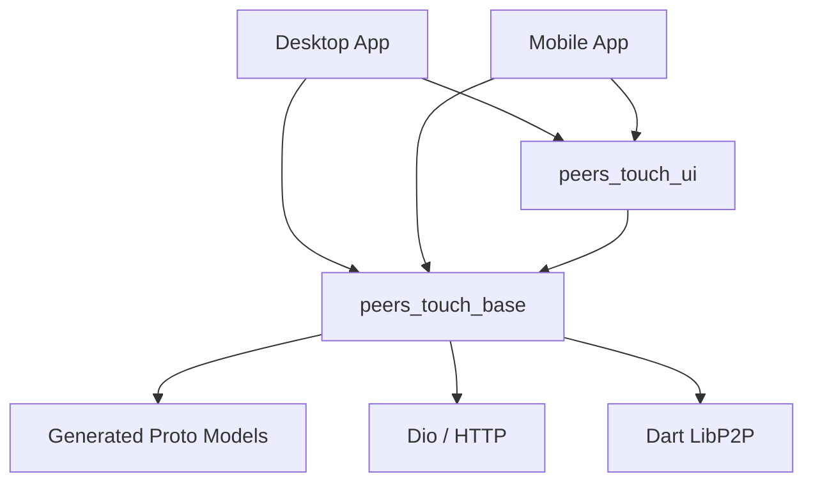

# Client: Common & Shared Code

> **Rules for Shared Libraries (`client/common`)**

---

## 🎯 Overview

The `client/common` directory contains code shared between Desktop and Mobile applications. It ensures consistency and reduces code duplication.

**Core Packages:**
1. **`peers_touch_base`**: Core logic, data models, networking, and utilities. (Logic-only)
2. **`peers_touch_ui`**: Shared UI components, theme tokens, and design system. (UI-only)

---

## 📜 General Principles

### 1. Platform Agnostic
- Shared code MUST work on both Desktop (Windows/macOS/Linux) and Mobile (iOS/Android).
- Avoid `dart:io` direct dependencies where `universal_io` or abstraction is possible.
- If platform-specific logic is needed, use **Interfaces** in `common` and implement them in specific client apps.

### 2. Logic vs UI Separation
- **`peers_touch_base`** should contain **NO UI code** (no `package:flutter/material.dart` unless absolutely necessary for utils).
- **`peers_touch_ui`** should contain **NO Business Logic** (dumb components only).

### 3. Stability First
- Changes in `common` affect ALL clients.
- **Breaking Changes**: Must be coordinated across Desktop and Mobile teams.
- **Deprecation**: Use `@deprecated` annotation before removing APIs.

---

## 📦 Dependency Graph

---

## 🛠️ Development Workflow

1. **Modify Common Code**:
   - Edit files in `client/common/peers_touch_base` or `client/common/peers_touch_ui`.
   
2. **Test Locally**:
   - Run tests inside the package: `flutter test`.
   - Use the `example` app inside the package if available.

3. **Update Clients**:
   - Clients reference these packages via `path` in `pubspec.yaml`.
   - Run `flutter pub get` in client directories to pick up changes.
   - Restart client apps (hot reload might not be enough for deep changes).

---

## 📚 Related Documents

- **Package Details**: [23.1-packages.md](./23.1-packages.md)
- **Desktop Usage**: [../21-DESKTOP/21.0-base.md](../21-DESKTOP/21.0-base.md)
- **Mobile Usage**: [../22-MOBILE/22.0-base.md](../22-MOBILE/22.0-base.md)
