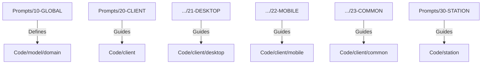

# Peers-Touch Prompt System

> **Unified Documentation for AI and Developers**  
> Version 2.1.0 | Last Updated: 2025-01-02

---

## 🎯 What is This?

This is the **centralized prompt system** for the Peers-Touch project. It provides:
- **Architectural guidelines** for all platforms (Desktop, Mobile, Station)
- **Coding standards** and best practices
- **Historical context** (why decisions were made)
- **Navigation guides** for AI assistants

---

## 🚀 Quick Start

### For AI Assistants

**ALWAYS start here**: [00-META/INDEX.md](./00-META/INDEX.md)

Then follow the reading strategy based on your task:
- **Desktop work**: Read `10-GLOBAL/` → `21-DESKTOP/`
- **Mobile work**: Read `10-GLOBAL/` → `22-MOBILE/`
- **Station work**: Read `10-GLOBAL/` → `30-STATION/`

### For Developers

1. Read [10-GLOBAL/10-project-identity.md](./10-GLOBAL/10-project-identity.md) to understand what Peers-Touch is
2. Read [10-GLOBAL/11-architecture.md](./10-GLOBAL/11-architecture.md) to understand the system architecture
3. Read your platform-specific base file:
   - Desktop: [20-CLIENT/21-DESKTOP/21.0-base.md](./20-CLIENT/21-DESKTOP/21.0-base.md)
   - Mobile: [20-CLIENT/22-MOBILE/22.0-base.md](./20-CLIENT/22-MOBILE/22.0-base.md)
   - Station: [30-STATION/30-station-base.md](./30-STATION/30-station-base.md)

---

## 🧠 System Logic & Structure

This directory structure follows a strict logical hierarchy designed for both **AI Context Retrieval** and **Human Readability**.

### 1. Macro Logic (The Decimal System)

The numbered prefixes (`00` - `90`) dictate the **reading order** and **dependency flow**.

| Prefix | Layer | Logic Metaphor | Dependency |
| :--- | :--- | :--- | :--- |
| **00** | **META** | **Control Tower** | Entry point. Navigation, Glossary, and Changelog. |
| **10** | **GLOBAL** | **Foundation** | **Universal Truths**. Rules that apply to ALL platforms (Identity, Architecture, Proto). |
| **20** | **CLIENT** | **Left Pillar** | Client-side implementations (Desktop/Mobile). Inherits from `10-GLOBAL`. |
| **30** | **STATION** | **Right Pillar** | Server-side implementations (Station). Inherits from `10-GLOBAL`. |
| **90** | **CONTEXT** | **Archives** | **History & Rationale**. Why we made these decisions (ADRs). |

**Logical Flow**:
> `00 (Index)` ➔ `10 (Define Problem)` ➔ `20/30 (Solve Problem)` ➔ `90 (Reference History)`

### 2. Micro Logic (File Numbering)

Within each directory, file numbers (`.0`, `.1`, `.2`...) represent the **knowledge dependency chain**.

*   **`.0-base`**: The root concept. Must read first.
*   **`.1-scaffolding`**: The physical structure. Where things go.
*   **`.2-principles`**: The rules of engagement. How to write code.
*   **`features/`**: The concrete implementations.

### 3. Architecture Mapping

The prompt structure is **isomorphic** to the codebase structure, allowing for intuitive navigation.



---

## 📂 Directory Structure

```
.prompts/
├── 00-META/                       # Start here!
│   ├── INDEX.md                   # Navigation guide (READ FIRST)
│   ├── GLOSSARY.md                # Terminology reference
│   └── CHANGELOG.md               # Version history
│
├── 10-GLOBAL/                     # Cross-platform rules
│   ├── 10-project-identity.md     # What is Peers-Touch?
│   ├── 11-architecture.md         # System architecture
│   ├── 12-domain-model.md         # Proto-based models
│   ├── 13-coding-standards.md     # Universal code style
│   └── 14-workflow.md             # Development workflow
│
├── 20-CLIENT/                     # Client platforms
│   ├── 21-DESKTOP/                # Desktop (Flutter + GetX)
│   ├── 22-MOBILE/                 # Mobile (Flutter + GetX)
│   └── 23-COMMON/                 # Shared Code (NEW)
│
├── 30-STATION/                    # Backend (Go)
│   ├── 30-station-base.md         # Base architecture
│   ├── 31-go-standards.md         # Go coding standards
│   ├── 32-app-layer.md            # App/Subserver Logic (NEW)
│   └── 33-frame-layer.md          # Frame/Core Logic (NEW)
│
└── 90-CONTEXT/                    # Historical context
    ├── decisions/                 # Architecture Decision Records (ADRs)
    └── evolution/                 # Migration guides
```

---

## 🤝 Contributing

### Adding New Prompts

1. **Determine Layer**: Is it Global (10), Client (20), or Station (30)?
2. **Check Dependencies**: Does it rely on a Base concept?
3. **Number It**: Use the next available number or sub-number.
4. **Update Index**: Add it to [00-META/INDEX.md](./00-META/INDEX.md).

---

## ⚠️ Important Notes

1. **This is the Source of Truth** - All other documentation should reference these prompts.
2. **Think of AI** - Write prompts that AI can easily parse. Use clear headings and structured lists.
3. **Keep it Updated** - Outdated prompts are misleading.

---

*For the complete navigation guide, start at [00-META/INDEX.md](./00-META/INDEX.md)*
