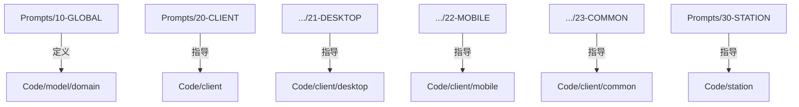

# Peers-Touch 提示词系统

> **AI 与开发者的统一文档库**  
> 版本 2.1.0 | 最后更新：2025-01-02

---

## 🎯 这是什么？

这是 Peers-Touch 项目的 **中心化提示词系统 (Centralized Prompt System)**。它提供了：
- **架构指南**：涵盖所有平台（桌面端、移动端、服务端 Station）。
- **编码规范**：最佳实践与标准。
- **历史背景**：决策背后的原因 (ADR)。
- **导航指南**：帮助 AI 助手快速理解项目。

---

## 🚀 快速开始

### 对于 AI 助手

**务必从这里开始**：[00-META/INDEX.md](./00-META/INDEX.md)

然后根据任务选择阅读路径：
- **桌面端任务**：阅读 `10-GLOBAL/` → `21-DESKTOP/`
- **移动端任务**：阅读 `10-GLOBAL/` → `22-MOBILE/`
- **服务端任务**：阅读 `10-GLOBAL/` → `30-STATION/`

### 对于开发者

1. 阅读 [10-GLOBAL/10-project-identity.md](./10-GLOBAL/10-project-identity.md) 了解项目定位。
2. 阅读 [10-GLOBAL/11-architecture.md](./10-GLOBAL/11-architecture.md) 了解系统架构。
3. 阅读对应的平台基础文档：
   - 桌面端：[20-CLIENT/21-DESKTOP/21.0-base.md](./20-CLIENT/21-DESKTOP/21.0-base.md)
   - 移动端：[20-CLIENT/22-MOBILE/22.0-base.md](./20-CLIENT/22-MOBILE/22.0-base.md)
   - 服务端：[30-STATION/30-station-base.md](./30-STATION/30-station-base.md)

---

## 🧠 系统逻辑与结构

本目录结构遵循严格的逻辑层级，旨在同时满足 **AI 上下文检索** 和 **人类阅读习惯**。

### 1. 宏观逻辑（十进制分类法）

数字前缀 (`00` - `90`) 强制规定了 **阅读顺序** 和 **依赖流向**。

| 前缀 | 层级 | 逻辑隐喻 | 依赖关系 |
| :--- | :--- | :--- | :--- |
| **00** | **META** | **控制塔** | 入口。包含导航、术语表和变更日志。 |
| **10** | **GLOBAL** | **地基** | **通用真理**。适用于所有平台的规则（身份、架构、Proto）。 |
| **20** | **CLIENT** | **左支柱** | 客户端实现（桌面/移动）。继承自 `10-GLOBAL`。 |
| **30** | **STATION** | **右支柱** | 服务端实现（Station）。继承自 `10-GLOBAL`。 |
| **90** | **CONTEXT** | **档案馆** | **历史与理由**。为什么做这些决策（ADR）。 |

**逻辑流向**：
> `00 (索引)` ➔ `10 (定义问题)` ➔ `20/30 (解决问题)` ➔ `90 (参考历史)`

### 2. 微观逻辑（文件编号）

在每个目录内，文件编号（`.0`, `.1`, `.2`...）代表 **知识依赖链**。

*   **`.0-base`**：根概念。必须最先阅读。
*   **`.1-scaffolding`**：物理骨架。代码放哪里。
*   **`.2-principles`**：行为准则。代码怎么写。
*   **`features/`**：具体实现。

### 3. 架构映射（同构性）

提示词结构与代码库结构 **同构** (Isomorphic)，便于直观导航。



---

## 📂 目录结构

```
.prompts/
├── 00-META/                       # 从这里开始！
│   ├── INDEX.md                   # 导航指南（必读）
│   ├── GLOSSARY.md                # 术语表
│   └── CHANGELOG.md               # 版本历史
│
├── 10-GLOBAL/                     # 跨平台通用规则
│   ├── 10-project-identity.md     # Peers-Touch 是什么？
│   ├── 11-architecture.md         # 系统架构
│   ├── 12-domain-model.md         # Proto 模型系统
│   ├── 13-coding-standards.md     # 通用编码规范
│   └── 14-workflow.md             # 开发工作流
│
├── 20-CLIENT/                     # 客户端平台
│   ├── 21-DESKTOP/                # 桌面端 (Flutter + GetX)
│   ├── 22-MOBILE/                 # 移动端 (Flutter + GetX)
│   └── 23-COMMON/                 # 共享代码 (NEW)
│
├── 30-STATION/                    # 服务端 (Go)
│   ├── 30-station-base.md         # 基础架构
│   ├── 31-go-standards.md         # Go 编码规范
│   ├── 32-app-layer.md            # 业务逻辑层开发 (NEW)
│   └── 33-frame-layer.md          # 核心框架层开发 (NEW)
│
└── 90-CONTEXT/                    # 历史上下文
    ├── decisions/                 # 架构决策记录 (ADR)
    └── evolution/                 # 迁移指南
```

---

## 🤝 贡献指南

### 添加新提示词

1. **确定层级**：属于 Global (10), Client (20), 还是 Station (30)？
2. **检查依赖**：是否依赖于某个 Base 概念？
3. **编号**：使用下一个可用的编号或子编号。
4. **更新索引**：将新文件添加到 [00-META/INDEX.md](./00-META/INDEX.md)。

---

## ⚠️ 重要提示

1. **这是唯一真理源 (SSOT)** - 所有其他文档都应引用这里的提示词。
2. **考虑 AI** - 编写提示词时要易于 AI 解析。使用清晰的标题和结构化列表。
3. **保持更新** - 过时的提示词比没有提示词更糟糕。

---

*如需完整导航指南，请从 [00-META/INDEX.md](./00-META/INDEX.md) 开始*
