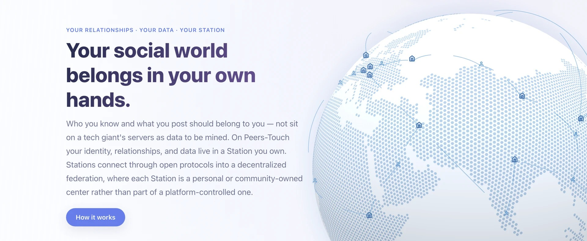
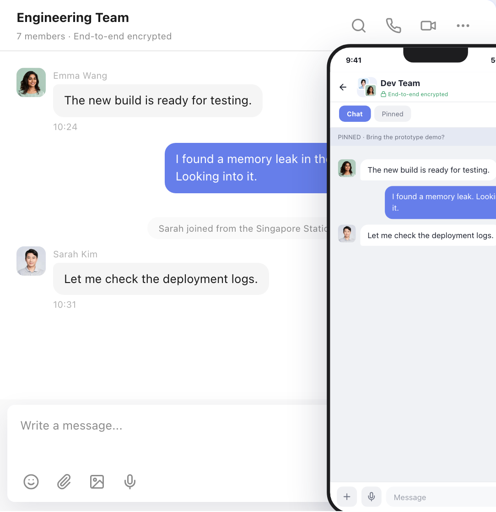
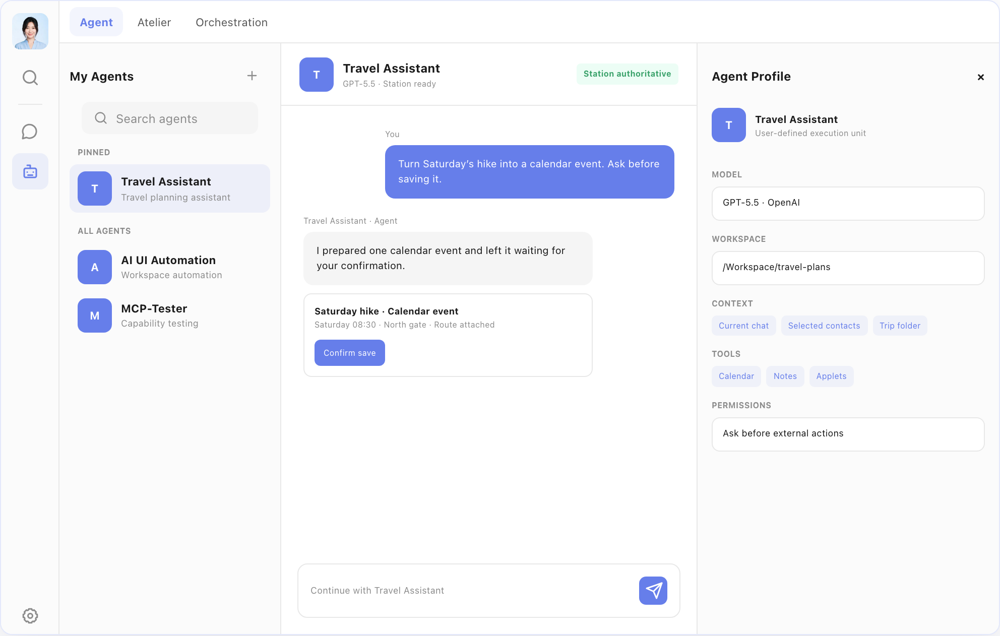
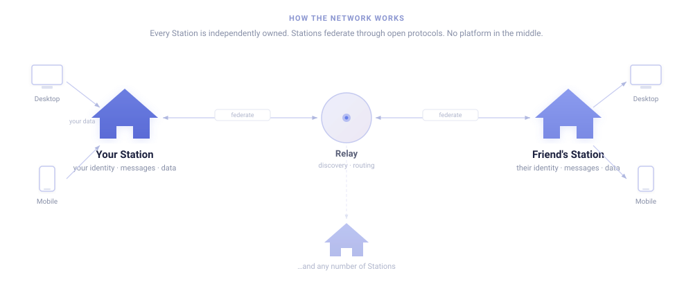

<div align="center">

# Peers-Touch

**Chat, share, and stay connected — on a social network nobody else controls.**

Your friends, messages, and memories live in a **Station** you own — not on a company's servers.<br>
Stations talk to each other like email. You reach anyone, anywhere, with no platform in the middle.

[Website](https://peers-touch.com) · [How it works](https://peers-touch.com/en/product) · [Roadmap](https://peers-touch.com/en/roadmap)

</div>

---



<table>
<tr>
<td width="50%">

<p align="center"><sub>Desktop + Mobile Chat</sub></p>
</td>
<td width="50%">

<p align="center"><sub>Agent — your personal AI on your Station</sub></p>
</td>
</tr>
</table>

## What you can do

- **Chat** — direct messages and group conversations, with reactions, photos, and rich media.
- **Share** — post to a private feed (Moments) visible only to friends you choose.
- **Connect** — add friends across independently run Stations.
- **Ask your AI** — an assistant on your devices and your data. Pick your model, set the rules.
- **Extend** — install applets on your Station.
- **Use it daily** — native macOS, Android, and iOS apps that work offline and sync in the background.

## How it works

Every user runs (or joins) a **Station** — a personal server on a NAS, Raspberry Pi, or cloud VM. Your Station holds your identity, contacts, messages, and content. Stations connect through open protocols, forming a federated network. Think of it like email: you pick your provider (or run your own), and you can still talk to everyone.

## Architecture



## What's ready

Desktop (macOS) and mobile (Android / iOS, in development) apps with chat, social feed, AI assistant, applets, and federation across Stations. Voice/video calls and end-to-end encryption are in development.

## Try it

> **Just want to use it?** Download links and hosted Stations are coming soon. Star the repo to get notified.

**Developers — run it locally:**

```bash
make profile local     # Configure for local development
make station           # Start your Station (Go + PostgreSQL via Docker)
make desktop           # Open the desktop app
```

Sign in, add a friend, send a message. Test accounts: `alice@p.t`, `bob@p.t`, `coral@p.t` (password: `1`).

Requires: pnpm 9+, Go 1.22+, Rust, Docker. [Full setup guide →](docs/global/local-dev-environment.md)

---

<details>
<summary><strong>For developers: repo layout and contributing</strong></summary>

### Repository

```
apps/
  station/         Go backend — Hertz + DDD subservers + PostgreSQL
  desktop/         Tauri + React/TypeScript + Rust
  mobile/          Tauri v2 Mobile + Rust kernel
  applets/         Official applets
  official-site/   Product website (Astro, i18n)
  oauth2-client/   OAuth broker (Vercel)
model/domain/      Protobuf contracts (single source of truth)
packages/          Shared: chat-core, storage, applet-sdk, UI, locales
docs/              Architecture and platform docs
tooling/           Build scripts, agent skills
```

### Contributing

- All data models in `model/domain/*.proto` — no hand-written models.
- No mocking — real front-to-back integration, always.
- Architecture docs before code for cross-layer changes.
- `make dev-start` before non-trivial work.
- Full guide: [AGENTS.md](AGENTS.md)

</details>

---

## Acknowledgements

| Project | What it means for us |
|---------|---------------------|
| [Tauri](https://tauri.app) | Native desktop and mobile — not Electron |
| [Hertz](https://github.com/cloudwego/hertz) | Station's Go HTTP framework |
| [LobeHub / Lobe UI](https://github.com/lobehub/lobe-ui) | Desktop UI components |
| [SimpleX Chat](https://simplex.chat) | Privacy-first messaging inspiration |
| [Protocol Buffers](https://protobuf.dev) + [prost](https://github.com/tokio-rs/prost) | Cross-platform contracts |
| [libp2p](https://libp2p.io) | Peer identity for federation |
| [SQLCipher](https://www.zetetic.net/sqlcipher/) | Encrypted on-device storage |
| [React](https://react.dev) + [Ant Design](https://ant.design) | Frontend rendering and design |

## License

[MIT](LICENSE)
