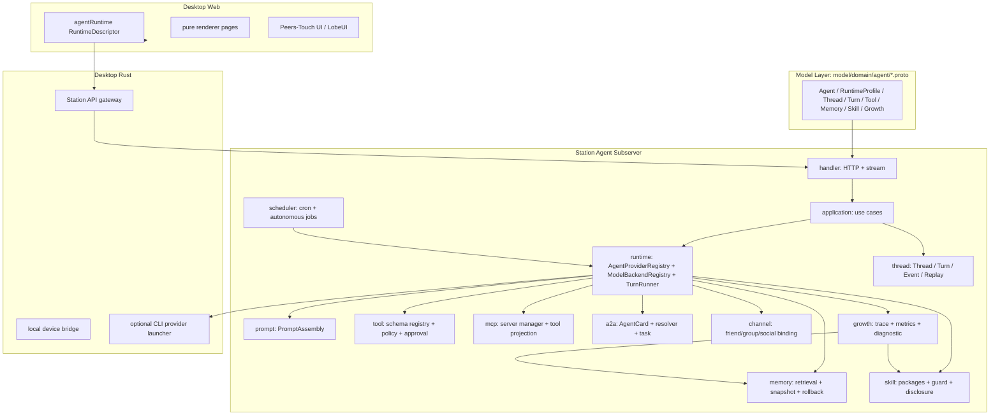
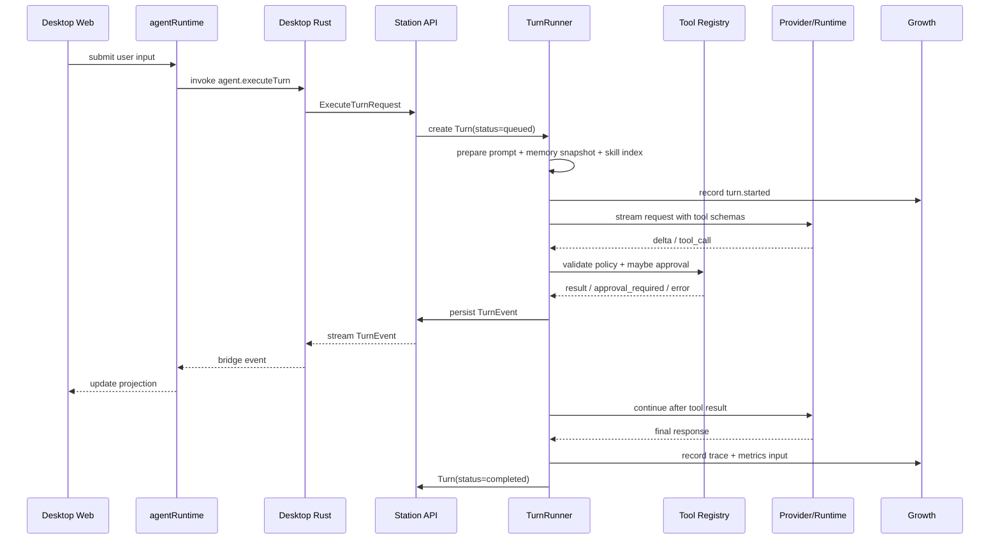

# Agent Kernel — 架构设计

> **Status**: draft
> **Version**: 2026.06
> **Created**: 2026-06-06 | **Updated**: 2026-06-06
> **Owner**: Architecture Team
> **Module**: `apps/station/app/subserver/agent/`

---

## 1. 核心原则

1. **Proto-first**：所有跨层数据结构先进入 `model/domain/agent/*.proto`，Station / Desktop Rust / Desktop Web 都从同一契约生成或映射。
2. **Station owns truth**：Agent、Thread、Turn、Tool policy、Memory、Skill、MCP、A2A、Channel、Growth、Scheduler 的业务真源都在 Station。
3. **Desktop owns experience and device bridge**：Desktop Rust 只承载设备能力、文件选择、本地 CLI Provider 启动、secure storage、stream bridge；Desktop Web 只做 runtime projection 与页面渲染。
4. **Execution closure first**：每个 Turn 必须可追踪、可重放、可停止、可恢复、可归因；不能只保存最终文本。
5. **Borrow capability, not shape**：借鉴 thirdparty 的运行时资源拆分、工具桥、MCP、A2A、Workspace 隔离、技能包理念，但 UI/UX、契约层、业务边界全部按 Peers-Touch 重做。
6. **Growth is a first-class loop**：Memory / Skill 的获取、应用、反馈、诊断、修正必须进入同一运行闭环，而不是后台统计。

---

## 2. 系统架构



目标态的 Agent Kernel 是 Station 业务内核，不是 Desktop 插件，也不是 thirdparty 的嵌入式管理台。它对外提供统一 API、流式事件和 projection 数据；对内通过 runtime、thread、tool、memory、skill、growth 等领域服务完成执行闭环。

---

## 3. 分层职责

| 层 | 责任 | 禁止事项 |
|----|------|----------|
| Model | proto 合同、枚举、请求响应、事件结构 | 不放业务逻辑，不手写平台私有模型 |
| Station | 业务真源、执行状态、策略、审计、跨端一致性 | 不依赖 Desktop 页面状态，不把设备 grant 当业务事实 |
| Desktop Rust | Tauri command、Station API gateway、设备权限、本地 CLI Provider 桥 | 不保存 Agent profile，不判断 tool policy |
| Desktop Web | Runtime projection、页面渲染、表单交互、审批体验 | 不直接绕过 runtime projection 拉业务数据 |

---

## 4. 核心模块

### 4.1 `runtime`

`runtime` 回答“这次由哪个 Provider、按什么能力执行”。

| 对象 | 职责 |
|------|------|
| `LogicalAgent` | 逻辑 Agent 身份、职责、默认 profile、策略、可见性 |
| `RuntimeProfile` | AgentProvider、ModelBackend、tool policy、memory/skill scope、workspace policy |
| `CapabilitySet` | streaming、native tool calling、mcp、a2a、workspace、resume、attachment、approval |
| `AgentProviderRegistry` | 注册 Kernel-native 与 CLI-wrapped AgentProvider |
| `ModelBackendRegistry` | 注册 OpenAI-compatible、Anthropic、Gemini、Ollama、custom gateway 等模型后端 |
| `TurnRunner` | 执行单轮 Turn 的状态机 |

推荐接口：

```go
type AgentProvider interface {
    Descriptor(ctx context.Context) AgentProviderDescriptor
    Prepare(ctx context.Context, envelope AgentRunEnvelope) (*PreparedAgentRun, error)
    Execute(ctx context.Context, run *PreparedAgentRun, sink AgentProviderEventSink) (*AgentProviderResult, error)
    Stop(ctx context.Context, runID string) error
    Resume(ctx context.Context, req AgentProviderResumeRequest, sink AgentProviderEventSink) (*AgentProviderResult, error)
}
```

Provider 是两层抽象：

- `AgentProvider`：负责一次 Agent Turn 的编排和事件输出，分为 `kernel_native` 与 `cli_wrapped`。
- `ModelBackend`：负责模型 token 从哪里来，只被 `kernel_native` 使用，例如 OpenAI-compatible、Anthropic、Gemini、Ollama、自定义网关。

Eino-native 不是与 vendor API 并列的东西；Eino-native 是 Kernel-native AgentProvider，vendor API 是它下面的 ModelBackend。CLI-wrapped Provider 不能假装拥有内部 tool loop、prompt 改写、memory、planning 的控制权。它只能通过启动参数、工作目录、环境变量、输入输出、受限 Tool Bridge、停止/超时等外层能力受控。详细策略见 [provider-strategy.md](./provider-strategy.md)。

### 4.2 `thread`

`thread` 回答“这次交互属于哪个上下文，以及历史如何回放”。

- `AgentThread`：统一 Web chat、Friend/Group chat、Channel topic、A2A context。
- `AgentTurn`：单轮运行记录，包含输入、输出、状态、profile snapshot。
- `TurnEvent`：流式事件源，包括 provider delta、tool call、approval request、memory hit、skill hit、diagnostic。
- `ReplayPolicy`：恢复外部 runtime 或重建 prompt 时如何截断历史。

约束：Thread 只记录过程状态，不写长期语义结论；Memory 不能替代 Thread 做恢复；Thread 不能替代 Memory 做长期偏好。

### 4.3 `prompt`

推荐 prompt 组装顺序：

1. Agent identity 与职责边界。
2. Runtime profile 指令和输出约束。
3. Channel / surface 上下文。
4. Memory snapshot。
5. Skill index 与按需加载提示。
6. Workspace contract 与用户引用上下文。
7. Tool inventory 与审批规则。
8. 当前 Thread 历史与本轮输入。

每个 Turn 记录 `system_prompt_hash`、`memory_snapshot_id`、`skill_index_hash`、`workspace_context_hash`、`tool_inventory_hash`，作为 replay 和 Growth 归因基础。

### 4.4 `tool`

`tool` 是 schema-first 的受控能力层，替代 `<tool_call>...</tool_call>` 文本解析。

| 子模块 | 职责 |
|--------|------|
| `registry` | 注册 tool descriptor、JSON schema、category、owner、capability |
| `policy` | profile allow/deny、agent allow/deny、channel scope、risk level |
| `approval` | 人工审批对象、UI token、过期、重复请求合并 |
| `dispatcher` | 根据 tool kind 调 Station service、MCP、A2A、Desktop bridge；这是工具分发器，不是 LLM Provider |
| `audit` | 每次 tool call 的输入摘要、输出摘要、错误码、耗时 |

工具类别建议：

| 类别 | 示例 | Owner |
|------|------|-------|
| `memory` | `memory_search`, `memory_add`, `memory_feedback`, `memory_remove` | Station |
| `skill` | `skills_list`, `skill_view`, `skill_manage`, `skill_package_query` | Station |
| `social` | `friend_send`, `group_send`, `channel_send` | Station |
| `mcp` | `mcp_{server}_{tool}` | Station registry + MCP adapter |
| `a2a` | `a2a_list_agents`, `a2a_call_agent` | Station |
| `scheduler` | `cron_manage`, `cron_list_runs` | Station |
| `workspace` | `workspace_context`, `workspace_file_read_ref` | Station + Desktop bridge |
| `local` | file picker、本地路径授权 | Desktop Rust |

### 4.5 `memory`

Memory 是长期语义知识，不是文件系统或 Thread 状态。

- 分 scope：global、user、agent、thread-derived。
- 分 layer：identity、preference、experience、fact、warning。
- 检索：关键词 + embedding + scope policy。
- 治理：trust score、source、last_used、feedback attribution。
- 快照：Turn 开始时生成冻结 snapshot。
- 回滚：按 snapshot 或 item version 回退。

保留 Peers-Touch 的差异化能力：Memory freeze、Knowledge Salvage、负反馈精准归因。

### 4.6 `skill`

Skill 是可复用操作知识包，不是 UI 插件。

- `SkillPackage`：来源、版本、可见性、owner、签名、sync 状态。
- `SkillRecord`：`SKILL.md`、metadata、依赖、适用 surface、风险等级。
- Progressive disclosure：默认只注入 index，按需 `skill_view`。
- Guard：prompt injection、秘密外泄、危险命令、不可见字符扫描。
- Versioning：编辑、回滚、禁用、归档。

Peers-Touch UI 不复制 thirdparty 的技能市场页面，而是做“Agent Profile 内技能配置 + Skill Library 管理”的双入口。

### 4.7 `mcp`

MCP 将外部工具/资源接入 Station：

- MCP server CRUD：stdio / HTTP / SSE，auth 配置，健康状态。
- Connection manager：连接、重连、capability refresh、tool schema cache。
- Tool projection：把 MCP tools 转成 Station Tool Descriptor。
- Policy binding：Agent profile 选择 MCP server，不默认暴露全部 MCP。
- Audit：每次 MCP 调用进入 TurnTrace。

### 4.8 `a2a`

A2A 负责 Agent-to-Agent 协作：

- Agent Card：从 LogicalAgent + CapabilitySet 生成。
- Resolver：本地 Agent、远程 Agent、shadow Agent。
- Task state：submitted、working、input_required、auth_required、completed、failed、cancelled、rejected。
- Transport：优先 Station in-process adapter；对外暴露 HTTP JSON-RPC。
- Policy：每个 Agent 对每个目标 Agent 的调用权限。

### 4.9 `channel`

Channel 把社交入口绑定到统一 Agent Thread：

- Friend chat、Group chat、外部 social channel 都转换为 `surface=friend|group|channel` 的 AgentThread。
- 每个绑定记录包括 `source_type`、`source_id`、`logical_agent_id`、routing policy、response mode。
- 群聊支持 mention-only、always、ai-decide 三种响应策略。
- 用户在 Desktop 的普通聊天 UI 中能看到 Agent 参与痕迹，但 Agent 运行态由 Agent projection 提供。

### 4.10 `growth`

Growth 是自成长闭环，不是统计面板。

- TurnTrace：记录 prompt hash、tool calls、memory hits、skill hits、provider calls、errors、feedback。
- GrowthEvent：memory.created、skill.created、tool.failed、turn.succeeded、turn.failed、feedback.positive。
- Metrics：成功率、反馈率、工具错误率、memory trust health、skill effectiveness。
- Diagnostic：质量下降时定位相关 memory / skill / tool / prompt / provider。
- Dogfood：固定场景集自动验证 Agent 是否真的变好。

关键输出是 `GrowthReport` 和 `CorrectionProposal`，后者必须能直接落到 freeze memory、rollback memory、disable skill、patch skill、tighten tool policy 等操作。

---

## 5. Turn 执行闭环



每个 Turn 的最低闭环数据：

- `turn_id`、`thread_id`、`logical_agent_id`、`runtime_profile_snapshot`
- 用户输入与附件引用
- prompt 组装摘要和 hash
- provider request/response 摘要、token、latency、错误
- tool call 输入摘要、输出摘要、审批状态、错误
- memory / skill 命中和写入
- final response、status、error_code
- growth events 与 diagnostic hooks

---

## 6. API 面

第一阶段建议只暴露必要 API，避免一开始复制参考系统的全量 surface。

| API | 说明 |
|-----|------|
| `GET /agent/agents` | Agent 列表 |
| `POST /agent/agents` | 创建 LogicalAgent |
| `GET /agent/agents/:id` | Agent Profile 详情 |
| `PUT /agent/agents/:id` | 更新 Agent Profile |
| `GET /agent/providers` | 可用 Provider 与能力矩阵 |
| `GET /agent/runtime-profiles` | 可用 Runtime Profile |
| `GET /agent/threads?agent_id=` | Thread 列表 |
| `POST /agent/threads` | 创建 Thread |
| `POST /agent/turns` | 执行 Turn |
| `GET /agent/turns/:id/events` | 获取 TurnEvent |
| `GET /agent/stream?scope=` | 统一事件流 |
| `POST /agent/tool-approvals/:id/respond` | 工具审批 |
| `GET /agent/memory?agent_id=` | Memory 管理 |
| `GET /agent/skills?agent_id=` | Skill 管理 |
| `GET /agent/growth/reports?agent_id=` | Growth 报告 |

API 返回结构必须来自 proto；HTTP JSON 只是传输编码，不是手写模型来源。
