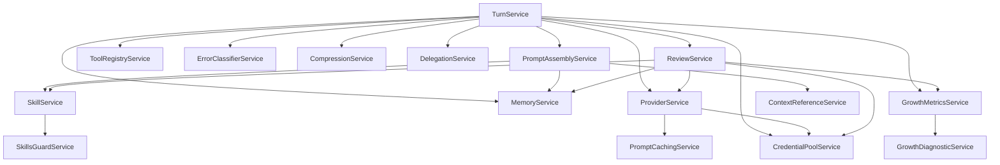
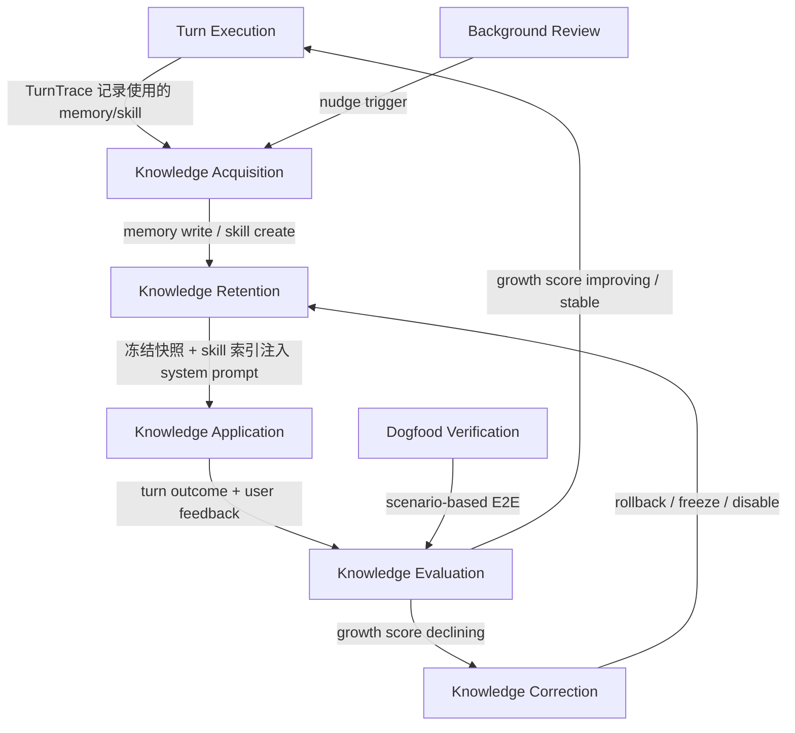

# Agent 自成长架构设计

> Design reference: [hermes-agent-self-improving-analysis.md](./hermes-agent-self-improving-analysis.md)

## 1. 什么是 Agent 自成长

Agent 自成长是指 Agent 在运行过程中：

1. **积累知识资产**（Memory + Skill）
2. **通过 system prompt 注入**影响后续行为
3. **通过信任评分和行为度量**评估知识质量
4. **通过精准归因和自动修正**回收有害知识

从而在不修改模型参数的情况下，持续改善任务表现并可度量地验证改善方向。

核心原则：

> **Observe concretely, accumulate cautiously, apply precisely, evaluate continuously, correct promptly.**

---

## 2. 系统架构

### 2.1 三端分工

| 端 | 职责 | 技术栈 |
|---|---|---|
| **Station** | 全部后端能力：Turn Loop 编排、Memory/Skill 持久化、Prompt Assembly、Error Recovery、Context Compression、Delegation、Credential Pool、Background Review、Growth Metrics、Diagnostic | Go + GORM + HTTP |
| **Tauri** | Station 通信桥接、本地文件系统代理（@file/@folder 上下文引用） | Rust |
| **Desktop** | 控制面与用户交互：ChatPage、Growth Dashboard、Memory/Skill 管理 UI | React + TypeScript |

### 2.2 Station Service 拓扑

```
apps/station/app/subserver/agent/
├── agent.go                               # subserver 生命周期 + DI + 路由注册
├── handler/
│   ├── turn_handler.go                    # POST /agent/turn/execute
│   ├── memory_handler.go                  # /agent/memory/*
│   ├── skill_handler.go                   # /agent/skill/*
│   ├── growth_handler.go                  # /agent/growth/*
│   └── error_mapper.go                    # BizError → HTTP error
├── service/
│   ├── turn_service.go                    # turn loop 编排（核心）
│   ├── prompt_assembly_service.go         # system prompt 8 层组装
│   ├── memory_service.go                  # memory CRUD + 安全扫描 + 冻结快照
│   ├── skill_service.go                   # skill CRUD + 渐进式披露 + 即时修补
│   ├── review_service.go                  # background review（后台 goroutine）
│   ├── compression_service.go             # context compression（pre-prune + summary）
│   ├── provider_service.go                # LLM API 调用（OpenAI/Anthropic/Ollama）
│   ├── error_classifier_service.go        # 错误分类（14 种 FailoverReason）
│   ├── delegation_service.go              # 子 Agent 编排（goroutine + semaphore）
│   ├── credential_pool_service.go         # 凭证池（轮换 + cooldown）
│   ├── prompt_caching_service.go          # Anthropic cache_control 注入
│   ├── tool_registry_service.go           # tool 注册 + 分发
│   ├── skills_guard_service.go            # skill 安全扫描（60+ 规则）
│   ├── context_reference_service.go       # @file/@folder/@url/@diff 解析
│   ├── growth_metrics_service.go          # 成长度量 + composite score
│   └── growth_diagnostic_service.go       # 退化归因 + diagnostic report
├── domain/                                # 领域对象（见 §4）
├── infrastructure/persistence/            # GORM 模型 + DB 读写
└── errcode/                               # 业务错误码
```

### 2.3 Service 依赖关系



---

## 3. 自成长生命周期



### 3.1 Knowledge Acquisition（知识获取）

Agent 在 turn 执行过程中获取知识的 3 条路径：

| 路径 | 触发条件 | 产出 |
|---|---|---|
| LLM 主动写入 | LLM 在 tool-calling loop 中调用 `memory` tool | MemoryItem |
| LLM 主动创建 skill | LLM 调用 `skill_manage(action='create')` | SkillManifest |
| Background Review | nudge 计数器达到阈值（默认每 10 个 user turns） | MemoryItem 或 SkillManifest |

所有写入经过安全扫描（prompt injection、exfiltration、invisible unicode 检测）。

### 3.2 Knowledge Retention（知识存储）

**Memory Store**：DB-backed 有界存储。

| 约束 | 值 | 说明 |
|---|---|---|
| memory target char limit | 2200 | agent 自身知识 |
| user target char limit | 1375 | 对用户的认知 |
| 分隔符 | `\n§\n` | 条目间分隔 |
| 安全扫描 | 每次写入 | 拒绝注入内容 |
| 冻结快照 | session 开始时 | mid-session 不变 system prompt |

**Skill Store**：DB-backed，渐进式披露。

| 层级 | API | 内容 |
|---|---|---|
| Index | `skills_list()` | 所有 skill 的 name + description（注入 system prompt） |
| Full | `skill_view(name)` | SKILL.md 全文 |
| Patch | `skill_manage(action='patch')` | 即时修补（fuzzy find-and-replace） |

Skill 写入经过 SkillsGuard 扫描（13 类威胁、60+ 正则规则、结构性检查、不可见 unicode 检测），按 trust level × verdict 矩阵决定 allow / ask / block。

### 3.3 Knowledge Application（知识应用）

通过 `prompt_assembly_service.go` 的 8 层组装注入 system prompt：

| Layer | Content |
|---|---|
| 1. Identity | Agent 身份定义 |
| 2. Behavioral Guidance | Memory/Skill/Session 使用规则 |
| 3. Memory Snapshot | 冻结的 memory + user 内容 |
| 4. Skills Index | 所有 skill 的 name + description |
| 5. Context Files | AGENTS.md / .cursorrules（向上遍历到 git root） |
| 6. Timestamp + Model Info | 会话时间、模型、provider |
| 7. Platform Hints | desktop / mobile 等平台提示 |
| 8. Context References | @file/@folder/@url/@diff/@staged 展开结果 |

关键设计：Memory Snapshot 在 session 开始时冻结，mid-session 的 memory 写入不改变 system prompt，保护 Anthropic prefix cache 稳定性。

### 3.4 Knowledge Evaluation（知识评估）

**Memory 信任评分**：

每个 MemoryItem 携带 `TrustScore`（初始 0.5，范围 [0.0, 1.0]）。反馈基于 TurnTrace 精准归因：

- 用户对某 turn 给出正面反馈 → 该 turn 使用的 memory items 各 +0.05
- 用户对某 turn 给出负面反馈 → 该 turn 使用的 memory items 各 -0.10
- 不对称衰减：错误知识快速边缘化，正确知识需反复验证才能升权

**Skill 效果追踪**：

- `ViewCount`：skill_view 调用次数
- `ApplyCount`：加载了 skill 且 turn 成功的次数
- `PatchCount`：被 LLM 修补的次数
- `SuccessRate`：apply_success / apply_total

**Growth Score**（composite metric，[-1, 1]）：

```
composite_score = w1 * success_rate_delta      // turn 成功率周环比
                + w2 * feedback_ratio_delta     // 正面反馈比例周环比
                + w3 * skill_effectiveness      // skill 使用后 turn 成功率
                + w4 * memory_trust_health      // 高信任 memory 占比
                - w5 * error_rate               // tool/provider 错误率
```

Growth verdict: `improving` (> 0.1) / `stable` (-0.1 to 0.1) / `declining` (< -0.1)

### 3.5 Knowledge Correction（知识修正）

当 Growth Score 下降或用户反馈负面时，`GrowthDiagnosticService` 启动精准归因：

1. 通过 `turn_id` 找到 `TurnTrace`
2. 通过 `TurnTrace.MemorySnapshotHash` 定位该 turn 使用的 memory snapshot
3. 通过 `TurnTrace.SkillsLoaded` 定位该 turn 使用的 skills
4. 只对实际使用的 memory/skill 做归因
5. 累计负面归因超过阈值（默认 3 次）的 item 标记为 suspected
6. 生成 DiagnosticReport，推荐操作（rollback_memory / freeze_memory / disable_skill）

用户可通过 Desktop UI 执行推荐操作，或由自动修正策略（未来）自动执行。

---

## 4. 领域对象

### 4.1 Turn

```go
type Turn struct {
    TurnID         string
    ConversationID string
    AgentID        string
    UserInput      string
    FinalResponse  string
    ToolIterations int
    Status         TurnStatus    // running | completed | failed | interrupted
    StartedAt      time.Time
    EndedAt        *time.Time
}
```

### 4.2 TurnTrace

```go
type TurnTrace struct {
    TraceID              string
    TurnID               string
    SystemPromptHash     string
    MemorySnapshotHash   string
    SkillIndexHash       string
    SkillsLoaded         []string
    ToolCalls            []ToolCallRecord
    ProviderCalls        []ProviderCallRecord
    ReviewTriggered      bool
    ErrorClassified      []ClassifiedError
    CompressionTriggered bool
    CompressionBefore    int
    CompressionAfter     int
    DelegationResults    []DelegationResult
}
```

TurnTrace 是自成长的审计基础。`MemorySnapshotHash` + `SkillsLoaded` 使反馈归因可以精准定位到该 turn 实际使用的知识资产。

### 4.3 MemoryItem

```go
type MemoryItem struct {
    MemoryID     string
    AgentID      string
    Target       string         // "memory" | "user"
    Content      string
    SourceTurnID string
    IsFrozen     bool
    TrustScore   float64        // [0.0, 1.0], initial 0.5
    RetrievalCount int
    HelpfulCount int
    HarmfulCount int
    CreatedAt    time.Time
    UpdatedAt    time.Time
}
```

约束：同一 agent 同一 target 下，所有 item content 总 char 数不超过上限（memory: 2200, user: 1375）。

### 4.4 MemorySnapshot

```go
type MemorySnapshot struct {
    AgentID       string
    MemoryContent string
    UserContent   string
    ItemIDs       []string       // 快照包含的 MemoryItem IDs
    CapturedAt    time.Time
}
```

### 4.5 SkillManifest

```go
type SkillManifest struct {
    SkillID     string
    AgentID     string
    Name        string
    Description string
    Category    string
    Platforms   []string
    Conditions  *SkillConditions
    Content     string           // SKILL.md 全文
    Source      string           // "agent-created" | "builtin" | "imported"
    TrustLevel  TrustLevel       // builtin | trusted | community
    ScanVerdict ScanVerdict      // safe | caution | dangerous
    Enabled     bool
    Version     int
    ViewCount   int
    ApplyCount  int
    PatchCount  int
    LastUsedAt  *time.Time
    CreatedAt   time.Time
    UpdatedAt   time.Time
}
```

### 4.6 ReviewResult

```go
type ReviewResult struct {
    ReviewID       string
    TurnID         string
    ConversationID string
    AgentID        string
    ReviewType     ReviewType     // memory | skill | combined
    ActionsTaken   []string
    SourceItems    []string       // review 产出的 memory/skill IDs
    OutcomeTracked bool           // 后续 turn 是否验证了 review 产出的有效性
    ErrorReason    string
    TriggeredAt    time.Time
    CompletedAt    *time.Time
}
```

### 4.7 GrowthEvent

```go
// 火力不间断记录的成长事件（由 GrowthMetricsService 写入）
type GrowthEvent struct {
    EventID   string
    AgentID   string
    EventType string     // memory_created | skill_used | turn_completed | feedback_positive | ...
    Category  string     // memory | skill | review | feedback | turn
    TurnID    string
    Payload   string     // JSON: 事件特定数据
    CreatedAt time.Time
}
```

### 4.8 DiagnosticReport

```go
type DiagnosticReport struct {
    ReportID      string
    AgentID       string
    GrowthScore   float64
    GrowthVerdict string
    SuspectsJSON  string     // JSON: []DiagnosticSuspect
    Summary       string
    CreatedAt     time.Time
}

type DiagnosticSuspect struct {
    ItemType          string  // "memory" | "skill"
    ItemID            string
    ItemContent       string
    NegativeCount     int
    RecommendedAction string  // rollback_memory | freeze_memory | disable_skill | ...
    Reason            string
}
```

### 4.9 ClassifiedError

```go
type ClassifiedError struct {
    Reason                 FailoverReason  // 14 种 + unknown
    Retryable              bool
    ShouldCompress         bool
    ShouldRotateCredential bool
    ShouldFallback         bool
    Provider               string
    Model                  string
    HTTPStatus             int
    ErrorCode              string
    ErrorMessage           string
    ClassifiedAt           time.Time
}
```

### 4.10 Conversation

```go
type Conversation struct {
    ConversationID string
    AgentID        string
    UserID         string
    Title          string
    Status         ConversationStatus  // active | compressed | archived
    ParentID       string              // compression 谱系追踪
    CreatedAt      time.Time
    UpdatedAt      time.Time
}
```

`ParentID` 在 context compression 触发 session split 时指向旧 conversation，形成压缩谱系链。跨会话搜索时自动追溯。

---

## 5. Turn 执行闭环

一次完整 turn 的执行流程：

```
1. User 发送消息
2. turn_handler 创建 Turn（status = running）
3. prompt_assembly_service.Assemble():
   a. 读取 memory 冻结快照
   b. 构建 skill index
   c. 注入 identity + guidance + context files
   d. 解析 Context References（@file/@folder/@url/@diff/@staged）
   e. 记录 hash（system_prompt_hash, memory_snapshot_hash, skill_index_hash）
4. turn_service 开始 tool-calling loop（上限 90 iterations）:
   a. provider_service.Call()（注入 cache_control breakpoint）
   b. 如果 LLM API 失败:
      - error_classifier_service.Classify() → ClassifiedError
      - retryable → 指数退避重试
      - should_compress → 跳转 Step 6
      - should_rotate_credential → credential_pool_service.Lease() → 重试
      - should_fallback → 切换备选 provider/model → 重试
      - 否则 → 终止 turn（status = failed）
   c. LLM 返回 tool calls → tool_registry_service.Dispatch()
      - memory → memory_service（安全扫描 + CRUD）
      - skill_view → skill_service.Get()
      - skill_manage → skill_service（Skills Guard 扫描 + CRUD）
      - delegate_task → delegation_service.Execute()（隔离子 Agent）
   d. 记录 ToolCallRecord 到 TurnTrace
   e. 循环直到 LLM 返回 final response 或达到 iteration 上限
5. 持久化 Turn + TurnTrace + Messages
6. 如果 context window 接近阈值 → compression_service.Compress():
   a. memory_service.FlushMemories()（Knowledge Salvage）
   b. Pre-prune tool outputs（> 200 chars → placeholder）
   c. Structured Summary（LLM 生成含 Goal/Progress/NextSteps 的摘要）
   d. Tail Protection（动态保留尾部消息，最少 3 条）
   e. Pair Integrity（修复孤立 tool_call/result）
   f. Session Split → 新建 conversation（ParentID 指向旧 conversation）
   g. Rebuild System Prompt（加载最新 memory）
7. growth_metrics_service.RecordEvent()（turn_completed / turn_failed）
8. review_service.CheckAndTriggerReview():
   - turns_since_memory >= nudge_interval → memory review
   - iters_since_skill >= nudge_interval → skill review
   - 后台 goroutine 执行 review（受限 tools: memory + skill_manage）
   - 记录 ReviewResult
9. credential_pool_service 更新 request_count
10. 返回 response 给用户
```

---

## 6. Background Review

### 6.1 触发机制

`NudgeState` 维护两个计数器（线程安全）：

- `turnsSinceMemoryReview`：每完成 1 个 user turn 加 1
- `itersSinceSkillReview`：每完成 1 次 tool-calling iteration 加 1

达到 nudge interval（默认 10）时触发对应类型的 review。

### 6.2 执行方式

后台 goroutine（120 秒超时），向 LLM 发独立请求：

- 注入 review 专用 identity prompt
- 携带 conversation snapshot（深拷贝）
- 仅允许使用 `memory` 和 `skill_manage` 两个 tool
- review agent 自主决定写入 memory 或修补 skill

### 6.3 Review 质量保障

- Review 产出的 memory 经过与正常写入相同的安全扫描
- Review 产出的 skill 经过 SkillsGuard 扫描
- Review 产出标记 `source = "review"` + `source_review_id`
- Review memory 初始 TrustScore = 0.4（低于用户交互产出的 0.5）
- ReviewResult 记录 `OutcomeTracked`：后续 turn 使用 review 产出且成功 → effective
- 连续 N 个 review 无有效产出 → 自动降低 review 频率（adaptive nudge interval）

---

## 7. Error Recovery

`error_classifier_service.go` 通过 7 步优先级管线将异构 provider 错误统一为 `ClassifiedError`。14 种 `FailoverReason`：

| Reason | 恢复策略 |
|---|---|
| auth / auth_permanent | 轮换凭证 |
| billing | 立即轮换 |
| rate_limit | 退避 + 轮换 |
| overloaded | 退避重试 |
| server_error | 重试 |
| timeout | 重建连接 + 重试 |
| context_overflow | 压缩上下文 |
| payload_too_large | 压缩上下文 |
| model_not_found | 切换模型 |
| format_error / thinking_signature / long_context_tier | 切换模型 |
| unknown | 报错给用户 |

`ClassifiedError` 的 4 个恢复提示（retryable / should_compress / should_rotate_credential / should_fallback）由 turn_service 的 retry loop 消费。

---

## 8. Credential Pool

`credential_pool_service.go` 管理多 API key 轮换：

| 机制 | 说明 |
|---|---|
| 4 种轮换策略 | fill_first / round_robin / random / least_used |
| Exhausted Cooldown | 429/402 触发后 1 小时冷却，自动恢复 |
| Lease 机制 | 并发子 Agent 独占使用，防止冲突 |
| Auto-seeding | 从 provider 配置表 + OAuth token 表自动加载 |

---

## 9. 跨会话学习

### 9.1 Session Search（FTS）

`agent_messages` 表建立全文索引。`SessionSearchService`：

1. 按关键词全文检索历史消息
2. 按会话分组，取 Top N
3. 返回匹配上下文片段（居中于匹配位置，前后各取 K 条消息）

注册为 tool `session_search`，Agent 在用户引用过去对话时自主搜索。

### 9.2 Compression 谱系追踪

Conversation 表的 `ParentID` 字段在 compression session split 时建立父子链。Session search 自动追溯完整谱系。

---

## 10. Dogfood 自验证

Agent 自己充当用户，端到端验证自身全部能力。三层职责分离：

| 职责 | 说明 |
|---|---|
| **Scenario** | 定义"验什么"和"期望什么"（纯数据，不执行） |
| **Executor** | 驱动场景步骤执行，直接调用 service 层方法 |
| **Judge** | 规则判定 + LLM 判定混合，对比 StepResult 与 Assertion |

4 个 Tier：

| Tier | 定位 | 代表场景 |
|---|---|---|
| 0 | 环境健康检查 | DB 连接、provider 连通性、凭证有效性 |
| 1 | 基础链路 | turn_execution, memory_lifecycle, skill_lifecycle, tool_dispatch |
| 2 | 高级能力 | compression, error_recovery, background_review, delegation |
| 3 | 自成长闭环 | growth_positive, growth_negative, growth_recovery |
| 4 | 安全防护 | security_injection, security_ssrf, security_skill_guard |

Dogfood 支持 regression detection：与上次 run 对比，检测已通过场景是否退化。

详细设计见 [execution-plans/20260412-dogfood-self-verification.md](./execution-plans/20260412-dogfood-self-verification.md)。

---

## 11. 与 Hermes 的对照

| 能力 | Hermes 做法 | peers-touch 做法 |
|---|---|---|
| Memory 存储 | 文件系统（MEMORY.md + USER.md） | DB-backed（GORM），保留有界 + 冻结快照约束 |
| Skill 存储 | 文件系统（~/.hermes/skills/） | DB-backed，保留渐进式披露逻辑 |
| Background Review | fork 完整 AIAgent 实例（Python） | 后台 goroutine + 独立 LLM 请求（Go） |
| Memory 信任评分 | Holographic store 不对称衰减 | MemoryItem.TrustScore 不对称衰减（peers-touch 增加精准归因） |
| Skill 效果追踪 | 无显式追踪 | SkillManifest 使用统计（ViewCount/ApplyCount/PatchCount） |
| Growth Score | 无显式 score | 基于 turn outcome 的行为度量 composite score |
| Diagnostic 归因 | 无 | TurnTrace 精准归因到实际使用的 memory/skill |
| Review 质量验证 | 纯 LLM 判断 | 安全扫描 + source 标记 + outcome 追踪 + adaptive interval |
| 跨会话学习 | SQLite FTS5 + session_search tool | DB FTS + SessionSearchService + session_search tool |
| Dogfood | skills/dogfood（浏览器 QA，未自动化） | Scenario/Executor/Judge 框架 + REST API + 定时执行 |
| Delegation | ThreadPoolExecutor | goroutine + errgroup + semaphore |
| Credential Pool | Python dict + threading lock | DB-backed + Lease 机制 |
| RL 训练闭环 | Atropos 框架 | 不做（不做模型训练） |

---

## 12. 验收标准

### Turn 执行

- [ ] Agent 完成 1 次完整 turn（prompt assembly → LLM call → response → persistence）
- [ ] TurnTrace 记录 system_prompt_hash、memory_snapshot_hash、skill_index_hash、skills_loaded
- [ ] Error Classifier 正确分类 14 种 FailoverReason + unknown
- [ ] Context Compression 使用 structured summary + iterative summary + tail protection

### Knowledge 闭环

- [ ] Memory 有 char limit 约束，满了后 LLM 自主替换低 TrustScore 条目
- [ ] Memory TrustScore 不对称衰减：+0.05 positive / -0.10 negative
- [ ] Skill 索引注入 system prompt，LLM 按需加载全文
- [ ] Skill 使用统计（ViewCount/ApplyCount/PatchCount）正确更新
- [ ] Background Review 按 nudge interval 触发，产出经过安全扫描和 source 标记
- [ ] Growth Score 基于 turn outcome 计算，verdict 区分 improving/stable/declining
- [ ] Diagnostic 通过 TurnTrace 精准归因到实际使用的 memory/skill

### 安全

- [ ] Memory 写入拒绝 prompt injection 内容
- [ ] Skills Guard 对 community trust level 的 dangerous verdict 执行 block
- [ ] Context References 拒绝 SSRF（内网 URL）

### 可观测性

- [ ] Growth Dashboard 展示 score 趋势、memory health、skill effectiveness、review activity
- [ ] Diagnostic alerts 展示 suspected items 和推荐操作
- [ ] Dogfood Tier 1 场景全部通过
