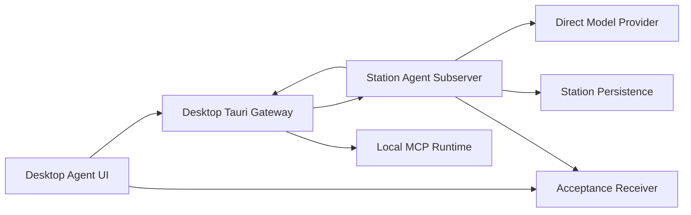

# Agent 架构设计

> **Status**: active
> **Version**: v1.0
> **Created**: 2026-10-02 | **Updated**: 2026-10-02
> **Owner**: Peers-Touch Agent Team
> **Module**: `model/domain/agent/`, `apps/station/app/subserver/agent/`, `apps/desktop/`

---

## 1. 核心原则

1. **Station 单一真源**：Agent、Conversation、Turn、Message、ToolCall 和能力绑定的业务状态由 Station 持有。
2. **客户端能力执行**：Desktop 可执行本机 MCP 等设备能力，但不得成为业务状态真源。
3. **显式能力绑定**：Agent 只能使用已声明、已绑定且当前 ready 的能力。
4. **可恢复执行**：Turn、ToolCall 和最终回复必须具备稳定身份，可在进程重启后读回。
5. **证据不越权**：Acceptance Harness 只驱动生产路径并读取结果，不创建替代业务路径。

详细产品、失败语义和运行时合同由
[`modern-chat-agent/`](./modern-chat-agent/README.md) 定义。

## 2. 系统架构



Station 决定 Turn 和 ToolCall 的权威状态。Desktop 负责用户交互、事件投影及
本机能力执行，执行结果必须带 fencing 与 lineage 返回 Station。Direct Model
Provider 通过 Station 适配器调用，不向页面暴露凭证。

## 3. 核心合同

```text
AgentCapabilityBinding
  -> CapabilityReadinessSnapshot
  -> Turn admission
  -> Station ToolCall
  -> fenced client execution receipt
  -> Station continuation
  -> final Assistant message
```

合同要求：

- Actor 与 device identity 在能力会话建立前完成验证。
- 一个 ToolCall 只产生一次受认可 side effect 和一个权威 result。
- cancel、retry、reconnect 和 replay 由稳定 Turn/ToolCall identity 约束。
- 最终 Assistant message 的 ID 与内容可由 Station 和客户端独立读回。
- Native 重启不得创建新的 Agent、Conversation 或替代回复。

## 4. 组件关系

| 组件 | 责任 | 禁止承担 |
|---|---|---|
| `model/domain/agent` | 跨层 Agent 协议与稳定类型 | 页面状态 |
| Station Agent subserver | 业务权威、持久化、Turn 与 ToolCall 编排 | 本机进程控制 |
| Desktop Tauri Agent/MCP application | 网关、本机 MCP 生命周期、设备能力回执 | 重定义 Station 状态 |
| Desktop Agent UI/runtime | 用户操作、事件消费、可见状态 | 持久化业务真源 |
| `packages/agent-catalog` | 受信 Agent/Skill/MCP catalog 合同 | 用户凭证 |
| Agent Acceptance Gate | 真实 Journey 驱动与接收方证据 | mock/fallback 业务路径 |

## 5. 运行时与接口

共享接口以 `model/domain/agent/` 为 proto 真源。Station Agent handler 暴露
Agent、Conversation、Turn、Provider、Capability Binding 和 ToolCall 操作；
Desktop 通过既有 Tauri gateway 访问这些接口，并通过 Agent runtime 投影事件。

最小可用 Native Journey 的正式证明入口为
`agent-minimum-usable-chat-native-e2e`。Browser、Mobile 与更广能力矩阵保持
显式 `UNPROVEN`，不能由该 Gate 推断。
