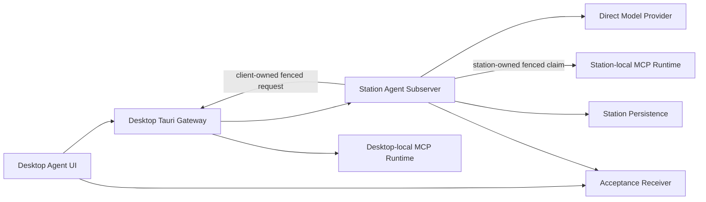

# Agent 架构设计

> **Status**: active
> **Version**: v1.3
> **Created**: 2026-10-02 | **Updated**: 2026-10-03
> **Owner**: Peers-Touch Agent Team
> **Module**: `model/domain/agent/`, `apps/station/app/subserver/agent/`, `apps/desktop/`

---

## 1. 核心原则

1. **Station 单一真源**：Agent、Conversation、Turn、Message、ToolCall 和能力绑定的业务状态由 Station 持有。
2. **执行位置显式化**：MCP transport 与 execution owner 正交；Desktop
   Rust 执行设备本地 MCP，Station 执行 Station 运行时本地 MCP。
3. **显式能力绑定**：Agent 只能使用已声明、已绑定且当前 ready 的能力。
4. **可恢复执行**：Turn、ToolCall 和最终回复必须具备稳定身份，可在进程重启后读回。
5. **证据不越权**：Acceptance Harness 只驱动生产路径并读取结果，不创建替代业务路径。
6. **单一实时出口**：业务事件先持久化，再通过共享 Station EventBus
   fan-out；模块私有总线、专属 SSE 和进度轮询不得成为并行实时架构。

详细产品、失败语义和运行时合同由
[`modern-chat-agent/`](./modern-chat-agent/README.md) 定义。

## 2. 系统架构



Station 决定 MCP Server 目录、配置元数据、能力 manifest/binding/readiness、
Turn、ToolCall 与审计的权威状态。每个 MCP Server 声明
`STATION` 或 `CLIENT_CAPABILITY` execution owner：

- `CLIENT_CAPABILITY` 在 Desktop Rust 所在设备执行 stdio/http/sse，并通过
  capability session 回传 fenced receipt。
- `STATION` 在 Station 运行时执行 stdio/http/sse，直接复用 Station ToolCall
  claim/receipt/continuation；Desktop 离线不阻断执行。

secret material 与进程状态只保留在执行位置，Station 配置真源仅持有 secret
reference。Direct Model Provider 通过 Station 适配器调用，不向页面暴露凭证。

## 3. 核心合同

```text
AgentCapabilityBinding
  -> CapabilityReadinessSnapshot
  -> Turn admission
  -> Station ToolCall
  -> execution-owner dispatch
       -> Station MCP executor
       -> fenced Desktop capability executor
  -> Station continuation
  -> final Assistant message
```

合同要求：

- Actor 与 device identity 在能力会话建立前完成验证。
- 一个 ToolCall 只产生一次受认可 side effect 和一个权威 result。
- MCP transport 不推导 execution owner；owner 只来自固定版本的 Server/Tool
  manifest。
- cancel、retry、reconnect 和 replay 由稳定 Turn/ToolCall identity 约束。
- 最终 Assistant message 的 ID 与内容可由 Station 和客户端独立读回。
- Native 重启不得创建新的 Agent、Conversation 或替代回复。

## 4. 组件关系

| 组件 | 责任 | 禁止承担 |
|---|---|---|
| `model/domain/agent` | 跨层 Agent 协议与稳定类型 | 页面状态 |
| Station Agent subserver | 业务权威、MCP 配置目录、Station-local MCP 生命周期与执行、Turn 与 ToolCall 编排 | 控制 Desktop 本地进程 |
| Desktop Tauri Agent/MCP application | 网关、Desktop-local MCP secret/进程与设备能力回执 | 持有 MCP 目录或绑定真源 |
| Desktop Agent UI/runtime | 用户操作、事件消费、可见状态 | 持久化业务真源 |
| `packages/agent-catalog` | 受信 Agent/Skill/MCP catalog 合同 | 用户凭证 |
| Agent Acceptance Gate | 真实 Journey 驱动与接收方证据 | mock/fallback 业务路径 |

## 5. 运行时与接口

共享接口以 `model/domain/agent/` 为 proto 真源。Station Agent handler 暴露
Agent、Conversation、Turn、Provider、Capability Binding 和 ToolCall 操作；
Desktop 通过既有 Tauri gateway 访问这些接口，并通过 Agent runtime 投影事件。
MCP 配置接口返回已脱敏的 Station 权威投影；Desktop 只为
`CLIENT_CAPABILITY` Server 保存本机 secret material。每个已发现 MCP tool
发布独立 manifest，使 `execution_owner` 在 admission 前固定，禁止由模型参数
或客户端临时选择。

最小可用 Native Journey 的正式证明入口为
`agent-minimum-usable-chat-native-e2e`。MCP 双运行时追加证明必须分别覆盖
Desktop-local 与 Station-local stdio，并证明 Station-local 调用在 Desktop
executor 离线时仍成功。Browser、Mobile 与更广能力矩阵保持显式
`UNPROVEN`，不能由相邻 Gate 推断。

## 6. Personal Agent OS

[`PAOS-D01` through `PAOS-D07`](./proposals/20261003-personal-agent-os.md)
extend the Agent architecture above the single-conversation runtime:

```text
Home / Atelier / Agent Canvas
            |
            v
        AgentGoal
  contract + graph + decisions
            |
            v
   TaskRun + ExecutionStep
            |
     +------+------+
     |             |
Direct Model   External Runtime
     |             |
     +------+------+
            v
 Artifact + Gate + GoalAcceptanceService
            |
            v
 durable Goal/Task event
            |
            v
 shared Station EventBus
            |
            v
 /events/stream projection
```

Station owns `AgentGoal`, graph revision, decisions, TaskRun dispatch, budget,
and terminal acceptance through `GoalAcceptanceService`. Acceptance Framework
is a read-only product proof system and never a production mutation
dependency. Agent Canvas contributes participant composition and engine intent.
Modern Chat Agent supplies Conversation/Turn execution. Atelier and Home render
Station projections and submit commands; they do not schedule work or infer
completion.

The target has one executable lifecycle: `TaskRun + ExecutionStep`.
`AgentTask` and `CollaborationTask` are migration sources, not permanent
parallel authorities. A Goal coordinator may dispatch Direct Model or
registered external runtime adapters, but those adapters can only return
events, artifacts, usage, and execution outcomes. They cannot mutate Goal
state directly.

Goal completion requires independent acceptance over immutable evidence.
Restart recovery first reconciles the Goal coordinator lease and every
in-flight TaskRun before dispatching new work. Duplicate commands and replayed
events are fenced by Goal revision, stable operation identity, and monotonic
event sequence.

Every durable Agent event follows one causal chain:

```text
Goal/Task mutation transaction
  -> domain event + AgentRealtimeOutbox commit
  -> leased retryable realtime relay
  -> typed StreamEvent adapter
  -> apps/station/app/subserver/events.EventBus.Publish
  -> canonical /events/stream
  -> idempotent Desktop/Applet projection
```

The current Agent-private `MemoryEventBus`, `EventStreamService` subscriber
registry, direct service/handler publishers, and Agent-specific stream routes
must be removed by the cutover. Durable append failure blocks publication;
shared EventBus failure leaves the outbox pending. A crash after publish may
redeliver, so projections deduplicate by stable domain event identity. Relay
order is fenced per target actor, and persisted ownership plus authenticated
context determine recipients. Outbox, subscriber, replay, and ready-frontier
buffers are bounded with terminal/control capacity reserved. Overflow produces
admission pause/rejection, disconnect, or `Resync`; snapshot plus cursor replay
is the recovery contract. Polling may perform bounded cold-load reconciliation
only; it cannot drive normal Goal progress. A sandboxed applet may drain a
bounded Desktop Host bridge queue after the Host consumes canonical SSE, but
that adapter owns neither the Station cursor nor business truth.
