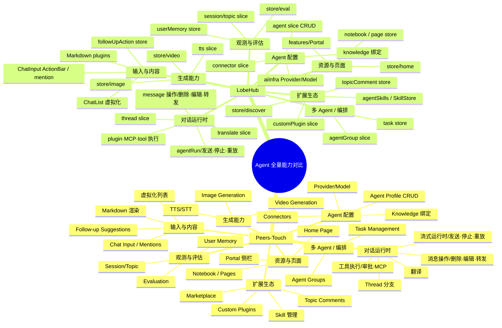

# Agent 全量能力对比脑图 — 源码级证据版（Parseable Source）

> **Status**: active
> **Created**: 2026-08-15
> **Updated**: 2026-09-08
> **Owner**: Peers-Touch Agent Team
> **Purpose**: 单总根、双产品镜像的 Agent 能力对比脑图的**可解析落盘源**。
> 每个节点携带：文本 + 状态标签 + 双侧源码引用。供 reviewer agent 做节点级审计，以及导出 SVG/mermaid 渲染。
>
> **本文件是脑图的权威源（source of truth）。** Dynamic UI panel / SVG 只是它的渲染。

---

## 0. 阅读约定

- **拓扑**：唯一总根 `Agent 全量能力对比` → 第一层 `Peers-Touch` / `LobeHub` → 能力域 → 模块 → 操作。左右严格镜像同一模块序。
- **对比方向**：左 = Peers-Touch 实现（我方），右 = LobeHub 实现（对标源）。
- **V1 / V2 语义**：指**证据等级**，不是产品版本号。项目仍处 v1 阶段。

### 证据等级（状态标签）

| 标签 | 含义 | 准入门槛 |
|---|---|---|
| `已闭环` | 按钮/入口 → handler/action → 状态字段 → 持久化/API/跨层路径 五项证据齐全 | 五项全部有源码行号 |
| `部分闭环` | 链路能跑通但缺一环（通常缺持久化或跨层落库） | 缺 1 项证据 |
| `代码存在未接线` | store/action 存在，但无页面入口 / 未注册到运行时 | 有 action，无 UI 入口或未 register |
| `缺失` | 该能力在本侧不存在 | 检索无实现 |
| `架构不同` | 有意分歧（我方拓扑不复制对方） | 有替代实现且已记录理由 |
| `未证实` | 本次未能定位到确定符号/行号 | 不得当作已实现 |

### 范围决策维度

| 决策 | 含义 |
|---|---|
| `当前闭环` | V1 已交付并跑通 |
| `当前阶段必做` | 已进入当前产品 required scope，但实现或运行证据尚未闭环 |
| `后续阶段` | 确认要对齐但当前阶段不做（仍保留在脑图中对比） |
| `能力对齐/拓扑不同` | 能力要，但按 Peers-Touch 边界重做（Station 单一真源） |
| `候选待确认` | 是否作为产品能力尚未拍板 |
| `合并能力` | 折叠进另一体系，避免重复 |
| `明确不采用` | 工程债或对方商业专有，不对齐 |

### 证据核验方法

本文件所有 Peers-Touch 行号均为 **2026-08-15 本会话对 `apps/desktop/src`、`apps/desktop/src-tauri`、`apps/station` 现网工作树的实测**。
LobeHub 行号取自 `Peers-Touch/external/lobehub/src` 现网工作树实测，其余模块路径引自同目录 [lobehub-feature-topology.md](./lobehub-feature-topology.md)（同为磁盘证据）。
**未在本会话逐行核到的节点一律标 `未证实`，不填造行号。**

---

## 1. 单总根镜像脑图（mermaid）

---

## 2. 节点级审计矩阵（每节点：文本 + 双侧状态 + 双侧源码引用 + 范围）

> 路径相对：Peers = `apps/desktop/…` 或 `apps/station/…`（`peers-ai-agent/` 下）；Lobe = `Peers-Touch/external/lobehub/src/…`。

### 2.1 能力域：对话运行时

| # | 对齐 | 操作节点（问题/按钮） | Peers 状态 | Peers 源码锚点 | Lobe 状态 | Lobe 源码锚点 | 范围决策 |
|---|---|---|---|---|---|---|---|
| R1 | ✅  发送消息 sendMessage | 已闭环 | `store/chat.ts#L903` | 已闭环 | `store/chat/slices/agentRun/actions/entries/conversationLifecycle.ts#L267` | 当前闭环 |
| R2 | ✅  重新生成 regenerate | 已闭环 | `store/chat.ts#L1129`：走 `findRegenerationPrompt`+`replacementOf`，operation 标签 `'regenerate'`；**与 retry 近乎逐行相同，无 branch 概念** | 已闭环 | `MessageActionBar/actions/regenerate.ts`→`regenerateAssistantMessage`（新 branch 非破坏性重跑）；另有 `delAndRegenerate.ts`（先删后生，破坏性）——**Lobe 有 branch/del-regenerate 语义拆分** | 当前闭环 |
| R3 | ✅  重试父消息 retry | 已闭环 | `store/chat.ts#L1257`：同 `findRegenerationPrompt`+`replacementOf`，operation 标签仅 `'retry'` 不同（见 R2 注） | 已闭环 | `features/Conversation/Error/useRetryParentMessage.ts#L7`→`regenerateUserMessage(parentId)` | 当前闭环 |
| R4 | ✅  停止流式 stop | 已闭环 | `store/chat.ts#L1484`（`stopStreaming`→`stopOperation#L1488`）：本地取消 op + **`api.stopChat(sessionKey)#L1493` 通知 Station**（跨层） | 已闭环 | `conversationControl.ts#L228`（`stopGenerateMessage`）：仅 `cancelOperations(...)` 本地 op 取消，**不直接发服务端请求**（纯客户端）——差异正面支撑「Station 单一真源」 | 能力对齐/拓扑不同 |
| R5 | ✅  工具审批 approve/deny | 已闭环 | `store/chat.ts#L1439`（`decideToolApproval`） | 已闭环 | `conversationControl.ts`（`approveToolCalling`/`rejectToolCalling`） | 能力对齐/拓扑不同 |
| R6 | ✅  断连重放 replay（reconciling→cursor） | 已闭环并通过 Native runtime proof | `src-tauri/src/application/agent_turn/mod.rs`（逐帧 SSE + bounded cursor replay，`catchup_done` 非终态）；`src/services/desktop_api.ts`（terminal snapshot 收口）；`OpStatusTray.tsx` / `GlobalOperationTray.tsx`（可见 reconciling）；identity pipeline + `chat.reset()`（logout/revoked abort 与 actor projection 清理）；current-source `agent-stream-resilience-e2e` run `20260824T185740538544Z-de8991b6a54c8890eda5a2fe9bdadfee`：seq 2→74、Desktop=Station、auth gate zero tray、re-login operation=0、cleanup PASS | 架构不同 | hetero `resumeReplay.ts`（客户端 Loop 重放） | 能力对齐/拓扑不同 |
| R7 | ✅  删除消息 delete | 已闭环 | `store/chat.ts#L1509` | 已闭环 | `.../MessageActionBar/actions/*`（`deleteMessage`） | 当前闭环 |
| R8 | ✅  编辑消息 edit | 已闭环 | `store/chat.ts#L1518` | 已闭环 | `slices/message/actions`（`toggleMessageEditing`/`modifyMessageContent`） | 当前闭环 |
| R9 | ✅  转发消息 forward | 已闭环 · Native `PROVEN` | 纯前端组合（对标 Lobe forwardMessages：序列化 transcript → 目标 agent 新会话 sendMessage，无新后端）：util `utils/forwardContent.ts buildForwardedContent`；`components/messages/ForwardMessageModal.tsx`（agent 选择器，`openAgentChatSession(target,{forceNew})`+`sendMessage`，落库由 `conversation_created` 完成）；action bar 入口 `actions/registry.ts#L41/#L60`（forward 项）+ `types.ts onForward`；接入 `AssistantMessage.tsx#L643`/`UserMessage.tsx#L242`；i18n `chat.message.action.forward`+`chat.messageForward.*`（中英）；Native Gate `agent-native-message-forward-e2e` 已完成源消息 Native DOM→forward action→目标 Station conversation readback→切换目标 Agent 后 Native DOM 可见，并验证 fixture cleanup；证据 `tooling/acceptance/reports/agent-native/r9.json`（2026-08-17） | 已闭环 | `slices/forward`（`forwardMessages`/`forwardTopic`）；UI `features/Conversation/MessageForward/` | 能力对齐/拓扑不同 |
| R10 | ✅  翻译 translate | 已闭环 | 翻译落库全链（对齐 Lobe `updateMessageTranslate`，不改 proto、不加列，寄生 `metadata_json`）：Station `conversation_service.go SetMessageTranslation`（merge metadata）+ handler `HandleSetMessageTranslation` + 路由 `/agent/conversation/message/translate` + `messagesToJSON` 输出 `metadata_json`；BFF `agent_message_translate` 命令；前端 `chat.ts#L1527 translateMessage` 追加 `api.updateMessageTranslate`（发/清均落库），回读 `cachedMessageToChatMessage#L188` 解析 `metadataJson.translation` 恢复；验收 `go build`+`cargo`+`tsc`+`check` 绿（2026-08-16） | 已闭环 | `store/chat/slices/translate/action.ts#L44`：经 `updateMessageTranslate` 落库（`#L33/#L54/#L80`） | 能力对齐/拓扑不同 |
| R11 | ✅ | Thread 分支会话 | 已闭环 | Station durable thread 全链：proto `AgentThread`+`AgentMessage.thread_id`（`agent.proto#L139/#L295`）；表/仓储 `persistence/thread.go` + `AgentMessage.ThreadID`；service `service/thread_service.go`（Create/List/ListMessages）；HTTP `agent.go#L239-241`（`/agent/thread/{create,list,messages}`）；BFF `agent_turn/mod.rs#L1432/#L1465/#L1490` + 命令注册 `main.rs#L289-291`；前端 `ThreadView.tsx` 改为 `api.listAgentThreads`→`createAgentThread`→`listAgentThreadMessages`（内存 slice 仅作 fallback）；验收：`./model/build.sh` + `go build ./app/subserver/agent/...` + `cargo build --lib` + `tsc` + `pnpm run check` 全绿（2026-08-16） | 已闭环 | `store/chat/slices/thread/action.ts#L130`（`createThread` → `threadService.createThreadWithMessage#L143` 落库） | 当前闭环 |
| R12 | ✅  复制 copy | 已闭环 | `components/messages/AssistantMessage.tsx#L620`（`onCopy: handleCopy`→`navigator.clipboard`） | 已闭环 | `MessageActionBar/actions/copy.ts` | 当前闭环 |
| R13 | ✅  继续 continue | 已闭环 | 真续写（带上下文）：`chat.ts#L1566 continueGeneration` 取最后一条 assistant 内容拼进 `chat.message.continueWithContext`（i18n 中英，「基于已生成内容继续、勿重复」）再 `sendMessage`，模型基于已生成部分接着写（后端 turn 每次 loadMessages 含 prior assistant）。**拓扑差异**：Peers 续写落新气泡（多一条 user 消息），非 Lobe 同气泡 assistant prefill——接受为能力对齐/拓扑不同；验收 `tsc`+`pnpm run check` 绿（2026-08-16） | 已闭环 | `MessageActionBar/actions/continueGeneration.ts`（client=assistant prefill 同气泡 / gateway=空 prompt+parentMessageId resume） | 能力对齐/拓扑不同 |
| R14 | ✅  删除并重生 delete&regenerate | 已闭环 | `AssistantMessage.tsx#L627`（`onDeleteAndRegenerate`→`deleteAndRegenerateMessage#L1383`） | 已闭环 | `MessageActionBar/actions/delAndRegenerate.ts`（破坏性：先删后生） | 当前闭环 |
| R15 | ✅  导出 export | 已闭环 | `AssistantMessage.tsx#L635`（`onExport`→ 拼 `# Assistant Response` 写剪贴板） | 已闭环 | `MessageActionBar/actions/share.tsx#L19`（`openShareMessageModal`）→ `features/Conversation/components/ShareMessageModal/*`（ShareText/ShareImage） | 能力对齐/拓扑不同 |
| R16 | ✅  朗读 read-aloud | 已闭环 | `AssistantMessage.tsx#L630`（`onReadAloud`→`useTTSStore.speak`，见 G3a） | 已闭环 | `MessageActionBar/actions/tts.ts` | 当前闭环 |

### 2.2 能力域：Agent 配置

| # | 对齐 | 操作节点 | Peers 状态 | Peers 源码锚点 | Lobe 状态 | Lobe 源码锚点 | 范围决策 |
|---|---|---|---|---|---|---|---|
| C1 | ✅  Provider 新建/更新 | 已闭环 | `store/provider.ts#L194`（create）/`#L115`（update，带 version 防脑裂） | 已闭环 | `store/aiInfra/slices/aiProvider`（`createNewAiProvider`/`updateAiProvider`） | 当前闭环 |
| C2 | ✅  Model 开关 toggle | 已闭环 | `store/provider.ts#L234`（`toggleModel` → `api.toggleModel`） | 已闭环 | `store/aiInfra/slices/aiModel`（`toggleModelEnabled`） | 当前闭环 |
| C3 | ✅  Agent Profile 更新 | 已闭环 | `store/agent.ts#L277`（`updateAgentProfile` → `api.updateAgent`，带 version） | 已闭环 | `store/agent/slices/agent`（`updateAgentConfig`/`updateAgentMeta`） | 当前闭环 |
| C4 | ✅  选中 Agent / 选中 Model | 已闭环 | `store/agent.ts#L97`（`setSelectedAgent`）/`#L82`（`setSelectedModel`） | 已闭环 | `store/agent/slices/agent`（`setActiveAgentId`） | 当前闭环 |
| C5 | ✅  Agent 创建 create | 已闭环 | 收口为一等 store action（对标 Lobe `createAgent`）：`store/agent.ts#L278 createAgent`（包装 `api.createAgent`→Station `/sub-agent/agent/create` 落库 → 并入 `agents` roster + `setSelectedAgent` + profile surface + `setSelectedAgent` 持久化）；UI 入口 `AgentCanvasPage.tsx#L357`/`AgentProfilePage.tsx#L1338` 由直连 api 改为调 `store.createAgent`（消除重复 payload + 移除 4 个死 selector）；验收 `tsc`+`pnpm run check` 绿（2026-08-16） | 已闭环 | `store/agent/slices/agent/action.ts#L144`（`createAgent`→service 落库→返回 agentId） | 当前闭环 |
| C6 | ✅  Knowledge 绑定 | 已闭环 · Native `PROVEN` | 收口为一等 agent↔resource 绑定关系（非 RAG 检索）：descriptor 写入后 `reconcileKnowledgeBindings` 维护 Station `agent_knowledge_bindings`；Native Gate `agent-native-knowledge-binding-e2e` 已通过 add→Station readback→disable/delete→re-enable/recreate→remove/delete，并发现/修复 GORM string primary-key delete 静默零行缺陷（显式 `WHERE id = ?` + zero-row error）；证据 `tooling/acceptance/reports/agent-native/c6.json`、截图 `c6.png`，Station Agent tests 与 Desktop check 通过（2026-08-17） | 已闭环 | `store/agent/slices/knowledge/action.ts#L29`（`addFilesToAgent`→`agentService.createAgentFiles`）/`#L40`（`addKnowledgeBaseToAgent`）。**注：此 action 仅做 file/KB id 关联（DB join 行插入）；RAG 切片/向量化在文件上传管线，不在此 action** | 能力对齐/拓扑不同 |
| C7 | ✅  Connectors 挂载/OAuth | 已闭环 · Native `PROVEN` | 三腿补齐（mount/OAuth/syncTools），复用 OAuth2 + Station-backed `chatConfig.connectors`；Native Gate `agent-native-connector-lifecycle-e2e` 强制显式 approved `AGENT_TEST_CONNECTOR_ID`，并已使用真实 GitHub OAuth connection 完成 Native mount→tool sync→Station-backed Agent config readback→unmount，disposable fixture cleanup 无残留；证据 `tooling/acceptance/reports/agent-native/c7.json`（2026-08-17） | 已闭环 | `store/tool/slices/connector`（`mountConnectorToAgent`/`startConnectorOAuth`/`syncConnectorTools`，经 `lambdaClient.connector.*` tRPC 落库） | 能力对齐/拓扑不同 |

### 2.3 能力域：多 Agent / 编排

| # | 对齐 | 操作节点 | Peers 状态 | Peers 源码锚点 | Lobe 状态 | Lobe 源码锚点 | 范围决策 |
|---|---|---|---|---|---|---|---|
| O1 | ✅  Agent Group 增删改 | 已闭环 | Station 落库全链：Go 端 M11 已建（`persistence/ecosystem.go#L10` 表 `ecosystem_agent_groups`、`ecosystem_service.go#L28/L39/L52/L60`、`ecosystem_handler.go#L28/L55/L86/L106`、路由 `agent.go#L369-372`）；BFF `agent_turn/mod.rs`（`agent_group_create/update/delete/list`）+ 命令注册 `main.rs#L292-295`；前端 `store/agentGroups.ts` 由 localStorage 改为 `api.createAgentGroupRemote/updateAgentGroupRemote/deleteAgentGroupRemote/listAgentGroupsRemote`（localStorage 清零），UI 入口 `pages/AgentGroupsPage.tsx`；验收 `cargo build --lib`+`tsc`+`pnpm run check` 全绿（2026-08-16） | 已闭环 | `store/agentGroup/slices/curd`（`updateGroup`/`updateGroupConfig`） | 当前闭环 |
| O2 | ✅  Group 成员管理/排序 | 已闭环 | `store/agentGroups.ts`：`addMember`/`removeMember`/`reorderMembers` 统一走 `updateAgentGroupRemote`（成员为有序 id 数组，reorder=整数组更新），Station `UpdateAgentGroup` 承载；UI 入口 `AgentGroupsPage.tsx`（成员增删）；验收同 O1 | 已闭环 | `store/agentGroup/slices/member`（`addAgentsToGroup`/`reorderGroupMembers`） | 当前闭环 |
| O3 | ✅  Task 生命周期 start/pause/cancel | 已闭环 | Station 全新后端全链（M11 无 task 模型，本次新建）：proto `model/domain/agent/task.proto`（`AgentTask`/`AgentSubtask` + create/list/status/delete/subtask req/resp）；表 `persistence/agent_task.go`（`agent_tasks`，subtasks JSON 列）；service `agent_task_service.go`（create/list/updateStatus/delete/addSubtask/completeSubtask + progress + owner 过滤）；HTTP `agent.go#L393-398`（`/agent/task/{create,list,status,delete,subtask/add,subtask/complete}`）；BFF `agent_turn/mod.rs`（6 命令）+ 注册 `main.rs#L299-304`；前端 `store/tasks.ts` 由 localStorage 改 Station（localStorage 清零），UI `TasksPage.tsx`（mount `loadTasks`）；验收 `./model/build.sh`+`go build`+`cargo build --lib`+`tsc`+`pnpm run check` 全绿（2026-08-16） | 已闭环 | `store/task/slices/lifecycle`（`runTask`/`cancelTopic`/`updateTaskStatus`） | 能力对齐/拓扑不同 |

### 2.4 能力域：输入与内容

| # | 对齐 | 操作节点 | Peers 状态 | Peers 源码锚点 | Lobe 状态 | Lobe 源码锚点 | 范围决策 |
|---|---|---|---|---|---|---|---|
| I1 | ✅ | @Mention | 已闭环 · Native `PROVEN` | 活体 composer popup/select/tag/remove/successful-send-clear 已由 `agent-native-mention-e2e` 在 Native Tauri 完整证明；使用真实 `claude-cli/default` runtime，Gate 独立 fail-closed 并完成 fixture cleanup。证据 `tooling/acceptance/reports/agent-native/i1.json`（2026-08-17）；源码链为 `ChatInput.tsx` + mention store/components | 已闭环 | `store/mention`（`addMentionedUser`/`setMentionedUsers`）；UI `features/ChatInput/ActionBar/Mention` | 当前闭环 |
| I2 | ✅  Follow-up 建议 | 已闭环 | **服务端已生成（原「承载字段」判定过时）**：Station `turn_service.go#L2368 GenerateFollowUpSuggestions`（agent 自有 provider/model，3s 超时，parse JSON≤3）→ `turn_handler.go#L240` 注入 `done` 事件 `follow_up_suggestions`（proto `turn_stream.proto#L93`）→ BFF 透传（`agent_turn/mod.rs#L819/#L872`）→ 前端 `store/streaming/handler.ts#L196` 收进 `followUpSuggestions`（`chat.ts#L131`）；**行为对齐**：由「点击即发」改为 Lobe `fillInputMessage` 填入不发——新增 chat store `composerFill`+`fillComposer`/`consumeComposerFill`（`chat.ts#L426/#L1599`），`MessageList.tsx#L79 onSelect={fillComposer}`，`ChatInput.tsx#L92` 消费填 draft+聚焦+清空；无 proto/后端改动（服务端本已具备）；验收 `tsc`+`pnpm run check` 绿（2026-08-16） | 已闭环 | `store/followUpAction`（`fetchFor`/`consume`/`abort`）；service `followUpAction.ts extract`（服务端模型生成，20s 超时+身份守卫）；**行为：`FollowUpChips.tsx:32-37 fillInputMessage` 仅填入输入框并聚焦，不发送** | 能力对齐/拓扑不同 |
| I3 | ✅  Markdown 渲染 | 已闭环 | 补上内联自定义标签管线（对齐 Lobe `markdownElements`）：`components/messages/markdownConfig.tsx` 用 `@lobehub/ui` Markdown 的 `allowHtml`+`allowHtmlList:['think']`+`components.think` 注入（无新依赖），`InlineThinkingTag.tsx` 渲染 `<think>` 折叠块（i18n `chat.thinking.title`）；基础 GFM/代码高亮/mermaid/latex 本就共用 `@lobehub/ui`（`LazyMarkdown.tsx`）；验收 `tsc`+`pnpm run check` 绿（2026-08-16）。注：artifact 侧栏门户/tool chip 等 Lobe 运行时强绑项不在本轮 | 已闭环 | `features/Conversation/Markdown/plugins/*`（LobeArtifact/LobeThinking/Tool/Skill/Mention…；think 经 `createRemarkCustomTagPlugin`） | 能力对齐/拓扑不同 |
| I4 | ✅  虚拟化消息列表 | 已闭环 | agent chat 链：`AgentChatPage`→`AgentWorkbench`→`ConversationRail.tsx#L53`→`ChatPage.tsx#L178`→`components/MessageList.tsx#L25`（`useVirtualizer` @tanstack/react-virtual + `useChatStore`） | 已闭环 | `features/Conversation/ChatList/`（VirtualizedList/AutoScroll/BackBottom） | 当前闭环 |

### 2.5 能力域：资源与页面

| # | 对齐 | 操作节点 | Peers 状态 | Peers 源码锚点 | Lobe 状态 | Lobe 源码锚点 | 范围决策 |
|---|---|---|---|---|---|---|---|
| P1 | ✅  Notebook / Pages CRUD | 已闭环 | `store/notebook.ts`：`createPage#L50`/`updatePage#L51`/`deletePage#L52`（乐观更新，替代 NotesPage 内 useState） | 已闭环 | `store/notebook`（`createDocument`/`updateDocument`）+ `store/page/slices/crud` | 当前闭环 |
| P2 | ✅  Portal 侧栏 | 已闭环 · Native `PROVEN` | client-side Portal 状态机已由 `agent-native-portal-navigation-e2e` 在 Native Tauri 完成 push 两视图→Back→collapse/reopen 保栈→explicit close 清栈；验收发现并修复 `DraggablePanel.onExpandChange(false)` 误调用 `close()` 的状态机缺陷，新增明确 `collapse()` 转移。证据 `tooling/acceptance/reports/agent-native/p2.json`、截图 `p2.png`（2026-08-17） | 已闭环 | `store/chat/slices/portal`：`portalStack` + `pushPortalView`/`popPortalView`/`goBack`/`goHome`/`replacePortalView`；`features/Portal/*` | 能力对齐/拓扑不同 |
| P3 | 🟨  Home Command Center（MCA-V2-H01） | 部分闭环 | `HomePage.tsx` 已有 pinned Agents、跨 Agent recent topics 与快捷入口；`AgentSidebar` 已有 pin/favorite；Station-backed `tasks.ts`、Connector panel 与 Chat readiness 可复用，但 Home 尚无 Chat/Task composer、Brief/Needs You、authoritative recents/readiness/recovery；V2 execution `Phase 2` 负责产品闭环 | 已闭环 | `features/Home/*` + `store/home/*`：pinned Agent、recents、Chat/Task input、Brief/Needs You、loading/error/empty/retry | 当前阶段必做 |

### 2.6 能力域：观测与评估

| # | 对齐 | 操作节点 | Peers 状态 | Peers 源码锚点 | Lobe 状态 | Lobe 源码锚点 | 范围决策 |
|---|---|---|---|---|---|---|---|
| E1 | 🟨  Evaluation Lab（MCA-V2-E01） | 部分闭环 | 用户入口与 UI 已存在：`EvaluationPage.tsx` + descriptor；`store/evaluation.ts` 有 dataset CRUD、真实 `quickCompletion` loop 与 cancel，但 dataset 仍在 localStorage、run/result 非 Station truth；Station 已有 `EcosystemEvalDataset`、proto 与 CRUD API；V2 execution `Phase 7` 负责产品闭环 | 已闭环 | `routes/(main)/eval/*` + `store/eval/*` + `services/agentEval.ts`；benchmark/dataset/test-case/run/experiment 全链，支持 `abortRun`/`retryRunCase`/`resumeRunCase` | 当前阶段必做 |
| E2 | ✅  User Memory | 已闭环 | `store/memory.ts#L93`（`deleteMemory`→`api.deleteMemory`）/`#L106`（`updateMemory` impl）/`#L60`（`api.listMemories`），Station-backed；UI `pages/MemoryPage.tsx#L280`（`api.listMemories`）/`#L297`（`api.deleteMemory`）/`#L152`（`api.getMemoryStats`） | 已闭环 | `store/userMemory/slices/*`（base/identity/activity/context/experience/preference） | 当前闭环 |
| E3 | ✅  Session/Topic 增删改 | 已闭环 | `store/agentTopics.ts`：`deleteTopic#L231`/`renameTopic#L242`（Station-backed） | 已闭环 | `store/chat/slices/topic` + `store/session/slices/session` | 当前闭环 |

### 2.7 能力域：生成能力

| # | 对齐 | 操作节点 | Peers 状态 | Peers 源码锚点 | Lobe 状态 | Lobe 源码锚点 | 范围决策 |
|---|---|---|---|---|---|---|---|
| G1 | ⛔  Image Generation | 长期不支持 | 无 store / page；Owner 2026-08-17 决定长期不纳入 Peers Chat Agent 产品，不保留空入口或完成度债务 | 已闭环 | `store/image/slices/*`（`createImage`/generationBatch/generationConfig） | 明确不采用 |
| G2 | ⛔  Video Generation | 长期不支持 | 无 store / page；Owner 2026-09-08 明确决定与 G1 相同，不纳入 Peers-Touch Agent 产品，也不保留未来阶段入口；如需视频生成，应由其它项目独立立项 | 已闭环 | `store/video/slices/*`（`createVideo`/`recreateVideo`） | 明确不采用 |
| G3a | ✅  TTS 朗读（客户端 read-aloud） | 已闭环 | `store/tts.ts#L51`（`speak`）/`#L108`（`getSynthesis`→`window.speechSynthesis`），Web Speech API；UI `modules/tts/index.tsx#L75`（`getVoices`） | 已闭环 | `store/chat/slices/tts/action.ts#L24`（`updateMessageTTS` 落库播放） | 当前闭环 |
| G3b | ⏸  TTS 服务端合成（synthesis） | 代码存在未接线 | `src-tauri/src/application/tts/mod.rs#L16-22`：`tts_synthesize` 返回 stub `data:audio/wav;base64,`（空）；命令注册 `main.rs#L476`，无真实合成；Owner 2026-08-17 决定当前 V2 不新增音视频生成能力 | 已闭环 | `store/file/slices/tts`（`uploadTTSByArrayBuffers`） | 后续阶段 |

### 2.8 能力域：扩展生态

| # | 对齐 | 操作节点 | Peers 状态 | Peers 源码锚点 | Lobe 状态 | Lobe 源码锚点 | 范围决策 |
|---|---|---|---|---|---|---|---|
| X1 | ✅  MCP Server 管理 | 已闭环 | `store/mcp.ts`：`createServer#L36`/`toggleServer#L91`（经 `mcpService`，Station-backed） | 已闭环 | `store/tool/slices/mcpStore`（`installMCPPlugin`）+ `features/MCP/*` | 能力对齐/拓扑不同 |
| X2 | ⛔  Custom Plugins | 代码存在未接线 | `store/customPlugins.ts`：`localStorage#L54`，凭证存 localStorage `#L19`；未注册到 ToolRegistry | 已闭环 | `store/tool/slices/customPlugin`（`installCustomPlugin`/`updateCustomPlugin`） | 合并能力（并入 connector 体系） |
| X3 | 🟨 Marketplace / Discover | 部分闭环 | 当前已实现 Desktop 本地多来源 package discover：`MarketplacePage.descriptor.tsx`→`MarketplacePage.tsx` 聚合 Desktop Rust market store 中已登记且同步成功的 JSON index source，并按 `packageType` 提供 Agent/Skill/MCP+merged Plugin tab、搜索、详情、install/uninstall。当前没有预置官方可信 source，source sync 直接读取 URL JSON，`branch` 尚未参与 Git 仓库解析；首次使用可能得到空目录。未来工作必须补齐默认可信 source、官方或联邦 catalog、来源签名/信任治理、分页与开箱数据，并增加真实 source→浏览→安装→权威 readback Acceptance。现阶段不得表述为与 LobeHub hosted market 完整对齐。 | 已闭环 | `store/discover/*`（assistant/mcp/plugin/model/provider/skill 各子域，数据来自 LobeHub Market 服务） | 后续阶段 |
| X4 | ✅  Topic Comments | 已闭环 | Station 落库全链：Go 端 M11 已建（`persistence/ecosystem.go#L24` 表 `ecosystem_topic_comments`、`ecosystem_service.go#L74/L85/L93`、`ecosystem_handler.go#L119/L146/L167`、路由 `agent.go#L375-377` create/delete/list，无 update=评论不可编辑，自洽）；BFF `agent_turn/mod.rs`（`topic_comment_create/delete/list`）+ 命令注册 `main.rs#L296-298`；前端 `store/topicComments.ts` 由 localStorage 改为 `api.createTopicCommentRemote/deleteTopicCommentRemote/listTopicCommentsRemote`（localStorage 清零），UI `TopicCommentsView.tsx`（mount 拉取 + 发/删）；验收 `cargo build --lib`+`tsc`+`pnpm run check` 全绿（2026-08-16） | 已闭环 | `store/topicComment`（`setDraft`/`upsertOptimisticComment`）+ service `topicComment.ts` | 当前闭环 |
| X5 | ✅  Skill 管理（list/toggle/delete/import） | 已闭环 | `store/skill.ts#L53`（`toggleSkill` impl→`skillService.toggle`）/`#L74`（`deleteSkill`）/`#L30`（`skillService.list`）；service `services/skill-service.ts#L44`（`toggle`→`api.toggleSkill`），另 `list/create/delete/importFromGitHub/importFromAddress`，Station-backed；UI `components/SkillsTab.tsx`/`SkillAppletSelector.tsx`/`pages/AgentProfilePage.tsx`；运行时 `runtimes/agentCapabilityRuntime.ts` | 已闭环 | `store/tool/slices/agentSkills`（`createAgentSkill`/`importAgentSkillFromGitHub`/`refreshAgentSkills`）+ `features/SkillStore/*` | 能力对齐/拓扑不同 |

---

## 3. 候选待确认（是否作为产品能力尚未拍板）

当前无候选节点。P3/E1 已进入 V2 required，G3b 已明确 deferred；G2 与 G1
均为 Peers-Touch 明确不采用的生成能力。

---

## 4. 明确不采用 / 合并 / 后续阶段（不作当前阶段 1:1 对齐）

| 项 | 类型 | 处置 | 理由 |
|---|---|---|---|
| localstorage-migration | 工程债 | 明确不采用 | 属技术迁移，非产品能力 |
| custom-plugins（独立 HTTP endpoint + localStorage 凭证） | 重复能力 | 合并进 `Tool + MCP + Connector` | 避免重复与本地凭证存储 |
| Image Generation（G1） | 非目标能力 | 长期不支持 | Chat Agent 产品不承诺图片生成；Owner 2026-08-17 明确不做 |
| Video Generation（G2） | 非目标能力 | 长期不支持 | Owner 2026-09-08 明确决定与 G1 相同，不属于 Peers-Touch；未来如需要，由其它项目独立立项 |
| TTS 服务端合成（G3b） | 当前阶段延后 | 后续阶段 | Owner 2026-08-17 决定当前 V2 不新增音视频生成能力；G3a 客户端朗读继续保留 |
| LobeHub 客户端 Agent Loop（`agents/transports/Client*`） | 架构分歧 | 架构不同 | Peers 由 Station 持有 Turn 状态机 |
| LobeHub Cloud Gateway / WebSocket 拓扑 | 架构分歧 | 架构不同 | Peers 用 Station SSE + durable event + cursor replay |
| Skill Store 托管 / 计费 / 订阅 / Composio 托管 | 商业专有 | 明确不采用 | LobeHub 商业生态，非本项目范围 |

---

## 5. 未证实 / 待深核清单

本轮 review 后，**无剩余 `未证实` 节点**（E2/I4/X4 已升级为实证状态）。仅余「已确认存在、深度未逐操作核」项：

| 节点 | 缺口 | 下一步 |
|---|---|---|
| P3 Home Command Center | pinned/recent 基础存在，但 Chat/Task composer、Brief/Needs You、readiness 与恢复未闭环 | 补 MCA-V2-H01 / V2-J01 / Phase 2 产品闭环与 Native/Station evidence |
| E1 Evaluation Lab | UI 与 Station dataset CRUD 已有，但 run/result 仍为 Desktop 本地态 | 补 Station benchmark/test-case/run/result、真实 Agent runtime、cancel/retry/readback/restart proof |

---

## 6. 计数声明（与落盘脑图一致）

- **能力域**：8（对话运行时 / Agent 配置 / 多 Agent·编排 / 输入与内容 / 资源与页面 / 观测与评估 / 生成能力 / 扩展生态）
- **操作节点总数**：**45**（R1–R16=16、C1–C7=7、O1–O3=3、I1–I4=4、P1–P3=3、E1–E3=3、G1·G2·G3a·G3b=4、X1–X5=5）
- **状态分布（Peers 侧 · 对齐 icon）**：✅ 已对齐 39 · 🟨 当前阶段必做 2（P3/E1）· ⬜ 候选 0 · ⏸ 后续阶段 1（G3b）· ⛔ 3（X2/G1/G2）= 45。历史证据分布（落地前基线）：已闭环 23 · 部分闭环 12 · 代码存在未接线 7 · 缺失 3 · 未证实 0，随落地推进逐步转 ✅。
- 历史口径演变：初版「87 操作 / 8 未证实」（旧 widget）→ 二版 40 节点（补 Skill 拆 TTS）→ **三版 45 节点**（补 R12–R16 message action bar 操作），均已作废旧值，以本表 45 / 0 为准。

---

## 7. V2 Product Closure Overlay

§2 的 `✅` 表示原子源码/行为节点已经闭环，不代表跨节点组合成的 V2
产品能力已经完成。V2 composite completion 由本表承担；它与 §2 共同构成
本文件的唯一完成度账本。

| V2 capability | 原子节点 | Journey | Phase | Required Gate | V2 状态 |
|---|---|---|---|---|---|
| MCA-V2-H01 | P3 | V2-J01 | Phase 2 | `agent-v2-home-command-center-e2e` | 🟨 required / `UNPROVEN` |
| MCA-V2-T01 | R5、C6、C7、X1、X5 | V2-J02 | Phase 3 | `agent-v2-capability-binding-e2e` | 🟨 required / `UNPROVEN` |
| MCA-V2-T02 | C3、C6、C7、X1、X5 | V2-J02 | Phase 3 | `agent-v2-capability-binding-e2e` | 🟨 required / `UNPROVEN` |
| MCA-V2-T03 | C1、C2、C4 | V2-J01/J02 | Phase 3 | Home + binding Gates | 🟨 required / `UNPROVEN` |
| MCA-V2-T04 | R5、R6 | V2-J03 | Phase 6 | `agent-v2-governed-tool-loop-e2e` | 🟨 required / `UNPROVEN` |
| MCA-V2-M01 | X1、R5、R6 | V2-J04 | Phase 4 | `agent-v2-mcp-lifecycle-e2e` | 🟨 required / `UNPROVEN` |
| MCA-V2-C01 | C7、R5、R6 | V2-J05 | Phase 5 | `agent-v2-connector-invocation-e2e` | 🟨 required / `UNPROVEN` |
| MCA-V2-O01 | R4、R5、R6 | V2-J03/J04/J05 | Phase 4/5/6 | Tool/MCP/Connector Gates | 🟨 required / `UNPROVEN` |
| MCA-V2-E01 | E1 | V2-J06 | Phase 7 | `agent-v2-evaluation-lab-e2e` | 🟨 required / `UNPROVEN` |

Overlay summary: **0/9 V2 required capabilities PROVEN**. Prototype review,
static checks, or an atomic node's historical `✅` cannot change this count.
Execution foundation status: **W0 complete; F1 in progress**. W0 proves the
proto/evidence/Gate foundation only; it does not change any product capability
from `UNPROVEN`.

---

## 8. 渲染与交接

- **可解析源（本文件）**：`docs/architecture/agent/lobehub-parity-mindmap.source.md`（含 mermaid 脑图 + §2 全节点表：`对齐` icon / 文本 / 状态 / 双侧源码引用）。
- **SVG（项目内）**：`docs/architecture/agent/lobehub-parity-mindmap.svg`，从本文件同一数据集确定性渲染；本文件为其权威源。
- **审计入口**：reviewer 从 §2 矩阵逐行核 `Peers 源码锚点` / `Lobe 源码锚点` 是否真实存在，再判状态标签是否夸大。

### 8.1 本文件已升级为「活进度看板」

§2 每节点新增 `对齐` 列，追踪对齐 LobeHub 的落地进度：

| icon | 含义 | 准入 |
|---|---|---|
| ✅ | 已对齐 | 六项证据齐全（真实入口 / handler / 状态字段 / 持久化·跨层 / 精确行号 / **验收记录**）|
| 🟨 | 进行中 | 缺验收或缺证据项 |
| ⬜ | 未开始 | — |
| ⛔ | 明确不做 | 合并 / 架构不同 / 不采用 |

- 基线（2026-08-16）：✅ 23 / ⬜ 16 / ⬜（候选）5 / ⛔ 1 = 45
- 落地执行计划：[`execution-plans/20260816-lobehub-parity-full-landing.md`](./execution-plans/20260816-lobehub-parity-full-landing.md)
- 联动规则：每节点「改代码 → 验收 → 打 ✅ + 补验收行号 → 重渲染 SVG → 计划勾选」，顺序不可颠倒。

---

## 9. Review 修正记录

### 9.1 第二轮修正（2026-08-16）

| 项 | 修正前 | 修正后 | 依据 |
|---|---|---|---|
| X5 Skill | （遗漏） | 新增，已闭环 | `store/skill.ts#L53/L74` + `skill-service.ts#L44` + `SkillsTab.tsx`，Station-backed |
| E2 User Memory | 未证实 | 已闭环 | `store/memory.ts#L93/L60/L106` + `MemoryPage.tsx#L280/L297`，Station-backed |
| X4 Topic Comments | 未证实 | 部分闭环 | `store/topicComments.ts#L18/L26` + `TopicCommentsView.tsx`，仅 localStorage |
| I4 虚拟化列表 | 未证实 | 已闭环 | `MessageList.tsx#L25` `useVirtualizer`（@tanstack/react-virtual） |
| I1 @Mention | 已闭环 | 代码存在未接线 | 活体 `components/ChatInput.tsx` 未引用 mention 系统，零活体消费者 |
| G3 TTS/STT | 单节点·代码存在未接线 | 拆 G3a 朗读(已闭环)/G3b 服务端合成(未接线) | `store/tts.ts#L51` Web Speech vs `tts/mod.rs#L16` stub |
| R2 Lobe 锚点 | `branching.ts` | `MessageActionBar/actions/regenerate.ts` | `branching.ts` 实为 `openThreadCreator` 线程创建 |
| 计数声明 | 87 操作 / 8 未证实 | 40 节点 / 0 未证实 | 与落盘脑图一致 |

### 8.2 第三轮修正（2026-08-16，读实现逻辑版）

| 项 | 修正前 | 修正后 | 依据 |
|---|---|---|---|
| A1 I4 主锚点 | 误指非 agent 组件 | 修正为 agent 域真实链路 `MessageList.tsx#L25` | agent 链 `AgentChatPage→AgentWorkbench→ConversationRail#L53→ChatPage#L178→MessageList`（`useChatStore`） |
| A2 计数笔误 | §8 写「41」 | 「40」（本轮再增至 45） | 实测 |
| A3 X5/E2 行号 | interface 声明行 | impl 行 | `skill.ts#L15→L53`；`skillService.toggle #L62→#L44`；`memory.ts updateMemory #L32→#L106` |
| B4 I2 Follow-up 行为 | 无行为对比 | 补：Peers 点击即发（`MessageList#L79 onSelect={sendMessage}`）/ Lobe `fillInputMessage` 填入不发 + chips 服务端生成 | `FollowUpChips.tsx#L29` vs Lobe `:32-37` |
| B5 R 系列遗漏 | 仅 R1–R11 | 补 R12 Copy / R13 Continue / R14 Del&Regen / R15 Export / R16 ReadAloud | `AssistantMessage.tsx#L620-640` 实际暴露；`continueGeneration#L1549` 为重发「继续」提示词非续写流 |
| B6 R2/R3 深度 | 无对齐度注 | 补：Peers regen/retry 近同（仅 op 标签），Lobe 有 branch/del-regenerate 语义拆分 | `chat.ts#L1129/#L1257` 同走 `findRegenerationPrompt`+`replacementOf` |
| B7 R4 Stop 跨层 | 无拓扑差异注 | 补：Peers `api.stopChat#L1493` 打 Station / Lobe `stopGenerateMessage#L228` 纯客户端 op 取消 | 支撑「Station 单一真源」 |
| B8 C6 Lobe 证据链 | 泛指 knowledge action | 收紧：`addFilesToAgent#L29→createAgentFiles` 仅 id 关联；RAG 索引在上传管线 | 「已闭环」= 绑定动作闭环，非检索闭环 |
| 计数 | 40 节点 | **45 节点**（+R12–R16） | §6 tally |

### 8.3 第四轮 cosmetic（2026-08-16）

| 项 | 修正前 | 修正后 | 依据 |
|---|---|---|---|
| R15 Lobe 锚点 | `features/Share/*`（泛指） | `MessageActionBar/actions/share.tsx#L19`（`openShareMessageModal`）→ `features/Conversation/components/ShareMessageModal/*` | reviewer 唯一残留项；`share.tsx#L5/#L19` 实证 |
