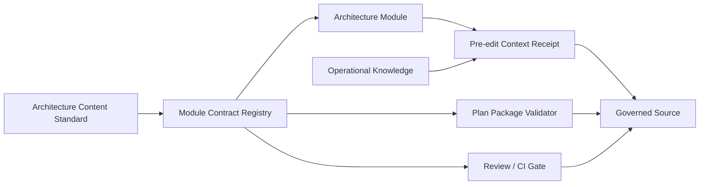

# 架构模块治理 - 架构设计

> **Status**: active
> **Version**: v1.0
> **Created**: 2026-09-27 | **Updated**: 2026-09-27
> **Owner**: Architecture Team
> **Module**: `docs/architecture/`, `tooling/scripts/`, `tooling/plugins/`

---

## 1. 核心原则

1. **目标态优先**：active 文档只描述当前允许存在的关系和契约。
2. **正向声明**：能力、owner、契约根、消费方和依赖全部使用 allowlist。
3. **单一解析器**：Hook、Plan、Review 和 CI 共享同一模块契约解析器。
4. **按特征完备**：协议、状态、ownership 和跨运行时特征决定必需文档。
5. **未知即失败**：受治理边界内未登记的接口或不完整模块不能进入实现。

## 2. 系统架构



模块文档仍是人类架构真源。机器声明是其闭合投影，只能引用已接受的 owner、
能力和依赖，不能自行发明语义。

## 3. Sources Of Truth

| Concern | 唯一真源 |
|---|---|
| 文档结构与内容最低要求 | `docs/global/architecture-document-standard.md` |
| 模块边界与语义 | 对应 `docs/architecture/<module>/` 文档集 |
| 机器治理声明 | `architecture-modules.json` |
| Station 公共能力 | `docs/architecture/api-ownership/station-api-capabilities.yaml` |
| 路径级运行知识 | `docs/knowledge/` |
| 执行范围与授权 | 当前绑定 Plan Package |
| 编辑前治理结果 | Hook 生成的只读 Context Receipt |

机器声明不得复制完整协议；它只登记稳定 ID、真源路径和消费关系。

## 4. 模块内容契约

每个登记模块必须声明模块特征：

```json
{
  "protocol": true,
  "stateMachine": true,
  "ownership": true,
  "crossRuntime": true
}
```

必需文档按以下规则推导：

| 条件 | 必需文件 |
|---|---|
| 所有 active 模块 | `README.md`、`design.md`、`decisions.md` |
| `protocol`、`stateMachine` 或 `persistence` | `data-model.md` |
| `ownership` 或 `moduleLayout` | `module-layout.md` |
| `crossRuntime` 或 `integration` | `integration.md` |

声明中的 `requiredDocuments` 必须与推导结果一致。文档缺失、状态不一致、
决策未接受或索引不可发现均为失败。

## 5. 正向能力契约

每个模块登记其当前能力：

```json
{
  "id": "architecture.module.validate",
  "owner": "architecture.governance",
  "contractRoots": ["tooling/scripts/architecture"],
  "consumers": [
    "tooling/scripts/plan",
    "tooling/scripts/review",
    "tooling/plugins/pt-ew-plugin"
  ],
  "allowedDependencies": ["node.fs", "node.crypto"],
  "evidenceGates": ["architecture-module-governance"]
}
```

约束：

- `id` 在全局唯一；
- owner、契约根和 consumer 均必须非空且指向当前路径；
- 受专用 capability registry 管理的模块只引用稳定 capability ID；
- validator 必须证明引用 ID 存在；
- 声明不得包含 retired、legacy、alias、denylist 或 superseded 字段；
- 受治理边界发现的新接口若没有正向登记，校验失败。

## 6. 编辑前上下文

```text
tool request
  -> normalize target paths
  -> match docs/knowledge owns
  -> match architecture governed paths
  -> validate matched module contracts
  -> read matched source documents
  -> compute immutable receipt digest
  -> allow with compact context, or deny
```

Context Receipt 包含：

- 规范化目标路径；
- 命中的 knowledge 文件及内容摘要；
- 命中的架构模块、必读文档和 capability ID；
- registry 与输入摘要；
- 单一 SHA-256 receipt digest。

回执是本次编辑前加载证据，不是新的架构真源，也不写入仓库或机器状态。

## 7. Plan 与 Review

Plan Package 的 architecture sources 命中已登记模块时，校验器必须同时证明：

- 模块声明有效；
- 必需文档齐全且为 `active`；
- Plan decisions 均为模块已接受决策；
- 模块在 `docs/README.md` 可发现；
- capability registry 引用完整。

Review/CI 对 changed paths 执行相同校验。修改 active 架构模块但没有模块声明时
直接失败，防止用未登记文档绕开规则。

## 8. 组件关系

| 组件 | 职责 | 不得承担 |
|---|---|---|
| Module Registry | 模块、路径、能力和证据的正向登记 | 业务语义设计 |
| Governance Parser | 解析、匹配、校验和生成回执 | 修改文档或 Plan |
| Workflow Hook | 调用解析器并注入上下文 | 持久化业务状态 |
| Plan Validator | 校验已登记 architecture sources | 选择或执行 Task |
| Review Gate | 校验 changed paths 与完整模块 | 替代架构评审判断 |

## 9. Failure Semantics

| Failure | 结果 |
|---|---|
| registry schema 非法 | fail closed |
| active 模块缺必需文档 | fail closed |
| 决策未接受或不在声明中 | fail closed |
| capability ID 不存在 | fail closed |
| active 架构模块被修改但未登记 | fail closed |
| knowledge 或架构文档无法读取 | 编辑前拒绝 |
| 无匹配模块的普通源码修改 | 继续执行 knowledge 匹配 |

## 10. 质量结果

任一受治理修改都能回答：

1. 哪个架构模块拥有该路径？
2. 必须先读取哪些当前文档和运行知识？
3. 哪些能力、owner、consumer 和依赖被允许？
4. 哪个 Plan decision 授权本次实现？
5. 哪个 Gate 证明声明、实现和索引仍一致？
