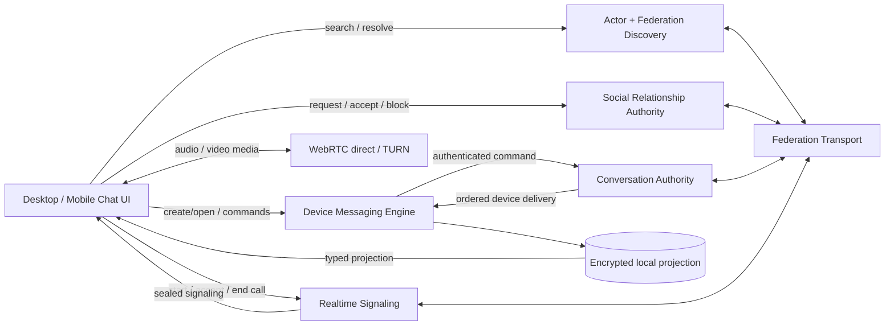

# Chat Lifecycle - Architecture Design

> **Status**: active
> **Version**: v1.1
> **Created**: 2026-09-16 | **Updated**: 2026-09-17
> **Owner**: Chat Product Team
> **Module**: `apps/desktop/`, `apps/mobile/`, `apps/station/app/subserver/`

---

## 1. Design Level

Chat Lifecycle is a cross-domain product-composition architecture. It does not
create a new business authority. It defines the only allowed composition of
existing owners needed to complete the user-visible Chat lifecycle.

Upstream sources:

- `docs/architecture/api-ownership/`
- `docs/architecture/messaging-platform/`
- `docs/architecture/social-runtime/`
- `docs/architecture/realtime/event-stream.md`
- `docs/architecture/realtime/voice-video-calls.md`
- `docs/architecture/federation/`
- `docs/client/chat/`

## 2. Evidence Ledger

| Claim | Class | Evidence | Confidence |
|---|---|---|---|
| Basic Chat currently fails its product readiness contract | verified_fact | Current acceptance coverage is 1/11 Chat and 0/9 Mobile; current interaction report fails | high |
| Find-person through first-message is not one accepted Journey | verified_fact | Messaging J01 starts after authentication with an already selectable Bob conversation | high |
| Desktop voice notes have real capture/send/playback code | verified_fact | `ChatComposer`, `useChatVoiceRecorder`, and `AttachmentItem` | high |
| Recorded voice lacks a complete product contract and proof | verified_fact | No duration persistence, progress/seek/retry contract, Mobile recorder, or Gate | high |
| Desktop live voice/video has a real WebRTC foundation | verified_fact | `callP2p`, `CallSurface`, Realtime signaling, and TURN discovery | high |
| Current Chat readiness is not proven | verified_fact | Stored evidence binds older source; current worktree has no matching aggregate | high |
| A lifecycle-level integration owner is required | inference | Individual domains contain substantial code, but no source governs their user-facing composition | high |
| Existing domain ownership should remain unchanged | accepted_decision | CHAT-D01 through CHAT-D06 | accepted |

## 3. Core Principles

1. Product journeys cross domains; business truth does not.
2. Actor/Social owns discovery and relationships.
3. Conversation owns conversation and group business facts.
4. Device Messaging Engine owns device-private encryption, durable delivery,
   local plaintext projection, attachments, and voice-note bytes.
5. Realtime owns sealed live-call signaling; WebRTC/TURN owns live audio/video
   media.
6. UI submits intents and renders typed projections; it never fabricates
   terminal truth.
7. Every readiness claim is current-source and receiver-perspective.
8. No alias, fallback, dual write, legacy owner, or undeclared debug egress is
   permitted.

## 4. System Topology

## 5. Ownership

| State | Source of truth | Local projection |
|---|---|---|
| Actor identity and discoverability | Actor / Federation Discovery | Client profile cache |
| Friendship and block state | Social | Client relationship projection |
| Conversation and membership | Conversation | Device Messaging Engine projection |
| Message and interaction order | Conversation event sequence | Engine SQLCipher projection |
| Device delivery and consumption | Device Inbox | Engine cursor/marker |
| Plaintext, ratchet, MLS private state | Device Messaging Engine | Encrypted local store only |
| Attachment and voice-note bytes | Encrypted object plane + Engine metadata | Verified local cache |
| Typing | Authenticated ephemeral Realtime path | Receiver TTL state |
| Live call lifecycle | Client call runtime plus sealed signaling facts | Runtime-owned call projection |
| Live audio/video media | WebRTC peers | No Station media state |

## 6. Lifecycle Composition Contracts

### 6.1 Discovery To Conversation

- Search returns canonical Actor identity and verified Home Station metadata.
- Relationship history projects one row per counterparty PTID with latest
  authority state and total request attempts; display names never define
  identity.
- Federation runtime joins Station peer IDs to authoritative Station names for
  human-readable summaries, while raw identifiers remain copyable details.
- Social relationship acceptance is the only friendship truth.
- Conversation creation consumes the selected PTID and verified routing
  context; duplicate creation converges on one Direct ID.
- Relationship and conversation events trigger runtime-owned reconciliation.
- UI keeps the selected peer and typed failure until success or explicit exit.

### 6.2 Durable Messaging

- The Engine persists a logical intent and exact command before network submit.
- Conversation accepts one ordered fact and creates required device deliveries.
- Each receiver commits private state, plaintext projection, marker, and cursor
  before ACK.
- Command result readback never advances the authority head; ordered delivery
  remains the committed projection input.
- Conversation list and message surfaces read the same Engine projection.

### 6.3 Rich Media And Voice Notes

- Voice note is a typed audio specialization of the encrypted attachment plane.
- Encrypted private metadata carries MIME/container, duration, and optional
  bounded waveform summary; Station cannot read it.
- Capture and preview remain local draft state until durable send admission.
- Playback uses only the fully verified local cache.
- Transfer progress and playback progress are separate typed states.

### 6.4 Groups

- Group creation and all membership/role/owner/name/dissolve changes are
  Conversation commands and ordered events.
- MLS transition and membership fact are one accepted transition.
- UI cannot mark a group ready before authoritative membership and local MLS
  projection agree.
- Legacy `/group-chat/*` mutation paths are deleted after consumers cut over.

### 6.5 Live Voice And Video

- Live voice and video use existing `CallSignal` over the Realtime stream.
- Signaling payloads remain sealed; Station validates sender, relationship,
  route, size, expiry, and replay metadata without reading SDP or candidates.
- Client call runtime owns permission, ringing, WebRTC, ICE/TURN, media tracks,
  reconnect, timeout, and teardown across page navigation.
- Video uses the same call identity and signaling lifecycle while adding camera
  permission, local preview, remote video, camera toggle, and camera-device
  selection.
- Conversation membership identifies the Direct peer but does not own media.
- Text messaging continues through the durable messaging path during calls.

## 7. Failure Semantics

| Failure | Required behavior |
|---|---|
| Search/resolve unavailable | Preserve query and scope; show retry |
| Relationship command uncertain | Preserve pending identity; reconcile canonical state |
| Direct creation failed | Preserve peer-bound pane; inline retry |
| Message submit timeout | Keep exact durable command retrying |
| Message terminal failure | Show failed-actionable; never read/delivered |
| Attachment/voice transfer interrupted | Resume from verified checkpoint |
| Microphone denied | Preserve draft context; show permission action |
| Camera denied | Preserve the conversation; expose retry or audio-only exit without false video-active state |
| MLS/membership mismatch | Stop send; reconcile before ready |
| Call network loss | Enter reconnecting, then recover or terminate visibly |
| Station/restart loss | Reopen durable projections and workers |
| Evidence identity mismatch | Fail the Gate; never substitute fixture values |

## 8. Allowed And Forbidden Relationships

Allowed:

- UI -> typed client runtime intent.
- Client runtime -> declared resource-owner API.
- Conversation -> Device Inbox and Federation for ordered delivery.
- Realtime -> Federation for sealed cross-Station call signaling.
- Engine -> encrypted object plane for attachments and voice notes.

Forbidden:

- UI -> direct Station database or foreign Station.
- Social or UI -> duplicate Conversation creation truth.
- Realtime/SSE frame -> durable message truth.
- Chunked file transfer -> claimed live voice stream.
- Client fixture -> observed identity or success result.
- Production source -> hard-coded debug/telemetry endpoint.
- Legacy friend/group Chat route -> fallback business owner.

## 9. Quality Gates

The architecture is falsified when any required journey lacks:

- real producer and receiver actions;
- authoritative and device-local readback;
- failure/restart evidence appropriate to the changed state;
- privacy/log scans;
- required Desktop and Mobile runtime cells;
- reverse-order cleanup.

The specific Gate mapping is defined only in `acceptance-matrix.md`.
