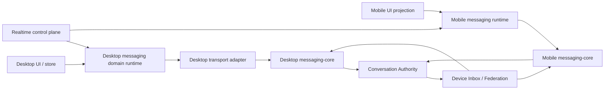

# Chat Lifecycle - 模块目录结构

> **Status**: active
> **Version**: v1.0
> **Created**: 2026-09-22 | **Updated**: 2026-09-22
> **Owner**: Chat Product Team

---

## 1. 目标目录

```text
model/domain/chat/                         canonical command/event/projection contracts
model/domain/realtime/                     typed projection and call-control notifications
packages/messaging-core/                   durable client state machine and encrypted projection
apps/station/app/subserver/conversation/   shared Conversation authority
apps/station/app/subserver/realtime/       Realtime routing and call-resolution control plane
apps/desktop/src/messaging/runtime.ts      Desktop Web Messaging domain runtime
apps/desktop/src/runtimes/messagingRuntime.ts
                                           thin Desktop Kernel descriptor
apps/desktop/src/services/im-service.ts    transport-only typed adapter
apps/desktop/src/store/socialChat.ts       UI projection container and pure projection actions
apps/mobile/src/runtimes/messagingRuntime.ts
                                           Mobile Messaging runtime descriptor/domain adapter
tooling/acceptance/gates/chat/             mixed-client and zero-reference proof
```

## 2. 文件职责

| Path | Responsibility |
|---|---|
| `model/domain/chat/` | 跨进程 command、event、projection、error 真源 |
| `model/domain/realtime/` | Realtime notification 与 call control contract |
| `packages/messaging-core/` | command/outbox/inbox、crypto、cursor、receipt、recovery 的唯一跨端本地状态机 |
| `apps/station/app/subserver/conversation/` | Conversation、membership、sequence 与 ordered fact |
| `apps/station/app/subserver/realtime/` | sealed signaling 路由与 durable call-resolution CAS |
| `apps/desktop/src/messaging/runtime.ts` | Desktop Chat command admission、scope、event、reconcile 与 teardown |
| `apps/desktop/src/runtimes/messagingRuntime.ts` | 将 domain runtime 适配为 Kernel `RuntimeDescriptor` |
| `apps/desktop/src/services/im-service.ts` | Tauri/HTTP transport mapping；不拥有业务 lifecycle |
| `apps/desktop/src/store/socialChat.ts` | 可观察 projection 与纯状态更新；不拥有后台 lifecycle |
| `apps/mobile/src/runtimes/messagingRuntime.ts` | Mobile session scope、native Engine activation、projection delivery 与 reconcile |
| `tooling/acceptance/gates/chat/` | mixed-client receiver proof、runtime-cell proof 与九维 zero-reference proof |

## 3. 依赖关系



允许：

- UI 读取 projection，并把用户 intent 交给本平台唯一 Messaging runtime。
- Runtime 通过 typed transport adapter 调用 native Messaging Core。
- Social runtime 读取 typed Conversation identity 以补充 Social 展示信息。

禁止：

- UI 或 store 直接绕过 Messaging runtime 提交 Chat command。
- `socialRealtime` 写入 message、conversation、receipt、typing、attachment 或 Chat
  settings projection。
- Desktop Kernel descriptor 自己实现第二套 domain lifecycle。
- Desktop/Mobile adapter 解释 crypto、ACK、authority sequence 或 replay。
- 旧 Friend/Group route、store、schema、fixture 或 alias 作为 fallback。

## 4. 生命周期

Desktop 与 Mobile Runtime 都绑定：

```text
actor_ptid + station_peer_id + profile_id + endpoint_id + activation_generation
```

旧 scope 必须在新 scope 激活前失效。Teardown 需要停止 timer/subscription、清除
dedupe 与 queued callback，并清空旧 Chat projection。Runtime 通过即时 typed event
和周期 canonical readback 两条路径维持 projection freshness。
