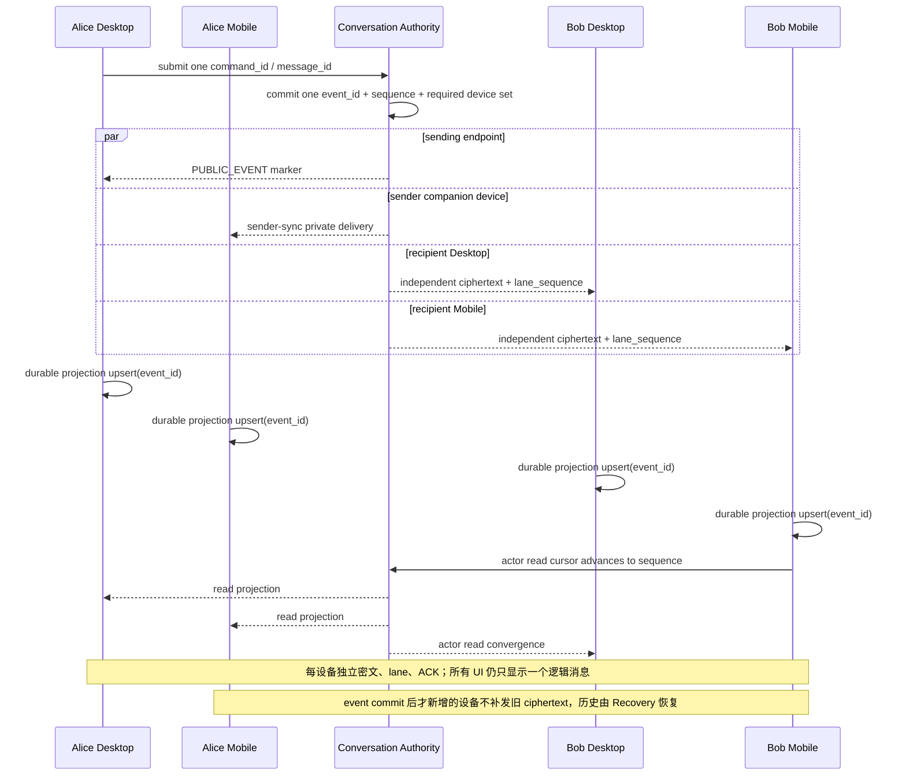
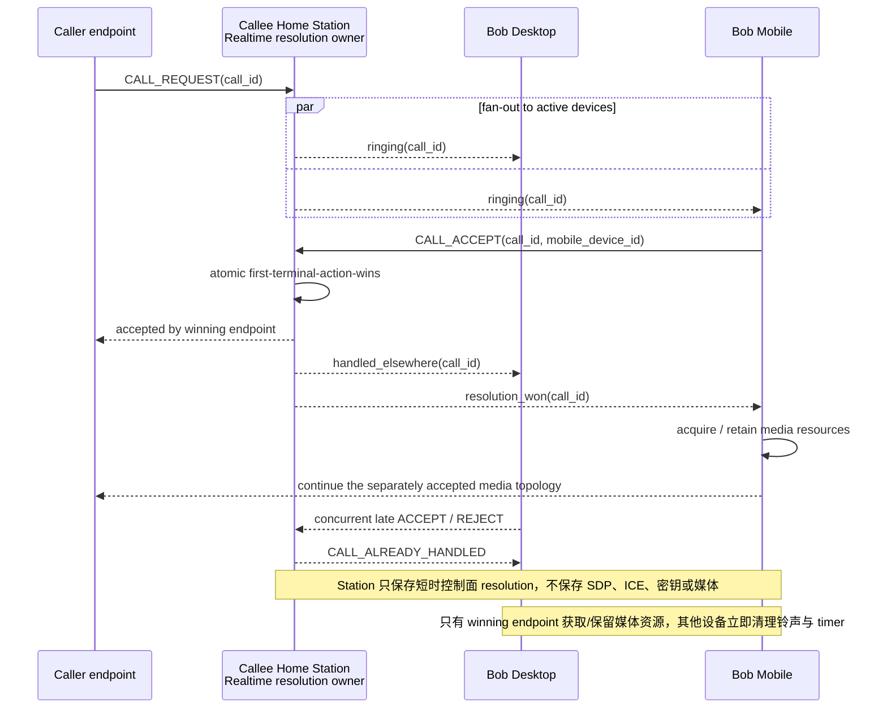
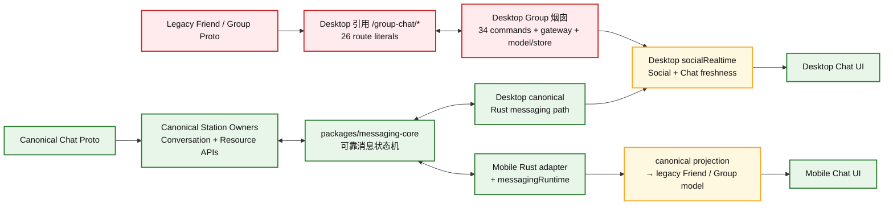
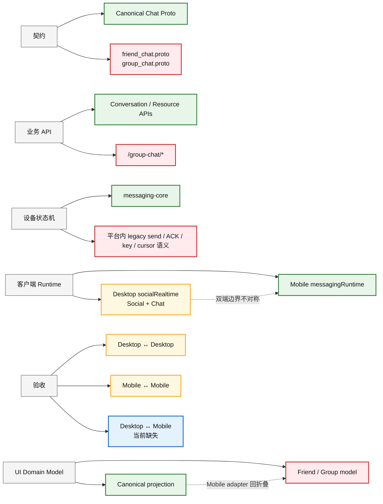
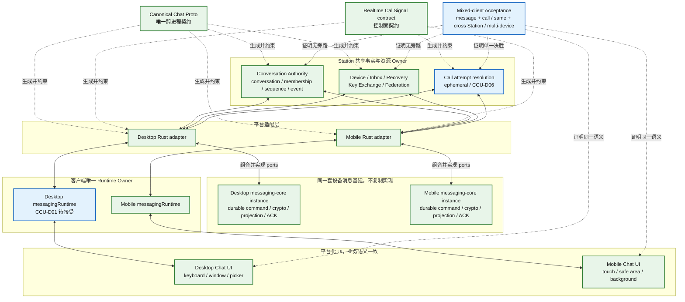
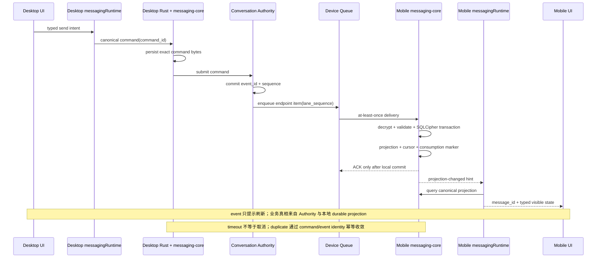
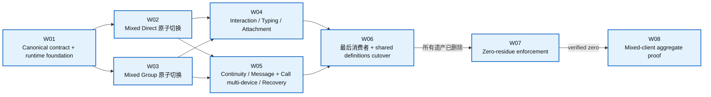

# Desktop 与 Mobile Chat 统一项目

> **Status**: draft
> **Version**: v0.11
> **Created**: 2026-09-21 | **Updated**: 2026-09-22
> **Owner**: Chat Product Team / Messaging Platform Team
> **Project ID**: `chat-client-unification`
> **Scope**: Desktop 与 Mobile Chat 联调、遗产清零、客户端架构统一
> **Evidence Baseline HEAD**: `c7a1e60ce496e87d7da13df4e8f4037deaf3ca90`

---

## 1. 文档定位

本文档定义一个待评审的新项目，用于统筹 Desktop 与 Mobile Chat 的：

- 产品语义对齐；
- 客户端运行时与 projection 架构统一；
- Direct、Group、MLS、附件、回执、Typing 和恢复能力联调；
- legacy Proto、HTTP route、Tauri command、store 和 adapter 清零；
- Desktop 与 Mobile 混合客户端 Acceptance 建设。

本文档是项目立项提案，不是已绑定的 Plan Package，不记录当前 Task、Session、
进度或完成声明。文档通过评审后，应由新的 Development Run 创建并绑定正式执行计划。

本项目按“基础设施收敛项目”而不是“两个客户端临时打通项目”治理。后续 Direct、
Group、Interaction、Attachment、Recovery 以及依赖 Chat identity/membership 的能力，
都必须建立在同一主干上；不允许为某个新功能再次建立平台专属 Chat 烟囱。

本文档不重新定义：

- Conversation Authority、Device Messaging Engine、Federation 或 Recovery 的领域所有权；
- Chat 页面视觉布局；
- Voice/Video 通话媒体拓扑、编解码或 SFU/TURN 实现；本项目只定义 Desktop/Mobile
  同时在线时必须统一的来电 fan-out、接听/拒绝仲裁和 sibling-device 收敛语义；
- Desktop 或 Mobile 平台通用生命周期。

上述内容继续分别由 Messaging Platform、API Ownership、Chat Lifecycle、
Cross-Client Chat UX 和各平台文档拥有。

### 1.1 图示导航

| 图 | 回答的问题 |
|---|---|
| §4.4 当前架构总图 | 哪些是合理主干，Desktop/Mobile 的旁路在哪里 |
| §4.5 重叠与烟囱剖面 | 每一层为什么会出现多个解释和多个 Owner |
| §5.1 最终目标 | 统一后的 Chat 与基建模块如何分层 |
| §3.5 多设备消息同步 | 同一 actor 的 Desktop/Mobile 如何获得同一逻辑消息与 read 状态 |
| §3.6 多设备通话处理 | 一端接听/拒绝后，其他设备如何停止响铃并收敛 |
| §6.2 端到端消息链路 | 一条消息如何跨 Desktop、Station、Mobile，并在何处 ACK |
| §6.3 保留、收敛与删除 | 哪些模块继续使用，哪些收窄，哪些必须硬删除 |
| §9 Hard-cut DAG | 如何在不保留兼容层的前提下落地 |

## 2. 项目背景

Peers-Touch 已经建立统一 Messaging Platform：

- Model 定义跨端 Proto 契约；
- Conversation Authority 持有 conversation、membership、authority sequence 和
  committed event；
- Device Messaging Engine 持有设备加密、durable command、ordered inbox、
  SQLCipher projection、ACK 和 recovery；
- Desktop 与 Mobile 都依赖 `packages/messaging-core`；
- UI 应只提交 typed command、读取 projection、展示 typed state。

但是，现有 Desktop 与 Mobile 并未在同一个客户端边界上完成硬切换：

1. Desktop 仍注册并调用完整的 `group_chat_*` Tauri command 集合。
2. Desktop Rust 仍直接请求 `/group-chat/*` legacy HTTP route。
3. Desktop Web 仍公开 `groupChat*` API，并广泛消费 `friend_chat_pb` /
   `group_chat_pb` 类型。
4. Mobile 已读取 canonical Messaging projection，但随后又转换成 legacy
   Friend/Group UI model。
5. 两端 projection event、runtime lifecycle、状态映射和错误展示没有统一契约。
6. 当前 Acceptance 分别覆盖 Desktop↔Desktop 与 Mobile↔Mobile，没有
   Desktop↔Mobile mixed-client runtime cell。

结果是“共享 Core 已存在”不等于“客户端已经统一”。任何一端都可能继续通过旧接口、
旧类型或旧状态机运行，从而让跨端联调变成两个局部实现之间的偶然兼容。

## 3. 需求

### 3.1 用户需求

`CCU-C01` 同一用户和联系人在 Desktop 与 Mobile 上看到相同 conversation 身份、
成员关系、消息顺序和历史。

`CCU-C02` Desktop 与 Mobile 可以互相发送 Direct 与 Group 消息，并获得一致的
queued、retrying、accepted、delivered、read、failed 和 terminal 可见状态。

`CCU-C03` 任一端离线、重连、重启或切换设备后，不丢消息、不重复显示、不回退到旧
Chat owner。

`CCU-C04` Group 创建、加人、移除、角色变更、Owner 转移、退群、解散和 MLS epoch
在两端一致。

`CCU-C05` Reply、thread、edit、retract、reaction、pin、read 和 typing 在两端收敛。

`CCU-C06` 图片、文件和语音附件在两端保持相同 message identity、byte hash、私有
metadata、可用性和恢复行为。

`CCU-C07` Desktop 与 Mobile 使用符合各自平台的交互，但不得改变共享 Chat 语义。

`CCU-C08` 同一 actor 在 Desktop 与 Mobile 同时登录时，消息、read cursor、来电和
通话终态必须跨 active devices 收敛；在一个设备接听或明确拒绝后，其他设备停止响铃
并显示“已在其他设备处理”，不能继续建立第二个媒体会话。

### 3.2 工程需求

`CCU-E01` Model 是跨端协议唯一真源。

`CCU-E02` `packages/messaging-core` 是客户端可靠消息状态机唯一实现。

`CCU-E03` Station Conversation 是 Chat 业务 API 唯一入口；Device、Inbox、
Recovery、Key Exchange 和 Federation 由各自 resource owner 暴露。

`CCU-E04` Desktop 与 Mobile 各自只有一个 Messaging Runtime owner。

`CCU-E05` 两端通过同一 canonical client contract 提交 command、读取 projection、
接收 projection notification 和执行 reconciliation。

`CCU-E06` 迁移采用原子硬切换，不增加 compatibility shim、fallback read、dual write
或长期 feature flag。

`CCU-E07` 每个旧 owner 只有在全部生产消费者切换且 mixed-client Gate 通过后删除。

`CCU-E08` 最终必须有 tree-wide zero-reference Gate，禁止 legacy 路径重新进入。

`CCU-E09` 消息沿用 Authority-selected per-device fan-out 和 actor-scoped monotonic
read cursor；通话必须有一个 Realtime control-plane resolution owner，以同一
`call_id` 对并发接听/拒绝执行 first-terminal-action-wins，不把媒体、SDP 或 ICE
plaintext 放入 Station。

### 3.2.1 遗产删除铁律

本项目不是“兼容旧架构”的迁移项目，而是把旧架构从当前代码树彻底移除。项目完成时：

1. 删除 legacy Proto 输入以及由其生成的 TS、Go、Rust descriptor/type 产物。
2. 删除 legacy HTTP routes、Tauri commands、handlers、registries、dispatch 分支和
   public exports；不允许改名后继续调用。
3. 删除 legacy Friend/Group domain models、projection adapters、stores、
   repositories、schema owners、旧表 read/write path 和 fallback query。
4. Legacy 数据、旧表和旧本地缓存均视为研发阶段可丢弃状态，在同一 cutover 直接
   drop/delete。禁止新增 migration、importer、normalizer、compatibility reader 或
   任何“先转换再保留”的历史数据路径。
5. 删除只验证旧行为的 tests、fixtures、mocks、Acceptance Gates 和 scripts；有价值的
   行为断言改写为 canonical mixed-client Gate。
6. 删除 `_old`、`_legacy`、`_deprecated`、`v2` 并存实现、re-export bridge、feature
   flag、注释掉的旧代码和“后续再迁移” TODO。
7. 不把实现复制到 `legacy/`、`deprecated/` 或 `archive/` 目录；当前实现树只包含
   canonical owner。
8. current-source 架构、平台和开发文档必须只描述 canonical owner。本提案的 accepted
   内容落入正式真源后，从当前代码树删除本提案，不保留 superseded 项目副本。

唯一治理例外是项目规定 append-only 的 `docs/knowledge/`：旧知识条目只能标记
`superseded-by`，不得继续触发或约束当前实现。除此之外，当前源码、生成链、注册表、
运行时、测试和 current-source 文档没有 legacy 留存白名单。

这里删除的是 legacy 实现及其研发数据。由 canonical Messaging Platform 产生的正常
消息历史、附件、read cursor 和 Recovery 数据属于当前产品事实，不属于历史兼容包袱。

任何一项未删除，W07 即失败，项目不得进入 aggregate proof 或宣称完成。

### 3.3 产品 Journey

| Journey | 起点与用户动作 | 接收方结果 | 失败与恢复 | 关联需求 |
|---|---|---|---|---|
| CCU-J01 Mixed Direct | 已认证用户在 Desktop 或 Mobile 打开/复用 Direct 并发送文本 | 另一平台立即显示相同 conversation/message identity 和 exact plaintext | queued/retrying/failed 可见；unknown outcome 经 readback 收敛 | C01-C03、C07 |
| CCU-J02 Mixed Group | Desktop 与 Mobile 用户创建或进入同一 Group，执行加人、角色、Owner、消息操作 | 所有 active endpoint 收敛到相同 membership、authority sequence、MLS epoch 和内容 | stale epoch、remove、rejoin、restart 均有 typed state | C01、C02、C04、C05 |
| CCU-J03 Mixed Interaction | 任一平台执行 reply/thread/edit/retract/reaction/pin/read/typing | 另一平台按相同 event/message identity 更新 projection | duplicate、disconnect、TTL、重启后不产生假失败或残留 typing | C03、C05 |
| CCU-J04 Mixed Attachment | 任一平台发送图片、文件或语音附件 | 另一平台按相同 message/attachment identity 打开 byte-identical 内容 | 中断可续传；grant、下载或本地提交失败可操作恢复 | C03、C06 |
| CCU-J05 Continuity | 一端离线、终止、重启、切换 Station/actor/endpoint 或新增设备 | 恢复后历史、未读、状态和最新消息与 Authority/Core 一致 | exact replay、reconcile、revoke 和 fresh-install fail closed | C01-C06 |
| CCU-J06 Legacy Absence | 用户完成上述任一 Journey | 全链路只经过 canonical owner | 任何 legacy command/route/type/runtime trace 使 Gate 失败 | C01-C08、E01-E09 |
| CCU-J07 Same-Actor Multi-Device Messaging | 同一 actor 同时登录 Desktop 与 Mobile，并从任一端发送或读取消息 | sender companion device 和所有 required recipient devices 以同一 `event_id` / `message_id` 收敛；read 在 actor devices 间单调推进 | 离线 active device 走 durable queue；新设备不补发旧 ciphertext；revoked device 无 future item | C01-C03、C05、C08 |
| CCU-J08 Cross-Device Call Resolution | 同一被叫 actor 的 Desktop 与 Mobile 同时收到语音/视频邀请，并在任一端接听或明确拒绝 | 只有一个 handling endpoint 进入 media session；其他 sibling devices 立即停止响铃并进入 `handled_elsewhere` | 并发 accept/reject 由一个 control-plane owner 决胜；重复、迟到或断线信号不能重启来电 | C07-C08、E09 |

Direct 和 Group Journey 必须双向执行：Desktop sender→Mobile receiver 与 Mobile
sender→Desktop receiver。单向成功不能证明互操作。

### 3.4 用户可见状态

| 状态 | 用户看到什么 | 允许动作 | 禁止误导 |
|---|---|---|---|
| ready | conversation 与本地 projection 可用 | 发送、互动、搜索、打开附件 | 不得暗示全部远端在线 |
| queued | command 已进入 durable outbox | 继续使用 Chat、查看等待状态 | 不得显示 delivered |
| retrying | 系统正在重放同一 command bytes | 等待或查看错误详情 | 不得创建新 message identity |
| accepted | Authority 已接受 command | 等待 receiver/delivery/read projection | 不得因本地 timeout 显示失败 |
| delivered | receiver endpoint 已 durable consumption | 查看 delivery 状态 | 不得等同全部设备已读 |
| read | canonical read cursor 已覆盖消息 | 查看 read 状态 | 不得由页面打开动作猜测 |
| reconciling | event 可能丢失，Runtime 正在读取 authoritative projection | 继续查看已提交内容 | 不得清空历史或回退旧 API |
| degraded | typing、presence 等 ephemeral 能力暂不可用 | 继续可靠消息 Journey | 不得把 ephemeral 失败升级为消息失败 |
| retryable-failure | typed failure 允许重试 | 重试同一逻辑 command | 不得静默改写 payload |
| terminal-failure | typed failure 明确不可重试 | 查看原因、修正输入或权限 | 不得无限重试 |
| unauthorized/stale | actor、endpoint、membership 或 epoch 无效 | 重新认证、刷新 membership 或恢复 | 不得读取旧 scope 或继续解密 |
| restored | restart/recovery 后 durable projection 已重建 | 继续原 Journey | 不得生成重复消息或跳过 ACK 边界 |
| ringing_all_devices | 同一 actor 的 eligible active devices 显示同一 `call_id` 来电 | 任一端接听或明确拒绝 | 每设备生成独立 call attempt |
| active_here | 当前 endpoint 赢得接听仲裁并建立媒体会话 | 通话、挂断、切换本地媒体设备 | sibling endpoint 同时进入 active |
| handled_elsewhere | sibling endpoint 已处理同一来电 | 返回 Chat、查看非重复终态 | 继续响铃、自动抢占或建立媒体 |

### 3.5 同一账号 Desktop + Mobile 的消息同步



需求语义：

1. 一个用户动作只产生一个 `command_id`、一个 Authority `event_id` 和一个逻辑
   `message_id`，不能按设备生成多条 UI 消息。
2. Authority 对发送端、发送者 companion devices 和接收者 active devices 建立独立
   queue item；各设备独立解密、提交和 ACK。
3. 同一 actor 的 Desktop/Mobile 以 `(conversation_id, event_id)` 幂等 upsert，因此
   任一端发送后，另一端自动出现同一消息，而不是依赖页面刷新或本地广播。
4. `delivered` 表示至少一个 required recipient device 已 durable consumption；
   `fully_delivered` 表示 required devices 已 consumed/revoked；两者不能混用。
5. `read` 使用 actor-scoped monotonic cursor。一端已读后，另一端的 unread/read
   projection 必须向前收敛，但各设备自己的 delivery/ACK 事实仍独立保留。
6. 事件提交时已 active 但暂时离线的设备从 durable lane 恢复；之后才注册的新设备不
   获得历史 ciphertext，通过 Recovery 恢复有权历史；revoked device 不再获得 future
   item。

### 3.6 一端接听语音/视频后其他设备的处理

现有 Realtime 基础已经支持 actor fan-out、sender echo，Desktop 也实现了
`handled-elsewhere` 本地终态；但跨 Desktop/Mobile 的并发决胜尚无 current-source
证明。目标语义如下：



需求语义：

1. `CALL_REQUEST` 对被叫 actor 的 eligible active devices fan-out，但每个设备展示的是
   同一 `call_id`，不是多个独立来电。
2. **明确接听和明确拒绝都是 actor-level terminal action**。第一个被 control-plane
   接受的动作获胜；并发迟到动作返回 `CALL_ALREADY_HANDLED`。
3. 某端接听后，其他端立即停止响铃、释放 ring timer/临时媒体资源，并显示
   `handled_elsewhere`；不得继续建立第二个 PeerConnection/LiveKit participant。
4. 某端明确拒绝后，其他端同样停止响铃；仅关闭或收起来电界面不是全局拒绝，不能
   静默替用户结束其他设备上的来电。
5. caller 只观察一个 accept/reject 终态。网络重放、SSE reconnect 和重复 signal 不得
   改变 winning endpoint。
6. 仲裁只属于 Realtime control plane。Station 可以持有带 TTL 的短时
   `(callee_actor, call_id, winning_device, terminal_action)`，但不得保存或解析
   SDP、ICE candidate、媒体、密钥或 sealed signaling plaintext。
7. 当前 transport fan-out 和 Desktop `handled-elsewhere` 是 `verified_fact`；
   Station-visible `call_id`、atomic resolution、Mobile 行为和 mixed-client Gate 是
   `proposal / UNPROVEN`，必须先通过 CCU-D06。

## 4. 当前现状

### 4.1 已统一基础

| 能力 | 当前事实 |
|---|---|
| 共享协议 | Desktop 与 Mobile 都从 `model/domain/chat/*` 生成类型 |
| 共享 Core | 两端 Rust 均依赖 `packages/messaging-core` |
| Station 真源 | Conversation Authority 拥有共享 conversation 事实 |
| 设备可靠性 | Core 已定义 durable outbox、ordered inbox、dedup 和 post-commit ACK |
| Direct/Group | 共用 command/event/queue/receipt 框架 |
| Group 加密 | 使用 OpenMLS 和设备级 leaf |
| Attachment | Authority object plane + Engine 私有 metadata/checkpoint |
| Typing | 独立 ephemeral QoS，不进入 durable history |
| UI 体验 | 已有 Desktop/Mobile 共用 Chat UX Contract |

### 4.2 未统一边界

| 对齐面 | Desktop 当前状态 | Mobile 当前状态 | 问题 |
|---|---|---|---|
| Runtime owner | Chat projection 位于较宽的 `socialRealtime` | 独立 `messagingRuntime` | 生命周期和重连责任不对称 |
| Projection event | `messaging:projection-changed` | `mobile:messaging-projection-changed` | 名称、payload、刷新范围不同 |
| UI model | 大量直接使用 legacy Friend/Group Proto | canonical projection 转 legacy UI model | 两端都未完成 canonical UI model 切换 |
| Group command | 旧 `group_chat_*` 与 `/group-chat/*` 仍存活 | 部分走 canonical Messaging commands | 同一业务存在双入口 |
| 状态映射 | Friend/Group 状态与 canonical state 混用 | adapter 再映射为 legacy 状态 | 失败、重试、回执可能不一致 |
| Acceptance | Desktop↔Desktop | Mobile↔Mobile | 无 mixed-client 证明 |

### 4.3 图例与架构判定

后续架构图统一使用以下语义。颜色表达的是“在本项目中的架构角色”，不是代码质量评价：

| 图例 | 含义 | 处理原则 |
|---|---|---|
| 绿色：合理主干 | 已接受且应保留的单一真源或基础设施 | 复用并补齐消费者，不重复实现 |
| 黄色：重叠边界 | 能力本身合理，但 Owner 过宽、双端语义不对称或职责交叠 | 收窄 Owner，明确唯一写入者 |
| 红色：遗产烟囱 | 绕开统一主干、自带契约/API/store/model 的纵向实现 | 消费者切换后整体删除 |
| 蓝色：待接受目标 | 本项目提出、仍需通过架构评审的目标关系 | 接受后写入 current-source 真源 |

Flowchart 箭头表达 owner 依赖或数据交换，不等同于进程内物理调用栈。§6.2 的
sequence diagram 才表达一条消息的实际调用和提交顺序。

### 4.4 当前架构总图：统一主干已经存在，但旁路仍在生产链路



这张图表达三个事实：

1. **合理基础已经存在**：canonical Proto、Conversation/Resource Owner 和
   `messaging-core` 构成统一主干，不需要再造一套 Chat 基建。
2. **Desktop 仍有完整烟囱**：旧 Proto、旧 Tauri commands、旧 HTTP route、旧
   model/store 形成可独立运行的纵向路径，与主干竞争同一业务能力。
3. **Mobile 是“主干之上回折叠”**：底层已接入 Messaging Core，但 UI 前又转换回
   legacy Friend/Group model，导致跨端契约无法一直贯穿到界面。

### 4.5 重叠与烟囱剖面：问题不是缺模块，而是同一层存在多个解释



结构性问题按严重程度分为：

- **烟囱**：Contract、API、platform command/store/model 自成闭环，绕开 shared Core
  或重新解释 shared truth。
- **重叠**：两个 Owner 都能推动同一 projection 或状态变化，无法判断谁负责
  bootstrap、event、reconcile、scope reset 和 failure recovery。
- **不对称**：Desktop 与 Mobile 底层能力相似，但暴露给 UI 的 Runtime/API/model
  不同，单端 Gate 通过仍不能证明互操作。
- **缺证明**：没有 mixed-client Gate，就无法证明两端对同一 ID、顺序、状态和
  failure semantics 的解释相同。

### 4.6 遗产基线

以下清单以当前源码中的显式 legacy 标识为准，作为项目开始时的 zero-reference 基线。
生成物、旧文档和 archive 不构成保留豁免；凡承载 legacy 实现、契约或当前态声明的
内容都必须在最终硬切换中删除。

#### Desktop 生产调用方：15 个文件

```text
apps/desktop/src-tauri/src/application/chat_storage.rs
apps/desktop/src-tauri/src/interface/http_gateway/mod.rs
apps/desktop/src-tauri/src/interface/tauri_commands/group_chat.rs
apps/desktop/src-tauri/src/main.rs
apps/desktop/src/components/chat/ChatDetailPanel.tsx
apps/desktop/src/components/chat/chatGroupPermissions.ts
apps/desktop/src/components/chat/message/ChatMessageRow.tsx
apps/desktop/src/services/chatReceipt.ts
apps/desktop/src/services/desktop_api.ts
apps/desktop/src/services/mediaRuntime.ts
apps/desktop/src/services/socialRealtime.ts
apps/desktop/src/store/socialChat.ts
apps/desktop/src/store/socialNormalizers.ts
apps/desktop/src/store/socialProfileProjection.ts
apps/desktop/src/store/socialProjection.ts
```

Desktop 当前注册 34 个 `group_chat_*` Tauri commands，并引用 26 个不同的
`/group-chat/*` route。

#### Mobile 生产调用方：14 个文件

```text
apps/mobile/src/features/chat/chatCommands.ts
apps/mobile/src/features/chat/chatSelectors.ts
apps/mobile/src/features/chat/messageCommandState.ts
apps/mobile/src/features/chat/messagingProjectionAdapters.ts
apps/mobile/src/features/group/groupNormalizers.ts
apps/mobile/src/features/group/groupPermissions.ts
apps/mobile/src/features/group/groupProjection.ts
apps/mobile/src/features/group/groupStore.ts
apps/mobile/src/features/social/socialStore.ts
apps/mobile/src/features/social/socialWire.ts
apps/mobile/src/pages/chat/ChatMessageSectionBoundary.tsx
apps/mobile/src/pages/chat/ChatOverlayHost.tsx
apps/mobile/src/pages/ChatPage.tsx
apps/mobile/src/services/gateways/groupGateway.ts
```

Mobile 的主要遗产形态不是旧 Station route，而是 canonical Messaging projection
通过 `friendSessionFromMessaging`、`friendMessageFromMessaging`、
`groupFromMessaging` 和 `groupMessageFromMessaging` 再投影为旧 UI model。

#### Legacy Proto 源、生成入口与生成物：10 个文件

```text
model/domain/chat/friend_chat.proto
model/domain/chat/group_chat.proto
packages/messaging-core/build.rs
apps/desktop/src/gen/proto/domain/chat/friend_chat_pb.ts
apps/desktop/src/gen/proto/domain/chat/group_chat_pb.ts
apps/mobile/src/gen/proto/domain/chat/friend_chat_pb.ts
apps/mobile/src/gen/proto/domain/chat/group_chat_pb.ts
apps/station/frame/touch/model/chat/friend_chat.pb.go
apps/station/frame/touch/model/chat/group_chat.pb.go
apps/desktop/src-tauri/src/model/peers_touch.model.chat.v1.rs
```

切换时先将仍有效的业务字段迁入 canonical Conversation、Command、Event、
Attachment、Endpoint 和 Receipt Proto，再删除两个 legacy Proto 输入并通过标准生成链
重建各端产物。禁止手工修改生成文件，也禁止仅删除 import 而保留无人拥有的旧消息定义。

#### 测试与 Acceptance：16 个文件

这些文件必须随生产切换更新，不能为了让旧测试继续通过而保留兼容入口：

```text
apps/desktop/src/acceptance/chat/harness.ts
apps/desktop/src/components/chat/ChatDetailPanel.permissions.test.ts
apps/desktop/src/services/api.test.ts
apps/desktop/src/services/chatReceipt.test.ts
apps/desktop/src/services/socialRealtime.test.ts
apps/desktop/src/store/socialChat.strictCrypto.test.ts
apps/desktop/src/store/socialProfileProjection.test.ts
apps/desktop/src/store/socialProjectionReceipt.test.ts
apps/mobile/scripts/check_mobile_shell_contracts_test.py
apps/mobile/src/features/chat/conversationSummary.test.ts
apps/mobile/src/features/chat/messagingProjectionAdapters.test.ts
tooling/acceptance/features/chat-group-station-lifecycle.yaml
tooling/acceptance/gates/chat/GATEWAY_AUTH_BLOCKER.md
tooling/acceptance/gates/chat/group_chat_gateway_e2e.py
tooling/acceptance/gates/chat/native_product_closure_runner.py
tooling/acceptance/gates/chat/native_two_client_runner.py
```

### 4.7 图示证据账本

| 图中主张 | 证据分类 | 当前证据 | 审计结论 |
|---|---|---|---|
| Canonical Chat Proto 已存在 | `verified_fact` | `model/domain/chat/{conversation_api,command,event,conversation,attachment,endpoint,receipt}.proto` | 可标为绿色保留主干 |
| Desktop/Mobile 使用同一 portable core | `verified_fact` + `accepted_decision` | 两端 `Cargo.toml` 均依赖 `packages/messaging-core`；MP-D16 | 可标为绿色，但不代表 UI/runtime 已统一 |
| Conversation 与 Resource API 是唯一 Station Owner | `accepted_decision` | `api-ownership/README.md`、MP-D30 | `/conversation/*` 与 resource-owned API 为绿色；旧 `/group-chat/*` 为红色 |
| Desktop 当前由 `socialRealtime` 持有 Chat freshness | `verified_fact` | `docs/client/desktop/runtime-projections.md` 与 `apps/desktop/src/services/socialRealtime.ts` | 黄色表示 Owner 过宽，不表示该 Runtime 本身应删除 |
| Desktop 旧 Group 路径仍注册 | `verified_fact` | `main.rs` 34 个 `group_chat_*`；Desktop Rust 26 个 `/group-chat/*` route literals | 红色烟囱有当前源码依据 |
| Mobile canonical projection 回转 legacy model | `verified_fact` | `messagingProjectionAdapters.ts` 及 `socialStore.ts` / `groupStore.ts` 消费者 | 黄色重叠有当前源码依据 |
| 当前只有同类客户端 Gate | `verified_fact` | `native_two_client_e2e` 与 `mobile-simulator-chat-contacts-e2e`；registry 无 mixed-client Gate | mixed-client 节点必须保持蓝色 proposed |
| 多设备消息使用同一逻辑 event | `accepted_decision` | MP-D06、MP-D14；sender companion delivery 与 actor-scoped read cursor | J07 可作为既有语义，不代表 Mobile mixed proof 已完成 |
| 多设备来电 fan-out 与 Desktop `handled-elsewhere` | `verified_fact` + `draft architecture` | Realtime sender echo/recipient fan-out；`apps/desktop/src/modules/p2p/callP2p.ts` | transport/单端行为存在；atomic winner 与 Mobile 收敛仍是 proposal |
| Desktop 独立 Messaging Runtime | `proposal` | CCU-D01；需同时满足 Messaging Platform module layout 与 Desktop Kernel contract | 不能当作当前事实，接受前保持蓝色 |
| 多维 zero-reference Gate | `proposal`，受 hard-cut 决策约束 | Messaging Platform integration rule 要求删除与 tree-wide proof | Gate 细节需在正式 Acceptance 设计中落地 |

证据账本只证明图中的结构关系和当前源码存在性，不把旧 Gate、单元测试或 source
presence 升级为产品 `PROVEN`。新 Development Run 必须在新 HEAD 上重新扫描数量。

## 5. 项目目标

### 5.1 最终目标

Desktop 和 Mobile 成为同一个 Messaging Platform 的两个平台 adapter：



两端允许有平台交互差异，但不得拥有不同的 Chat 业务模型、状态机、协议解释或可靠性
语义。统一的是契约、Owner、状态机和证据，不是把两个客户端做成同一套 UI。

### 5.2 可度量目标

1. legacy 生产调用方从 29 个文件降为 0。
2. Desktop 注册的 `group_chat_*` Tauri command 从 34 个降为 0。
3. Desktop 使用的 `/group-chat/*` route 从 26 个降为 0。
4. `friend_chat_pb`、`group_chat_pb` 在非生成生产代码中的引用降为 0。
5. Mobile legacy projection adapter 及其消费者降为 0。
6. Desktop 与 Mobile 共享同一 command/projection/error contract fixture。
7. mixed-client required runtime cells 全部产生 current exact-source evidence。
8. legacy zero-reference Gate 成为持续门禁。
9. legacy store/repository/schema owner、旧表 read/write path、tests、fixtures、scripts 和
   Gate 引用全部归零。
10. 当前实现树中不存在 `legacy/`、`deprecated/`、`_old`、re-export bridge 或仅为
    兼容旧链路存在的 feature flag。

### 5.3 非目标

- 不重做 Chat 页面视觉设计。
- 不把 Desktop 布局强制复制到 Mobile。
- 不改变 Station、Conversation、Device Messaging Engine 或 Federation 的既有
  ownership。
- 不新增第二套持久化 schema、状态文件或映射表。
- 不借本项目实现群通话或新的媒体能力。
- 不改变 WebRTC/LiveKit/SFU/TURN 媒体拓扑；多设备 call resolution 是控制面一致性，
  属于本项目范围。
- 不保留旧 API 作为回滚通道；回滚通过 commit 或 deployment rollback。

## 6. 目标架构

### 6.1 Owner

| 责任 | 唯一 Owner |
|---|---|
| 跨端 wire、command 和 authority event | `model/domain/chat/conversation_api.proto`、`command.proto`、`event.proto` 及其 canonical companion Proto |
| conversation、membership、sequence、event | Station Conversation Authority |
| device identity、crypto、outbox、inbox、ACK、local projection 类型与状态机 | `packages/messaging-core/src/contracts/` + Core 实现 |
| Desktop Messaging lifecycle | 提议由 `apps/desktop/src/messaging/runtime.ts` 拥有 domain runtime，`apps/desktop/src/runtimes/messagingRuntime.ts` 只做 Kernel descriptor/composition |
| Mobile Messaging lifecycle | `apps/mobile/src/runtimes/messagingRuntime.ts` |
| Same-actor call attempt resolution | 提议由被叫 Home Station Realtime control plane 持有带 TTL 的短时仲裁；不拥有媒体或 signaling plaintext |
| UI 本地选择和呈现 | 各平台 UI store/component |
| 跨端体验语义 | `docs/client/chat/chat-ux-contract.md` |
| 产品完成口径 | Chat Lifecycle Acceptance Matrix |

Desktop Runtime Owner 是本项目需要接受的架构修订，不是当前事实。修订接受后：

- `messagingRuntime` 独占 Chat command lifecycle、projection event consumption、
  reconciliation、actor/Station/endpoint scope reset；
- `apps/desktop/src/messaging/runtime.ts` 承载 Messaging domain runtime，
  `apps/desktop/src/runtimes/messagingRuntime.ts` 只按 Desktop Kernel contract 注册、
  bootstrap 和 teardown，不能形成第二套状态机；
- `socialRealtime` 保留 friendship、contact、profile、presence 和 Social 通知投影；
- 两个 Runtime 只能通过 typed identity/social projection 协作，不能共同写 message、
  conversation、receipt、typing 或 attachment projection；
- `docs/client/desktop/runtime-projections.md` 必须与代码切换在同一 closure 更新，
  不能让文档继续声明 `socialRealtime` 拥有 Chat projection。

### 6.2 统一后的端到端消息链路

下面以 Desktop 发送、Mobile 接收为例。反向链路使用完全相同的 contract 和 owner：



这条链路必须满足：

- UI 不生成 authority fact，不解释 ACK、crypto、sequence 或 replay；
- Runtime 不持久化第二份业务真相，只编排 lifecycle、event consumption 和 reconcile；
- 平台 Rust adapter 不复制 Core 状态机，只实现 transport、storage、clock、key material
  等 port；
- Station 不持有客户端 plaintext/private key；客户端不持有共享 membership 真相；
- 对端必须在同一链路上接收，不能因平台不同转入 Friend/Group 兼容路径。

### 6.3 基建模块的保留、收敛与删除

```mermaid
flowchart LR
  subgraph Keep["保留并强化"]
    K1["Canonical Chat Proto"]:::retained
    K2["Conversation / Resource Owners"]:::retained
    K3["packages/messaging-core"]:::retained
    K4["Platform Rust adapters"]:::retained
    K5["平台化 Chat UI"]:::retained
  end

  subgraph Narrow["收窄为单一 Owner"]
    N1["Desktop socialRealtime<br/>移出 Chat ownership"]:::overlap
    N2["Desktop / Mobile projection event<br/>统一 schema 与语义"]:::overlap
    N3["TS facade / store<br/>只消费 canonical projection"]:::overlap
  end

  subgraph Delete["硬删除"]
    X1["friend_chat.proto / group_chat.proto"]:::legacy
    X2["34 group_chat_* commands"]:::legacy
    X3["26 /group-chat/* routes"]:::legacy
    X4["legacy Friend / Group UI model adapters"]:::legacy
    X5["legacy stores / repositories<br/>schema owners / old table paths"]:::legacy
    X6["旧 tests / fixtures / Gates / scripts"]:::legacy
    X7["legacy/deprecated/archive 副本<br/>aliases / bridges / feature flags"]:::legacy
  end

  Keep --> Narrow
  Narrow -->|"全部消费者切换 + mixed Gate PASS"| Delete

  classDef retained fill:#E8F5E9,stroke:#2E7D32,color:#111,stroke-width:2px;
  classDef overlap fill:#FFF8E1,stroke:#F9A825,color:#111,stroke-width:2px;
  classDef legacy fill:#FFEBEE,stroke:#C62828,color:#111,stroke-width:2px;
```



这里的核心不是“抽一个公共包”这么简单，而是完成四个统一：

1. **协议统一**：一个跨进程契约源。
2. **状态机统一**：一个设备可靠消息实现。
3. **Owner 统一**：每类共享事实、本地 durable state、Runtime freshness 各有唯一写入者。
4. **证明统一**：同一 mixed-client Journey 同时证明 Desktop、Mobile 和 Station。

### 6.4 Canonical Client Contract

两端必须共享以下逻辑契约，平台层只做 transport 和生命周期适配：

```text
MessagingClient
├─ lifecycle: activate / suspend / resume / reconcile / deactivate
├─ commands: create / send / interact / membership / receipt / typing
├─ queries: conversations / messages / threads / search / status
├─ attachment: stage / write / complete / discard / open
├─ recovery: readiness / export / restore / reconcile
└─ events: projection changed / typing / runtime state / typed failure
```

唯一归属规则：

1. 跨进程 wire、command、response 和 authority event 只定义在 canonical Chat
   Proto；Desktop/Mobile TypeScript 和 Station Go 类型均从该源生成。
2. 设备本地 projection、command lifecycle 和 repository contract 只定义在
   `packages/messaging-core/src/contracts/`；平台 Rust adapter 只能实现 port。
3. TypeScript API facade 只能消费生成类型并封装 transport，不能重新定义 Friend、
   Group、Message 或 CommandStatus domain model。
4. Desktop 与 Mobile 共用一组从 canonical Proto 构造的 contract fixture，验证
   command name、request、response、typed error 和 projection event。
5. 不新建当前不存在的第二个 `packages/client-api` 真源，也不能由两个平台各自维护
   `string + unknown` envelope。

### 6.5 状态语义

必须区分三类身份：

- `command_id`：客户端幂等命令；
- `event_id`：Authority committed fact；
- `message_id`：用户可见消息。

必须区分两类顺序：

- `sequence`：Conversation Authority 顺序；
- `lane_sequence`：设备投递顺序。

Command 状态统一为：

```text
draft -> pending -> prepared -> submitted -> retry_wait
      -> accepted -> delivered -> read
      -> failed | terminal
```

timeout 不等于取消。unknown outcome 必须通过 canonical readback 判断，再决定等待、
失败或重放完全相同的 command bytes。

### 6.6 Projection 与 Runtime

1. 两端使用同一个 projection event schema。
2. event 只用于提示“哪些 projection 可能变化”，不携带第二份业务真相。
3. Runtime 同时拥有即时 event consumption 和周期 reconciliation。
4. 页面只读取 projection；mount、tab switch 或手工 refresh 不能成为唯一刷新路径。
5. actor、Station 或 endpoint 切换必须清空旧 identity scope，再激活新 scope。

### 6.7 禁止关系

- UI 直接请求 `/group-chat/*`、`/friend-chat/*` 或任何旧 Chat route。
- UI、store 或 runtime 直接解释 crypto、ACK、sequence 或 replay。
- Desktop 与 Mobile 各自定义不同的 command/message 状态枚举。
- canonical projection 再转换为 legacy Friend/Group domain model。
- 新旧 command owner 双注册、双读、双写或互相 fallback。
- 为保留旧测试而维持生产 compatibility shim。
- Typing 进入 durable queue、history、receipt 或 recovery。
- ACK 发生在本地 durable transaction commit 之前。

### 6.8 待接受设计决策

| ID | 决策 | 当前状态 | 接受条件 |
|---|---|---|---|
| CCU-D01 | Desktop 从 `socialRealtime` 原子拆出唯一 `messagingRuntime` | proposed | Runtime ownership review 通过并同步修订 Desktop 真源 |
| CCU-D02 | Proto 拥有跨进程契约，Messaging Core 拥有本地状态机与 projection contract | proposed | 类型映射和生成方向无第二真源 |
| CCU-D03 | 每个业务 closure 同时切换两端 adapter/runtime/consumer，不设置后置“大切换”阶段 | proposed | DAG 与 hard-cut invariant 一致 |
| CCU-D04 | 本项目完整继承 Chat Lifecycle 平台矩阵，不由执行计划降低已接受范围 | proposed | 所有未运行 cell 明确保持 `UNPROVEN` |
| CCU-D05 | Legacy 清零由 source、registry、descriptor、generated manifest 和 runtime trace 共同证明 | proposed | Gate 能检测字符串改名后的隐藏旧路径 |
| CCU-D06 | 同一 actor 多设备来电由一个 Realtime control-plane owner 按 `call_id` 原子决胜 | proposed | 明确 Station-visible routing metadata、TTL、first-terminal-action-wins、duplicate/reconnect 和无媒体持久化 |

## 7. 联调对齐矩阵

| ID | 对齐项 | 联调前完成条件 | 核心证明 |
|---|---|---|---|
| CCU-A01 | Proto/type | 两端只消费 canonical Chat 类型 | generated diff + zero legacy import |
| CCU-A02 | Command API | 名称、输入、输出、错误完全一致 | shared contract fixture |
| CCU-A03 | Runtime lifecycle | activate/resume/reconcile/deactivate 同语义 | identity switch + restart |
| CCU-A04 | Projection event | event schema、scope、cursor 一致 | dropped-event reconcile |
| CCU-A05 | Direct | 创建、复用、发送、接收和状态一致 | Desktop↔Mobile 双向消息 |
| CCU-A06 | Group/MLS | membership、role、owner、epoch 一致 | 三 actor 混合客户端 |
| CCU-A07 | Receipt/read | delivered/read 与 unread attribution 一致 | sender/receiver durable readback |
| CCU-A08 | Interactions | reply/thread/edit/retract/reaction/pin 一致 | duplicate + restart convergence |
| CCU-A09 | Typing | TTL、stop、disconnect、switch 一致 | zero durable row |
| CCU-A10 | Attachment | identity、hash、metadata、resume 一致 | byte-identical open after restart |
| CCU-A11 | Search/history | pagination、thread、search 顺序一致 | local projection readback |
| CCU-A12 | Recovery | unknown outcome、retry、fresh install 一致 | exact replay + no duplicate |
| CCU-A13 | Error/UI | typed error 与用户动作一致 | retryable/terminal assertions |
| CCU-A14 | Legacy deletion | 所有旧 owner、route、type、adapter 删除 | tree-wide zero-reference Gate |
| CCU-A15 | Multi-device convergence | sender companion、actor read cursor、call answer/reject 在双端收敛 | one actor Desktop+Mobile + peer endpoint |

## 8. Mixed-Client Acceptance

### 8.1 必需运行单元

| Runtime cell | 必需范围 |
|---|---|
| macOS Desktop ↔ iOS Mobile，同 Station | Direct、Group、receipt、typing、attachment、call resolution |
| macOS Desktop ↔ Android Mobile，同 Station | Direct、Group、receipt、typing、attachment、call resolution |
| Desktop ↔ Mobile，跨 Station | Direct、Group、offline、reconnect、interaction、call resolution |
| Desktop + Mobile，同一 actor 多设备 | sender companion fan-out、actor read、revoke、identity isolation、call answer/reject resolution |
| Desktop + 两个 Mobile，三人群组 | membership、MLS epoch、interaction、restart |
| 任一端冷启动或进程终止 | outbox/inbox replay、projection recovery |

本项目继承 `docs/architecture/chat-lifecycle/acceptance-matrix.md` 的完整平台矩阵：

- macOS Desktop、iOS Mobile、Android Mobile 执行全部与本项目相关的
  `CHAT-G04..G12`；
- Linux/Windows Desktop 执行上游矩阵已要求的 G04、G06、G08-G11；
- same-Station、cross-Station、multi-device 和三 actor Group cell 不得省略；
- 正式执行计划只能增加风险运行单元，不能降低上游已接受范围；
- 环境未提供或未运行的 cell 必须保持 `UNPROVEN`，不能以其他平台 PASS 替代。

### 8.2 核心断言

1. Receiver 看到 exact plaintext exactly once。
2. 两端对同一 conversation、message 和 event 使用相同 ID。
3. sequence、thread order、latest preview 和 unread attribution 一致。
4. sender command 状态不会因 timeout 被错误标记为取消或 terminal failure。
5. duplicate delivery、event loss 和 restart 不产生重复 projection。
6. Group membership 与 MLS epoch 在所有 active endpoint 上收敛。
7. removed/revoked endpoint 不再接收后续 private content。
8. attachment 在重试和重启后仍 byte-identical。
9. typing 在 stop、disconnect、session switch 或 TTL 后消失，且无 durable row。
10. 所有旧 command、route、type 和 adapter 在运行链中不可达。
11. wrong actor、wrong endpoint、wrong Station 或 stale session 不能读取或写入其他
    identity scope 的 projection。
12. forged event、sequence rollback、previous-hash mismatch 和 duplicate command
    collision 必须 fail closed，且不推进 durable cursor。
13. stale MLS epoch、forged Welcome、removed member 和 revoked device 不得安装或继续
    使用 Group crypto state。
14. invalid、expired 或 wrong-recipient attachment grant 不得返回 plaintext 或更新
    attachment availability。
15. failed local transaction、process termination 和 storage error 均不得提前 ACK。
16. Runtime scope 切换后，旧 actor/Station/endpoint 的 message、typing、receipt 和
    attachment projection 不得泄漏到新 scope。
17. 同一 actor 从 Desktop 发送后，Mobile 以相同 `event_id/message_id` 出现一条消息；
    反向发送同样成立，任何设备都不产生重复气泡。
18. 同一 actor 在一端推进 read cursor 后，另一端 unread/read projection 单调收敛，
    但 per-device consumed/ACK 事实仍保持独立。
19. 同一来电在 Desktop 与 Mobile 同时响铃；一端接听或明确拒绝后，另一端进入
    `handled_elsewhere`，停止响铃并释放 timer/media，不建立第二个会话。
20. 并发 accept/reject、duplicate signal、SSE reconnect 和迟到 signal 只能产生一个
    winning endpoint 与一个 caller-visible terminal result。

### 8.3 建议 Gate

| Gate | 证明范围 | 上游对应 |
|---|---|---|
| `chat-client-contract-conformance` | Proto、Core contract、两端 command/error/event fixture 一致 | CHAT-G00、G04-G09 |
| `chat-desktop-mobile-same-station-e2e` | Desktop↔Mobile Direct、Group、interaction、typing、attachment | CHAT-G04-G09、G12 |
| `chat-desktop-mobile-cross-station-e2e` | Federation、offline、duplicate、restart、readback | CHAT-G04-G05、G08-G11 |
| `chat-desktop-mobile-multidevice-e2e` | fan-out、read、revoke、scope isolation、recovery | CHAT-G04、G09、G11-G12 |
| `chat-desktop-mobile-call-resolution-e2e` | 双端同时响铃、first-terminal-action-wins、handled-elsewhere、duplicate/reconnect | CHAT-G10-G12 |
| `chat-desktop-mobile-group-mls-e2e` | 三 actor membership、epoch、remove/rejoin、forged/stale deny | CHAT-G08-G09、G11-G12 |
| `chat-client-legacy-zero-reference` | source、registry、descriptor、generated manifest、runtime trace 归零 | CHAT-G00、G13 |
| `chat-client-unification-aggregate` | required cells 同一 exact source 全部通过 | CHAT-G13 |

`chat-client-legacy-zero-reference` 不能只运行文本搜索，至少必须同时证明：

1. tracked source 中无 legacy import、route、command、adapter 和 owner；
2. Desktop Tauri invoke registry 与 HTTP gateway registry 无 legacy entry；
3. compiled Proto descriptor set 无 legacy file/message/service；
4. 标准生成 manifest 不再产出 legacy TS/Go/Rust symbols；
5. mixed-client runtime trace 无 legacy route 或 command 调用；
6. legacy store/repository/schema owner 和旧表 read/write path 全部归零；
7. tests、fixtures、mocks、Acceptance Gates 和 scripts 不再导入、构造或调用旧契约；
8. renamed wrapper、generic dispatch、fixture alias、`legacy/`、`deprecated/`、
   `_old`、re-export bridge 和 compatibility feature flag 不得绕过上述检查；
9. current-source 文档不存在旧 Owner 的当前态声明；append-only knowledge 只允许
   `superseded-by` 且不进入当前 Skill/Review 匹配。

## 9. 建议的后续执行项目

正式新任务应将本提案转换为独立 Plan Package，并按以下 vertical closure 建立 DAG。
这些是项目边界建议，不是当前执行状态。`CCU-D01..CCU-D06` 和所需原型必须在
Plan 建模前完成评审，执行 Task 不得承担“接受架构”的职责。



W07 不是延期删除阶段。W02-W05 每完成一个 vertical cutover，就必须在同一 closure
删除该 slice 已失去最后消费者的旧实现；W06 切换最后消费者并删除共享 legacy
Proto、生成入口、registries 和 current-source 文档残留。W07 只运行多维
zero-reference Gate，发现任何遗产就回退到对应 owner 修复，不能在 W07 引入兼容代码。

| Closure | 端到端结果 | 依赖 |
|---|---|---|
| CCU-W01 Contract 与 Runtime foundation | 实现已接受的 D01-D06：canonical fixture、两端唯一 Runtime descriptor/domain owner、call resolution contract 和 focused contract checks | 无 |
| CCU-W02 Mixed Direct 原子切换 | 两端 Direct adapter/runtime/UI 同步切换，通过 mixed Gate，并删除该 slice 的 Friend legacy consumers/stores/tests | W01 |
| CCU-W03 Mixed Group 原子切换 | 两端 Group lifecycle/membership/MLS 同步切换，通过 mixed Gate，并删除已失去消费者的 Group commands/routes/models/tests | W01 |
| CCU-W04 Mixed interactions/media 原子切换 | interaction、typing、attachment 同步切换，通过 mixed Gate，并删除对应 legacy handlers/adapters/fixtures | W02、W03 |
| CCU-W05 Continuity 原子切换 | offline、restart、multi-device message/read、call resolution、scope reset、recovery 收敛，并删除对应旧 runtime/recovery/call paths | W02、W03 |
| CCU-W06 Final consumer cutover | 切换最后生产消费者，删除 legacy Proto/生成物、registries、旧 schema/table、scripts 和旧 current-source 文档 | W02-W05 |
| CCU-W07 Zero-residue enforcement | 运行 source/registry/descriptor/generated/runtime/schema/test/doc 多维 Gate；结果必须为零遗产 | W06 |
| CCU-W08 Mixed-client aggregate | 完整平台矩阵、安全负向与多维 zero-ref Gate 在同一 exact source 通过 | W07 |

每个 closure 必须同时覆盖 Model、Station、shared Core、Desktop、Mobile 和 Gate 中
实际受影响的部分；禁止拆成互不闭合的“先后端、再前端、最后测试”阶段。

上述 W01-W08 是 dependency-backed workstreams，不是可直接持久化的 Task Slices。
正式 Plan 必须按真实 contract/consumer/cutover 边界进一步拆成一次 bounded Progress
Slice 可以关闭的 Task；每个 Task 都要留下可运行的 canonical 结果，并在同一 Task
删除已失去最后消费者的旧路径，禁止用“后续统一清理”作为完成条件。

## 10. 风险

| 风险 | 后果 | 控制 |
|---|---|---|
| 删除旧 Group API 暴露隐藏消费者 | 群管理功能回归 | 先完成调用图与 shared fixture，再原子切换 |
| 两端状态枚举含义不一致 | 假失败、假已读或无法重试 | canonical state table + mixed sender/receiver assertions |
| projection event 统一但 runtime owner 未统一 | 页面刷新依赖 mount | event + reconciliation 双路径 Gate |
| MLS membership 切换不原子 | epoch 分叉或内容泄露 | authority plan + Engine transaction + revoke evidence |
| attachment 私有 metadata 映射丢失 | 文件不可打开或恢复失败 | hash/metadata/restart receiver proof |
| Desktop/Mobile 同时接听或接听/拒绝竞态 | 两个媒体会话、其他设备持续响铃或 caller 看到冲突终态 | CCU-D06 单一 control-plane arbitration + mixed-device race Gate |
| 为降低改动量保留 adapter | 架构永久双轨 | zero-reference Gate + 禁止 compatibility layer |

## 11. 完成定义

本项目只有同时满足以下条件才可完成：

1. `CCU-D01..CCU-D06` 已通过架构评审并同步进入对应 current-source 真源。
2. `CCU-C01..CCU-C08` 与 `CCU-J01..CCU-J08` 在要求的平台 cell 上通过。
3. `CCU-E01..CCU-E09` 均有 source 和 runtime evidence。
4. 29 个 legacy 生产调用文件已切换或删除。
5. 34 个 `group_chat_*` Tauri command 注册归零。
6. 26 个 `/group-chat/*` Desktop route 引用归零。
7. 非生成生产代码对 `friend_chat_pb`、`group_chat_pb` 的引用归零。
8. `friend_chat.proto`、`group_chat.proto` 及其生成入口删除，所有生成产物通过标准
   生成链刷新。
9. Mobile legacy projection adapter 归零。
10. legacy store/repository/schema owner 与旧表 read/write path 归零。
11. 旧 tests、fixtures、mocks、Acceptance Gates 和 scripts 已删除或改写为 canonical
    mixed-client proof。
12. 当前实现树不存在 legacy/deprecated/archive 副本、旧别名、re-export bridge 或
    compatibility feature flag。
13. Chat Lifecycle 要求的 macOS、Linux、Windows、iOS、Android、same-Station、
    cross-Station、multi-device 和 Group cells 对本项目范围全部 `PROVEN`。
14. 第 8.2 节的可靠性、安全负向和 identity isolation 断言全部通过。
15. 第 8.3 节全部 Gate 在同一 current exact source 上通过。
16. 没有 compatibility shim、fallback、dual read、dual write、假证据或遗留调试探针。

## 12. 上游真源

- `docs/architecture/messaging-platform/README.md`
- `docs/architecture/messaging-platform/design.md`
- `docs/architecture/messaging-platform/data-model.md`
- `docs/architecture/messaging-platform/integration.md`
- `docs/architecture/api-ownership/README.md`
- `docs/architecture/chat-lifecycle/README.md`
- `docs/architecture/chat-lifecycle/acceptance-matrix.md`
- `docs/architecture/realtime/voice-video-calls.md`
- `docs/architecture/realtime/event-stream.md`
- `model/domain/realtime/event.proto`
- `docs/client/chat/chat-ux-contract.md`
- `docs/client/desktop/runtime-projections.md`
- `docs/client/mobile/base.md`

## 13. 进入新任务的条件

新 Development Run 启动前必须：

1. 将产品范围与 `CCU-D01..CCU-D06` 持久化到 governing
   `product-definition/experience-contract/product-state-model/acceptance-matrix` 和
   `design/decisions/data-model/integration`；每条决策补齐 alternatives、负面后果和
   reversal trigger，并通过产品与架构评审。提案本身不能替代 accepted 真源。
2. 用 `pt-prototype-design` 更新 Desktop call 与 Mobile Chat 原型，覆盖
   `ringing_all_devices`、`active_here`、`handled_elsewhere`、并发决胜和跨设备
   message/read 收敛，并通过原型确认门；确认前不得修改生产 UI。
3. 与 active `CHAT-LIFECYCLE-20260916` Plan 完成 ownership reconciliation：
   重叠的 Mobile、interaction/group、live-call、multi-device、recovery 和 release
   scope 只能由一个 Plan 拥有；新项目启动前必须 amendment/transfer/supersede 对应
   未完成 Task，禁止两个 Plan 并行写同一产品和代码边界。
4. 重新扫描当前 HEAD，更新 legacy 基线，禁止沿用过期数量。
5. 用 `pt-architecture-execution-methodology` 将 closure 转为 dependency-backed
   execution model。
6. 用 `pt-plan-and-document` 在新 workspace 创建、校验并绑定 Plan Package。
7. 在正式实现前声明 source/runtime claims。

在这些条件满足前，本文件只代表项目提案，不代表实现已开始或能力已证明。
