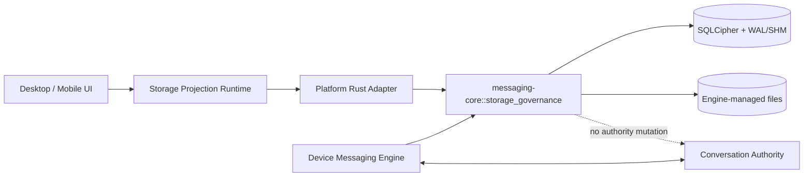

# Chat 本机存储治理 - 架构设计

> **Status**: active
> **Version**: v1.2
> **Created**: 2026-09-26 | **Updated**: 2026-09-27
> **Owner**: Device Messaging Engine
> **Module**: `packages/messaging-core/`, `apps/desktop/`, `apps/mobile/`

---

## 1. 核心原则

1. Station 保留 Conversation authority；治理只修改当前设备投影。
2. Storage Governance 是 Device Messaging Engine 的子模块，不是新业务服务。
3. 统计、候选选择、删除顺序、journal 和 compact 条件由共享 Rust Core 唯一拥有。
4. 可靠性、crypto、草稿和活跃传输优先于空间回收。
5. 清理边界用 authority sequence/hash 表达，不单独依赖设备墙钟。
6. 无历史用户，旧 schema、archive 和兼容路径直接硬切。
7. 批量清理只编排 canonical 单会话命令，不创建第二套删除协议或持久状态。

## 2. 系统架构



## 3. Ownership

| Concern | Owner |
|---|---|
| Conversation facts 与 ordered events | Station Conversation |
| 本地加密投影、附件与 delivery state | Device Messaging Engine |
| 统计、retention、cleanup、journal | `messaging-core::storage_governance` |
| SQLCipher connection、managed roots、compact | Desktop/Mobile Rust adapter |
| 页面状态、确认与结果展示 | 各端 storage runtime/UI |
| 完整加密 Recovery archive | Messaging Recovery owner |

## 4. Typed Commands

双端只暴露同一语义的 typed commands：

```text
chat_storage_snapshot
chat_storage_clear_cache
chat_storage_set_retention
chat_storage_clear_conversation
chat_storage_cleanup_status
```

跨进程请求、响应与 error enum 定义在 `model/domain/chat/storage.proto`。它不是
Station business route。

## 5. Byte Accounting

总物理占用：

```text
SQLCipher main + WAL + SHM
+ Engine-managed attachment/source/cache files
```

分类：

- message：可见投影、FTS、interaction projection；
- media：Engine 托管的已完成附件；
- cache：缩略图和可重新下载媒体；
- system：数据库页、共享索引、journal 与无法唯一归属的字节；
- protected：可靠性、crypto、草稿与 active transfer，不可清理。

同一 inode/object 只计数一次。`physical_total_bytes` 读取真实 metadata，不由逻辑
分类相加伪造。Web localStorage 头像/profile cache 不进入 Chat 总量。

## 6. 删除保护集

Retention、cache clear 和 conversation clear 均不得删除：

- prepared/submitted/retrying command；
- 未 durable consume/ACK 的 inbox；
- receipt、dedup marker 与 authority head；
- Direct ratchet、MLS state、device identity 与 key；
- draft、active upload/download 与 `.part`；
- conversation/member/read truth；
- Engine 管理目录外的用户导出文件。

候选不确定时 fail closed。

## 7. Retention 与本机 Floor

- retention 只选择已 durable consume 的可见投影。
- 时间只用于候选选择，提交边界为
  `pruned_through_sequence + authority_event_hash`。
- manual clear 冻结当前已验证 authority high-water sequence/hash。
- floor 在同一 hash chain 上单调前进。
- 普通 reconcile 与分页不得恢复 floor 内旧明文。
- 完整加密 Recovery 是独立显式操作。

## 8. Cleanup 流程

1. 冻结 scope/revision、physical bytes before 和 immutable item list。
2. transaction 删除 projection、FTS、interaction、completed transfer reference，
   同时提交 floor/tombstone、consumption marker、cursor 与 item state。
3. commit 后可 ACK Hide/Retract；零引用文件异步删除。
4. passive checkpoint/compact 后重新测量 main/WAL/SHM/managed files。
5. 仅实际物理字节下降可进入 `succeeded`；compact 失败进入
   `compaction_pending`。

重试复用 `operation_id + scope_revision + item_id`，不得重新查询扩大范围。

## 9. Hide、Retract 与 Recovery

| 动作 | Authority | 范围 | 本地结果 |
|---|---|---|---|
| 清理缓存 | 无业务事件 | 当前设备 | 删除可再生成文件 |
| 清理会话本机数据 | 无业务事件 | 当前设备 | floor + 删除旧投影/媒体 |
| 为我删除 | actor-scoped fact | 本人所有设备 | 明文/FTS/无引用媒体删除，保留 tombstone |
| 撤回 | ordered fact | 所有参与者 | 撤回占位，原内容缓存删除 |

`MessageHiddenForActor` 的 projection effect 仅作用于目标 actor，但它仍是全局
authority hash chain 中的 ordinary event，必须投递给所有 active endpoints。目标
actor 的设备提交 redaction；其他 endpoint 以 observe-only transaction 推进
authority head、lane cursor、consumption marker 与 receipt，不修改消息 projection。

新 Recovery archive 包含 floor 与 redaction tombstone，不包含已清理或 redacted 的
明文和 attachment metadata。restore staging 后先 reconcile 更新的 authority
redaction，再开放 projection。in-place restore 保留当前已认证 device identity，
并从已停止的 live SQLCipher store 直接转移该 endpoint 的 enrollment、SPK/OPK、
MLS bootstrap inventory、lane cursor、consumption markers、authority heads 与
retired checkpoints；这些 continuity rows 不进入 Recovery archive，也不能跨设备
复制。restore 仍清除 Direct ratchet、MLS group/session/transition、command outbox
与 attachment transfer state，避免复用 message key/nonce 或恢复 stale session。

## 10. 硬切

- 删除 `cleared_at(_unix_ms)`、24 小时 restore 和相关 Station persistence。
- 删除 Desktop `deletedMessageUlids`。
- 删除 `disappear_timer_seconds` 全链路。
- 删除固定零值 `statistics_get` 或由其真实非 Chat owner 重建。
- 删除受影响的 backfill、compat reader、旧 archive schema 和测试。
- 重置获批开发数据，不编写迁移。

## 11. 目标布局

```text
model/domain/chat/storage.proto

packages/messaging-core/src/
└── storage_governance/
    ├── accounting
    ├── retention
    ├── cleanup
    └── redaction

packages/client-chat-core/src/
└── storageBatch

apps/{desktop,mobile}/
├── storage runtime/UI
└── src-tauri messaging storage adapter
```

页面不得拥有长生命周期 scan、retention 或 cleanup worker。

## 12. 批量编排

- Desktop 与 Mobile 的 Storage Section 只拥有选择、确认、进度与结果 projection。
- 选择提交时冻结有序去重的 `conversation_id` 列表和当前 scope revision。
- 客户端按列表顺序串行调用 `chat_storage_clear_conversation`，避免并发 compact 和
  cleanup lease 竞争。
- 每项只接受 exact-scope `SUCCEEDED`；`compaction_pending`、typed error、异常或
  scope stale 均进入失败集合。
- 已成功项不可回滚；失败项保留供显式重试，未执行项在 scope 变化后停止。
- 批量结果只汇总单项真实 `physical_bytes_before - physical_bytes_after`，不得用
  预计值伪装实际释放量。

## 13. Failure Semantics

| Failure | 行为 |
|---|---|
| scope stale | 丢弃结果，不写入新账号 |
| DB busy/locked | 保持 journal，可重试 |
| protected state 命中 | 停止并修正候选 |
| 文件删除失败 | DB 不再引用，逐项重试 |
| compact 失败 | 语义删除保持，物理回收未证明 |
| 统计部分失败 | 返回 typed partial，不显示 0 |
| 磁盘不足 | 停止新清理并保护可靠性状态 |
| 批量单项失败 | 保留已提交项，报告失败项并允许只重试失败集合 |
| 批量期间 scope 变化 | 停止未开始项并丢弃旧 scope UI 结果 |

当前状态：`DESIGN_READY_FOR_EXECUTION`。
