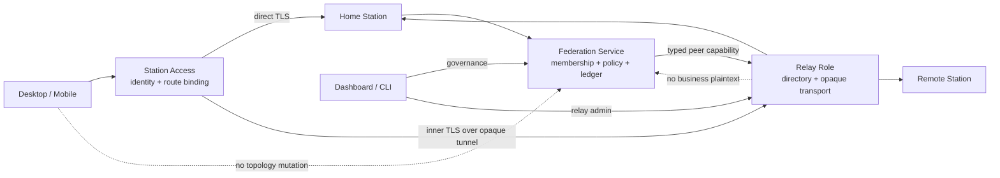

# Federation Architecture - 架构设计

> **Status**: active
> **Version**: v1.0
> **Created**: 2026-05-31 | **Updated**: 2026-10-06
> **Owner**: Architecture Team

---

## 1. 核心原则

1. Federation 是持久虚拟实体，Station 是成员节点，Actor 是参与者。
2. Federation Ledger 记录治理事实；Chat、Social 等业务数据不上账本。
3. Station app 是 membership、policy、ledger 和业务裁决真源。
4. Station frame 提供 signing、locator、resolver、Relay 与 transport primitive，
   不积累业务规则。
5. 所有 discovery、Catalog、Resolver 和 transport capability 显式带
   `federation_id` 或 `station_peer_id`，不存在全局默认 scope。
6. Relay 是不可信 rendezvous/transport，不是 Federation、Station identity、
   Access Gate 或业务 authority。
7. Relay 与 Station 复用同一仓库和 binary，但通过显式 role allowlist 隔离运行面。

## 2. 系统架构



Station Access 回答“客户端如何可信到达 Home Station”；Federation 回答“Station
属于哪些网络以及如何治理”；Relay 回答“如何在不获得业务 authority 的情况下提供
连接”。三者不可合并为一个 owner。

## 3. Federation 核心模型

### 3.1 Federation 与 Membership

Federation 拥有稳定 `federation_id`、metadata、policy、member stations、
active sequencer 和 ledger head。一个 Station 可以加入多个 Federation。

Membership 只能由 ledger replay 得到：

```text
pending -> active -> suspended | left | removed
```

Relay mount 不是 Federation membership。Station 注册 Relay 不表示加入任何
Federation，退出 Federation 也不自动删除 Relay route。

### 3.2 Actor 与权限

跨 Station identity 只使用 `ActorRef`、persisted federated handle 与
`station_peer_id`。请求 URL、Host、proxy 或 Relay endpoint 不得生成/修改
`ActorRef.acct`。

| 层 | 角色 | 职责 |
|---|---|---|
| Station | `station_owner` / `federation_admin` / `member` | 本站治理授权 |
| Federation | `federation_owner` / `federation_admin` / `moderator` | 跨站治理 |
| Relay | `relay_operator` / `mounted_station` | 传输运维，不授予业务权限 |

普通 Actor 可以搜索、联系、聊天、follow 和管理个人可见性，不能修改 Station
membership 或 Relay mount。

## 4. Federation Ledger

Ledger 是 permissioned append-only hash chain：

```text
genesis(seq=0)
  -> event(seq=1, prev_hash=genesis_hash)
  -> event(seq=2, prev_hash=event_1_hash)
```

正式 event 需要 actor、origin Station 和 active sequencer 的签名。v1 使用每个
Federation 一个 active sequencer：

- 非 sequencer Station 提交 signed proposal；
- sequencer 校验 policy 后分配 `seq/prev_hash/event_hash`；
- 同 seq 不同 hash 进入 `fork_detected` 并停止推进；
- sequencer 失联时按 policy `read_only`、handover 或 `orphaned`。

Ledger 不记录 token、Session、private key、email、消息、动态或在线状态。

## 5. Federation Discovery 与 Catalog

三层 discovery 不得混用：

| 层 | 回答 | 真源 |
|---|---|---|
| Federation manifest | Federation 是谁、genesis 在哪 | signed manifest + genesis |
| Station membership | 哪些 Station 是成员 | ledger replay |
| Actor catalog | scope 内哪些 Actor 可发现 | member Station + visibility policy |

所有 Station list、Catalog、Resolver 和 public actor 查询显式携带
`federation_id`。Relay directory 只发布 Station transport route，不发布或推导
Federation membership、policy 或 Actor catalog。

## 6. Relay Runtime Role

Relay role 只装配：

- health 与 signed endpoint identity；
- opt-in public route directory、grant-scoped private route resolve；
- Station enrollment、credential rotation/revocation 与 mount health；
- client/Station opaque tunnel 与 deny-by-default broadcast；
- bounded metrics、audit 和 operator admin。

Relay role 禁止装配：

- Actor registration/session、OAuth、Chat、Social、Agent、OSS；
- Federation membership、policy、ledger append/replay；
- 任意 HTTP path proxy；
- Station application JWT 通用认证。

生产 Relay 缺少 TLS、Relay signing key、operator auth policy、frame/connection
quota 任一项时启动失败。

## 7. Station Enrollment

Station enrollment 是 Relay transport 的 operator lifecycle：

```text
one-time invite
  -> relay challenge
  -> station host-key proof
  -> atomic consume + mount generation
  -> short-lived relay-signed credential
  -> TLS stream
  -> signed route attestation
```

Relay 从 host public key 推导 `station_peer_id`，不接受 header 或 label 作为身份。
invite secret 只显示一次、只存 hash。mount credential 使用 Relay 专用非对称
issuer，绑定 `aud/scope/jti/exp/station_peer_id/generation`。

撤销必须原子完成：

1. generation 失效并递增 epoch；
2. active stream 关闭；
3. refresh 被拒绝；
4. 旧 credential 的 reconnect 被拒绝；
5. public/private route attestation 停止发布。

恢复只能通过新 invite 或明确的 operator recovery policy，不能由过期缓存自动恢复。

## 8. Signed Route Discovery

Relay 目录只返回目标 Station host key 签名的 `StationRouteAttestation`：

```text
station_peer_id
relay_peer_id
route_id
route_generation
inner_tls_spki_sha256
visibility
capabilities_digest
issued_at / expires_at
signature
```

- `PUBLIC` 由 Station 显式 opt-in；默认是 `GRANT_ONLY`。
- private route 需要 Station 签发、Relay 只存 digest 的 connection grant。
- Relay 可以过滤失效 generation，但不能创建或修改 Station attestation。
- 客户端必须验证 Station signature、Relay binding、expiry、generation 与 inner
  TLS SPKI。

## 9. Opaque Tunnel

客户端通过 WSS、Station mount 通过 TLS stream 连接 Relay，再在 Relay 的 opaque
byte stream 内建立 client-to-Station TLS 1.3：

```text
Client
  -- WSS binary / outer TLS --> Relay
  -- TunnelOpen(route_id/generation) --> Relay
  == inner TLS, SPKI pinned by Station attestation ==> Station
  == canonical Station HTTP/protobuf =================> Station router
```

WSS endpoint 固定为 `/.well-known/peers-touch/tunnel`。只接受 binary frame，拒绝
text frame、per-message compression、redirect 和协议降级。Relay 不改变 inner TLS
bytes。

Relay 只可观察：

- Relay/route/tunnel ID；
- frame 长度、方向、时间和关闭原因；
- 配额计数、连接健康与低基数 error class。

Relay 不可观察：

- HTTP method/path/header；
- Station Access input、Session credential；
- Chat/Social/Agent payload；
- inner TLS key 或 plaintext。

Station 在 inner TLS 终止后复用现有 canonical router。未登录 tunnel 只允许
endpoint identity 和 Access Gate；登录后仍由 Station session middleware 决定。

## 10. Station-to-Station Transport

Federation transport 与客户端 tunnel 共用 Relay 的 bounded opaque transport
primitive，但使用不同 caller scope：

- caller Station 用自己的 host identity 和 mount generation 建立 peer tunnel；
- target capability 必须来自正向 typed manifest；
- receiver 校验 caller Station identity、Federation membership、scope 和业务权限；
- Relay 不读取 target Authorization 或业务 path；
- broadcast topic deny-by-default，并校验 publisher scope、速率、大小和 replay。

现有 ANY `/relay/forward/{peer}/{path}` 与 `relay-client-token` 在 cutover 后删除。

## 11. 资源与失败语义

每个 tunnel 强制：

- handshake/idle/request deadline；
- frame/request/response/connection byte limit；
- per-source、per-route、per-Station、global concurrency 和 rate limit；
- backpressure、cancel、drain 与 bounded queue；
- typed `UNAVAILABLE/REVOKED/OVERLOADED/OVERSIZE/TIMEOUT`。

禁止静默截断、无限 `ReadAll`、无界 goroutine fan-out 或用 `mountedAt` 清理仍健康
stream。存储状态和 stream liveness 必须由同一 generation/heartbeat 语义协调。

## 12. 用户感知

- 日常入口仍是搜索、联系人、Chat 和 Social，不新增“Relay 产品页”。
- Settings 展示 Home Station、Federation context 和 `直连/经 Relay` 摘要。
- Dashboard/CLI 承担 Federation governance 与 Relay operator flow。
- Relay 故障是连接故障，不改变用户身份、Federation membership 或业务数据。

## 13. 安全验证

必须证明：

- forged PeerID/header、wrong host key、invite replay、credential replay 失败；
- revoke 后旧 generation 不能 refresh/reconnect；
- Relay 日志/抓包无业务 plaintext 和 Station credential；
- role route inventory 无 Station 业务 handler；
- overload、oversize、slow consumer、disconnect、restart 有界恢复；
- 两 Station 经 Relay 的 typed Federation 与客户端业务 Journey 通过。
