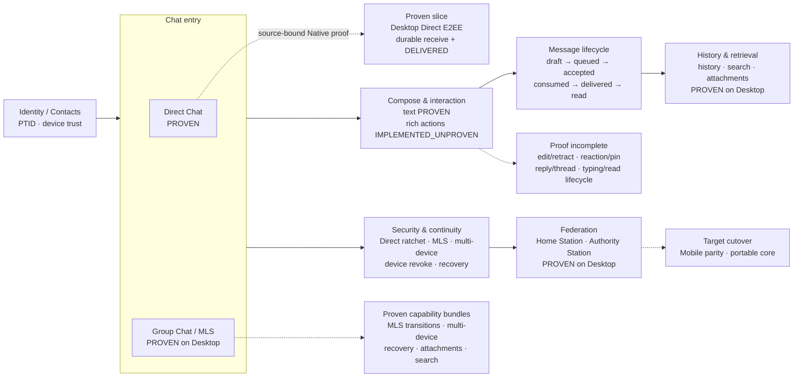
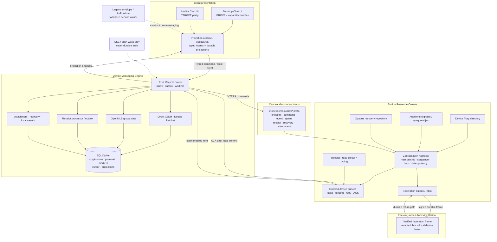

# Messaging Platform — 架构设计

> **Status**: active
> **Version**: v1.3
> **Created**: 2026-08-08 | **Updated**: 2026-09-06
> **Owner**: Messaging Platform Team
> **Module**: `model/domain/chat/`, `apps/station/`, `apps/desktop/`, `apps/mobile/`
>
> **Accepted MP-D30 correction**: this document previously used “Station Messaging
> Platform” for both Conversation authority and device delivery. The accepted target
> now separates those planes: `/conversation/*` owns Chat business APIs and one
> DDD authority, while the internal Device Messaging Engine remains a client runtime. See
> [`../api-ownership/design.md`](../api-ownership/design.md).

---

## 1. 核心原则

Conversation is the sole Chat business authority. Every public route, authority
table, and client caller must resolve through its declared resource owner.

| ID | 原则 |
|---|---|
| MP-A01 | Crypto endpoint 永远是 `(PTID, device_id)`；逻辑消息身份永远是共享的 `event_id`，不得按设备复制为多条消息 |
| MP-A02 | Station authority 与 device delivery 是共享事实 |
| MP-A03 | 每个 device 只有一个有 fencing 的有序 inbox consumer |
| MP-A04 | Realtime 只 wake，durable queue 是唯一消费路径 |
| MP-A05 | Device Engine 原子拥有 decrypt、local commit、dedup 和 ACK boundary |
| MP-A06 | 所有网络提交由 durable workers 驱动，不由 UI timer 驱动 |
| MP-A07 | Device registry 是 active/revoked truth，fresh device 使用 fresh sessions |
| MP-A08 | Group 使用 RFC 9420 MLS，每 active device 一个 leaf |
| MP-A09 | accepted、consumed、delivered、read 是不同事实 |
| MP-A10 | 重试、过载、poison、lease、shutdown 都有显式语义 |
| MP-A11 | 大 payload 使用 opaque object plane，不进入 message control frame |
| MP-A12 | Model proto 是跨端唯一 contract root |
| MP-A13 | Authority event 只保存公共事实与 opaque delivery commitments；每个 queue item 只携带当前 endpoint 的私有 payload |
| MP-A14 | 每个相关 active device 都通过自己的 lane 观察完整 authority sequence；sending endpoint 使用无 ciphertext 的 public-event marker |
| MP-A15 | Device enrollment 只有在 Station 验证 actor-cross-signed fresh DSK proof 后才可 ACTIVE |
| MP-A16 | Fresh MLS endpoint 只能以明确添加自己的 Welcome event + hashed post-state snapshot 建立首个 authority checkpoint |
| MP-A17 | Reply/edit/retract/reaction/pin/read 使用同一 authority sequence 和 per-device consumption boundary；UI optimistic state 不能成为 terminal truth |
| MP-A18 | Typing 是独立 bounded ephemeral QoS；不得进入 durable message lane、history、receipt 或 recovery |
| MP-A19 | 只有网络提交前的本地 draft 可取消；durable outbox admission 后 timeout 保持 pending/retrying，accepted 内容只通过新的 Authority edit/retract fact 变更 |

### 1.1 Delivery Commitment Amendment

> **Amendment status**: accepted (`MP-D13`, Owner accepted 2026-08-08)

Evidence ledger：

| Claim | Class | Evidence | Confidence |
|---|---|---|---|
| Canonical `command.proto` and `event.proto` are missing | verified_fact | `model/domain/chat/` source tree | high |
| Current authority event hash covers all Direct device ciphertexts | verified_fact | `hashCommittedEvent` deterministically marshals the complete `CommittedConversationEvent` | high |
| Filtering a current event per recipient breaks authority hash verification | inference | filtered protobuf bytes differ from the committed hash input | high |
| Sending the complete current event exposes other endpoints' ciphertexts | inference | every `DeviceEncryptedPayload` is embedded in the delivered event | high |
| Public delivery commitments plus endpoint-private payloads preserve both properties | accepted_decision | `MP-D13` | accepted |

### 1.2 Portable Messaging Core Amendment

> **Amendment status**: accepted (`MP-D16`, Owner accepted 2026-08-09)

Evidence ledger：

| Claim | Class | Evidence | Confidence |
|---|---|---|---|
| Desktop 已有 Direct、OpenMLS、atomic receive、recovery 和 queue drain Rust implementation | verified_fact | `apps/desktop/src-tauri/src/messaging/` 与 28 个 Messaging tests | high |
| Mobile Rust 仍拥有 Sender Keys，且没有 OpenMLS/Device Messaging Engine | verified_fact | `apps/mobile/src-tauri/src/domain/crypto/sender_keys.rs`、`sender_key_store.rs`、`commands/group_crypto.rs` | high |
| Desktop 与 Mobile 分别维护协议实现会形成第二套 crypto/queue/recovery state machine | inference | 两个独立 Tauri crate 当前没有共享 Messaging Rust dependency | high |
| 一个 portable Rust core 加平台 adapters 让双端执行同一协议与 transaction semantics | accepted_decision | `MP-D16` | accepted |

Accepted client boundary：

```text
                    model/domain/chat/*.proto
                               │
                               ▼
                 packages/messaging-core (Rust)
        Direct │ OpenMLS │ Queue FSM │ Recovery │ Projection
                               │
             ┌─────────────────┴─────────────────┐
             ▼                                   ▼
 Desktop Messaging Adapter              Mobile Messaging Adapter
 SQLCipher/keychain/HTTP/lifecycle       SQLCipher/keychain/HTTP/push/lifecycle
```

Portable core 不依赖 Tauri、React/Lynx、platform keychain API、concrete HTTP client 或
平台文件路径。它通过 typed ports 取得 encrypted store transaction、key material、
clock、randomness、queue transport 和 projection sink。Desktop/Mobile adapters 只能实现
这些 ports，不得复制 Direct、OpenMLS、dedup、cursor、ACK、recovery codec 或 receipt
state machine。

## 2. 当前能力与系统架构

本节是当前实现快照，不改变后续章节定义的 accepted target architecture。状态必须同时由
源码、执行账本和 Acceptance evidence 支撑；存在组件或单元测试不等于产品能力已经证明。

### 2.1 状态图例

| 状态 | 含义 |
|---|---|
| `PROVEN` | 当前 source-bound Gate 已证明真实发送端、接收端和用户可见结果 |
| `IMPLEMENTED_UNPROVEN` | 已有 canonical source path，但缺少该能力要求的完整 Native/runtime evidence |
| `TARGET` | accepted architecture 的目标关系；尚未完成实现或切换 |

### 2.2 产品架构



产品表面由 `apps/desktop/src/components/chat/` 与 `apps/desktop/src/store/socialChat.ts`
呈现，但 UI 可见组件不是独立 truth owner。Direct、Group、附件、恢复和 federation
最终都必须通过相同的 message lifecycle 与 receiver-perspective Acceptance contract。

### 2.3 当前技术架构



以下是 consolidation 前已验证、并作为 MP-D30 hard-cut 输入保留的 Direct
`DELIVERED` hot path：

```text
Bob ordered queue item
  -> Rust decrypt + atomic SQLCipher receive commit
  -> durable MessageReceipt outbox
  -> POST /conversation/delivery/receipt
  -> Station DEVICE_RECEIPT fan-out
  -> Alice Rust receipt processor atomic commit
  -> messaging:projection-changed
  -> socialChat projection
  -> native message row: sent -> delivered
```

### 2.4 当前能力证据矩阵

| 能力区域 | 当前状态 | Canonical owner/path | 当前证明边界 |
|---|---|---|---|
| Desktop Direct send/receive + E2EE | `PROVEN` | Rust Device Messaging Engine + pre-consolidation Station authority implementation | Native 双客户端双向 exact plaintext |
| Direct `DELIVERED` | `PROVEN` | durable receipt outbox + `DEVICE_RECEIPT` + atomic receipt processor | Alice/Bob 双向 native row 前向推进 |
| Ordered queue、dedup、post-commit ACK | `PROVEN` for Direct slice | Station Device Queue + Rust SQLCipher transaction | Direct Gate bundle；不外推到全部 payload class |
| Group MLS 与 membership transition | `PROVEN` on Desktop | OpenMLS + Station authority plans | W07: add/remove/rejoin/restart/crash recovery Native evidence |
| Multi-device fan-out / revoke | `PROVEN` on Desktop | Device Directory + per-device lanes | W07: one-device-one-leaf、remove isolation 与 transition recovery |
| Recovery / fresh device continuation | `PROVEN` on Desktop | Rust recovery + Station opaque repository | W08/W11-R: fresh restore、fresh enrollment、继续通信与失败原子性 |
| Attachments / resumable transfer | `PROVEN` on Desktop | Rust attachment runtime + Station object/grant | W10-E: Direct/MLS byte-exact、restart、recovery 与跨 Station Native evidence |
| Local history / SQLCipher search | `PROVEN` on Desktop | Device SQLCipher projection / FTS | W10-E: Direct/Group FTS 与 recovery round-trip |
| Edit/retract/reaction/pin/reply/typing/read | `IMPLEMENTED_UNPROVEN` | Chat command/event/projection paths | UI 与 source path 存在；各 receiver-visible Gate 未统一闭环 |
| Cross-Station federation | `PROVEN` on Desktop | durable federation outbox/inbox | W06: outage retry、幂等 ingest、ordered delivery 与 cold restart |
| Mobile parity / portable Messaging Core | `TARGET` | `packages/messaging-core` + platform adapters | `MP-W09` 未完成 |

能力状态的正式完成判定仍以
[`acceptance-matrix.md`](./acceptance-matrix.md) 和
[`execution-plans/20260808-messaging-platform.md`](./execution-plans/20260808-messaging-platform.md)
为准。此矩阵禁止把 Direct slice 的证明外推为整个 Chat domain 已证明。

### 2.5 Accepted target topology

```text
┌──────────────── Client Presentation ────────────────┐
│ Desktop Web / Mobile UI                             │
│ typed intents, drafts, plaintext projections       │
└──────────────────────┬─────────────────────────────┘
                       │ ChatCommand / LocalEvent
┌──────────────────────▼─────────────────────────────┐
│ Device Messaging Engine                            │
│                                                    │
│ Identity │ Direct Crypto │ MLS │ Inbox │ Outbox    │
│ Receipt  │ Recovery      │ Search │ Attachment     │
│                                                    │
│ one process owner + SQLCipher transaction boundary │
└───────────────┬───────────────────────┬────────────┘
                │ HTTPS commands        │ SSE/push wake
┌───────────────▼───────────────────────▼────────────┐
│ Station resource owners                            │
│                                                    │
│ Conversation DDD       │ Device Inbox              │
│ Federation Transport   │ Actor/Key Directory       │
│ Recovery Repository    │ Conversation Attachments  │
└───────────────┬────────────────────────────────────┘
                │ signed durable federation frames
                ▼
          Remote Home/Authority Stations
```

## 3. Sources Of Truth

| Concern | Source of truth | 禁止 owner |
|---|---|---|
| Conversation/membership/sequence | Conversation Authority | UI、device cache |
| Active/revoked devices | Device Directory | crypto store |
| Public bundles/key packages | Key Directory | page lifecycle |
| Device lane sequence/items | Device Queue Service | SSE connection |
| Federation delivery | Federation outbox/inbox | request goroutine memory |
| Direct ratchet/skipped keys | Device SQLCipher | Station、TypeScript |
| MLS private state | Device SQLCipher/OpenMLS | Station、UI |
| Plaintext history/search | Device SQLCipher | Station |
| Device consumption dedup | Device SQLCipher | frontend `Set` |
| Recovery revisions | Station opaque repository | localStorage |
| Reply/edit/retract/reaction/pin/read | Conversation Authority event/read cursor + Device SQLCipher projection | UI-only mutation、legacy conversation store |
| Typing presence | Fresh authenticated ephemeral pulse with receiver TTL | authority log、device durable lane、history |
| Draft/selection/scroll | UI | Station |

## 4. Runtime Units

### 4.1 Device Messaging Engine

单一长生命周期 owner，Desktop 落在 Rust runtime，Mobile 使用相同 domain contract
与平台 Rust/native adapter。它负责：

- identity/device enrollment 和 trust；
- Direct X3DH/Double Ratchet；
- OpenMLS state 与 transitions；
- durable command/outbox workers；
- single ordered inbox worker；
- SQLCipher plaintext projections、search 和 consumption markers；
- receipt/read cursor 提交；
- backup/restore codec；
- typed local events。

它不得：

- 渲染 UI；
- 自行改变 Station membership/device truth；
- 通过 browser event handlers 执行协议；
- 把 private state 传给 Web runtime。

### 4.2 Conversation Authority

负责 command admission、membership/role、monotonic conversation sequence、event hash
chain、idempotent command receipt 和 fan-out intent。一个 command commit 与所有目标
device queue rows 必须在一个 Station unit of work 中完成。

### 4.3 Device Queue Service

每个 `(PTID, device_id)` 维护独立 lane：

- 原子分配 `lane_sequence`；
- at-least-once delivery；
- claim lease 与 consumer epoch fencing；
- retry/backoff、expiry、dead-letter；
- consumption ACK ownership validation；
- bounded resume batches；
- SSE/push wake-up。

Queue 不解析 ciphertext 或决定业务权限。

### 4.4 Federation Transport

以 `(source_station, target_station, idempotency_key)` 提供 durable forwarding。
Dispatcher 使用 lease/`SKIP LOCKED` claim；目标 Station 幂等写入 authority inbox 或
device lanes。网络失败不改变 authority event identity。

> **Routing amendment status**: accepted (`MP-D19`)

`CryptoEndpoint`不包含Home Station。跨Station prepare必须消费Home Station签名的短TTL
endpoint manifest：

```text
ActorEndpointManifest
  = actor + home_station + directory_version
  + active endpoints + public material hashes
  + issued/expiry + Home Station signature
```

Authority plan绑定manifest及endpoint routes。Authority commit将delivery按Home Station
分区：

```text
local endpoints  -> local device queues
remote endpoints -> per-Home-Station FederatedDomainFrame
                 -> CONVERSATION_DEVICE_DELIVERY payload
                 -> durable federation outbox
```

authority event、全部local queue rows、全部remote outbox rows和command receipt必须在
同一database transaction提交。Target Home Station验证frame后原子写inbox与local
device lanes，并再次过滤已revoked endpoint。network dispatcher不得成为event或queue
truth owner。

非authority Station上的client command通过durable `AUTHORITY_COMMAND` frame转发；
authority result不直接推进device authority head，ordered queue marker仍是唯一推进路径。

### 4.5 Home Station Follower Membership Projection

> **Amendment status**: accepted (`MP-D29`, Owner accepted 2026-09-05)

Runtime evidence from the Windows multi-Station product Gate established this
gap:

| Claim | Class | Evidence | Confidence |
|---|---|---|---|
| Authority station-four has active Alice/Bob rows while Bob's Home Station has no canonical conversation membership row | verified_fact | Gate `20260904T074120233666Z-fdb77bd29b2e510be6a9964332a9e4d5` database readback | high |
| Bob's Home Station rejects member settings because active membership cannot be proven locally | verified_fact | station-five runtime log: `active conversation membership required` | high |
| `FederatedDeviceQueueBatch` already carries deterministic `DeviceEventDelivery` bytes containing the public `ConversationEvent`, but only for active endpoint writes | verified_fact | `model/domain/chat/event.proto`, `federation.proto`, and authority fan-out source | high |
| Membership may remain active while an actor has zero active devices, and revoked endpoints receive no future device writes | verified_fact | Messaging data model plus authority fan-out rules | high |
| Queue receipt history alone is insufficient membership truth after removal | inference | old queue rows survive after the final removal transition | high |
| A Station-addressed authority projection stream can reuse public events, reach zero-device/removal targets, and remain endpoint-payload blind | accepted_decision | `MP-D29`, Owner accepted 2026-09-05 | implementation proof pending |

The accepted target relationship is:

```text
Authority transaction
  -> ConversationEvent
  -> endpoint-private DeviceEventDelivery rows
  -> Station-addressed FOLLOWER_PROJECTION outbox rows
       target = affected actor Home Stations, independent of active devices
  -> target Home Station verifies signed public event
  -> transaction: follower head + membership + inbox
  -> device batch independently writes exact private queue rows
  -> actor-local member settings authorize against follower membership
```

Authority fan-out sends `FOLLOWER_PROJECTION` to current active member Home
Stations for ordinary events, initial member Home Stations for creation, and
the union of pre/post member Home Stations for membership transitions. The
authority membership row therefore persists the verified actor Home Station
route; projection delivery never depends on active endpoint count.

On the first `ConversationCreatedFact`, the target verifies that frame source,
event `authority_station_id`, and the verified Home Station of `owner_ptid`
are identical, then pins that authority to the follower conversation.
Subsequent projection and replay signatures must match the pinned Station key;
an event cannot establish authority merely by repeating its own source ID.

Target Home Station may decode the projection's public `ConversationEvent`.
Device queue ingest may decode only the outer `DeviceEventDelivery` to verify
its public-event binding; it must keep `endpoint_payload` opaque and must not
interpret Direct ciphertext, MLS bytes, private message content, or device
crypto state.

Follower membership rules:

- target `ConversationCreatedFact.members[]` carries
  `ptid + home_station_id + role` and initializes the follower actor set
  without directory inference.
- `MembershipTransitionCommittedFact.post_state.active_members` atomically
  replaces the active follower actor set.
- the Station-addressed final removal projection updates membership before the
  projection frame is acknowledged, even when the removed actor has zero
  active endpoints.
- ordinary events advance the verified follower head but do not invent
  membership.
- an empty follower projection may establish its first checkpoint from a
  self-contained `ConversationCreatedFact`, or from an `MLS_WELCOME`
  membership transition whose hashed `post_state` explicitly adds and contains
  a local actor/Home Station; both paths require event authority to equal the
  hashed owner Home Station.
- late-join Welcome additionally resolves `post_state.owner_ptid` through the
  signed Federation Actor locator/profile path and requires that independently
  verified owner Home Station to equal the frame source.
- all other non-initial first events require authority event-log replay.
- duplicate event/hash is a no-op; sequence gaps trigger bounded resync;
  same sequence with a different hash enters fork-protected read-only state.
- resync returns original hash-chained public events scoped and freshly signed
  to the requesting Home Station; it does not return a mutable current-state
  snapshot and cannot roll the follower head backward.
- projection replay repairs only public follower state. Missing
  endpoint-private delivery remains in the source federation outbox and must
  arrive through exact device-frame retry before any device lane ACK advances.
- authority replay returns an event only when the immutable event projection
  grant includes the requesting Home Station. Pre-join and post-removal
  metadata is never widened by current membership. The signed page binds both
  ordered event bytes and ordered projection-grant tuples.
- public future-event buffering is bounded to 128 events or 4 MiB per
  conversation with a 10-minute expiry. Overflow stays retryable and
  fail-closed.
- `FORK_PROTECTED_READ_ONLY` has no automatic transition back to active; only
  explicit operator-authorized forensic rebootstrap may replace it.
- Authority events and projection grants co-retain for the active conversation
  lifetime. Unexpected replay-source loss enters
  `RESYNC_UNAVAILABLE_READ_ONLY`; normal GC requires a signed terminal
  projection tombstone acknowledged by every granted Home Station.

Canonical membership reads compose two sources without duplicating authority:

```text
authority_station_id == local_station_id
  -> authority membership repository

authority_station_id != local_station_id
  -> verified follower membership repository
```

Actor-local member settings remain owned by the actor's Home Station. Thread
summary/count UI reads Device Messaging Engine projections and must not call
the legacy plaintext Conversation service.

Forbidden relationships:

- legacy `conversation_members` or `conversation_follower_members` authorizing
  canonical Messaging conversations;
- a queue item's historical existence being treated as current membership;
- device-delivery fan-out being the only route for membership projection;
- a mutable current-state snapshot replacing event-log replay;
- follower resync advancing a device lane or manufacturing private payload;
- target Home Station parsing endpoint-private payloads;
- client-supplied membership, Home Station, role, or authority head becoming
  Station truth;
- swallowing authorization errors and keeping a local-only terminal setting.

## 5. Canonical Command And Event Contracts

```protobuf
message ChatCommand {
  string command_id = 1;
  string conversation_id = 2;
  CryptoEndpoint sender = 3;
  int64 observed_membership_epoch = 4;
  oneof payload {
    SendMessage send_message = 10;
    EditMessage edit_message = 11;
    RetractMessage retract_message = 12;
    MembershipTransition membership_transition = 13;
    Reaction reaction = 14;
  }
}

message ConversationEvent {
  string event_id = 1;
  string conversation_id = 2;
  int64 sequence = 3;
  bytes previous_hash = 4;
  bytes event_hash = 5;
  repeated bytes delivery_commitments = 6;
  oneof payload { /* committed facts */ }
}

message DeviceEventDelivery {
  ConversationEvent event = 1;
  CryptoEndpoint recipient = 2;
  QueuePayloadType payload_type = 3;
  bytes endpoint_payload = 4;
  bytes endpoint_payload_sha256 = 5;
  bytes delivery_commitment = 6;
}

message DurableDeviceInboxItem {
  string item_id = 1;
  int64 lane_sequence = 3;
  string idempotency_key = 4;
  string event_id = 4;
  string idempotency_key = 5;
  QueuePayloadType payload_type = 6;
  bytes opaque_payload = 7;
  bytes payload_sha256 = 8;
```

Direct event 含每目标 device 独立 ciphertext。Group event 含一个 MLS application
`ConversationEvent.delivery_commitments` 按 bytewise ascending 排序，并进入 authority
event hash。每个 commitment 是以下 canonical input 的 SHA-256：

```text
ASCII("peers-touch/device-delivery-commitment") + 0x00
+ uint32_be(schema_version = 1)
+ uint32_be(len(conversation_id)) + UTF8(conversation_id)
+ uint32_be(len(event_id)) + UTF8(event_id)
+ uint32_be(len(recipient_ptid)) + UTF8(recipient_ptid)
+ uint32_be(len(recipient_device_id)) + UTF8(recipient_device_id)
+ uint32_be(payload_type)
+ endpoint_payload_sha256[32]
```

event 不携带 endpoint、Direct ciphertext 或 MLS application ciphertext。Queue 的
`opaque_payload` 是 deterministic `DeviceEventDelivery` bytes；queue
`payload_sha256` 绑定完整 delivery bytes。Direct 每个 endpoint 有独立 ciphertext；
Group 每个 active MLS leaf 有独立 commitment，可引用同一个 MLS application
ciphertext hash。

Device Engine 必须依次验证：

1. authority event hash 和 previous hash；
2. queue recipient 等于 local endpoint；
3. `SHA-256(endpoint_payload)` 等于 `endpoint_payload_sha256`；
4. recomputed commitment 存在于 event 的 sorted commitments；
5. `SHA-256(DeviceEventDelivery bytes)` 等于 queue `payload_sha256`。
多设备 fan-out 必须保持两层身份：


```text
Logical message: (conversation_id, event_id, sequence)
  -> Device delivery: (recipient endpoint, lane_sequence, ciphertext)
  -> Device projection: upsert by (conversation_id, event_id)
```

同一用户的不同设备接收独立 ciphertext 和 queue item，但解密后以同一 `event_id`
投影为同一条消息。发送者的其他 active devices 通过 sender-sync delivery 得到相同
逻辑消息。设备在 event commit 后才加入时，不追补 live queue ciphertext；历史由
Recovery 恢复，未来消息从该设备 activation sequence 开始 fan-out。

Fresh Direct endpoint 在本地不存在该 conversation 的 authority head、session、
message projection、consumption marker 或 command state 时，可以从 authenticated
public event log 建立 activation checkpoint。Engine 必须从 sequence 1 起验证完整
event hash chain，使用 genesis snapshot 建立 actor-level Direct projection，并把
验证后的当前 event head 与该 projection 原子写入。中间 message events 只推进验证
链，不生成旧 message projection、receipt、cursor 或 endpoint-private payload。
最终 checkpoint 必须与当前 send-preparation plan 的 sequence、hash、authority 和
epochs 完全一致；否则 fail closed。旧 plaintext/history 仍只能通过 MP-D08 Recovery
取得。

## 6. End-To-End Send

```text
UI intent
  -> Engine persists command intent
  -> resolve active endpoints / authority head
  -> prepare Direct fan-out or MLS ciphertext
  -> SQLCipher: crypto advance + exact command + outbox
  -> worker submits command
  -> Authority: validate + event + device queue fan-out (atomic)
  -> result updates durable command submission state
  -> sending endpoint consumes ordered public-event marker
  -> Engine atomically promotes pending sender projection and authority head
  -> UI receives accepted state
```

失败时 exact command bytes 重放，不重新加密或再次推进 ratchet。

### 6.1 Sending Endpoint Ordering Amendment

> **Amendment status**: accepted (`MP-D14`)

Command response 与 device queue 是两个独立到达路径。若 response 直接推进 sender
authority head，它可能越过先提交但尚未 drain 的 event；若不推进 head，后续 queue
event 的 `previous_hash` 又无法验证。

因此每个 committed event 必须为 sending endpoint 生成一个
`PREPARED_ENDPOINT_PAYLOAD_KIND_PUBLIC_EVENT` queue item。该 item：

- 携带 public authority event 和 endpoint-bound commitment；
- 不携带 Direct ciphertext、MLS application ciphertext 或 plaintext；
- 在本地 transaction 中将 pending sender projection 升级为 committed；
- 与普通 receive 共用 marker、cursor、authority head 和 post-commit ACK；
- command response 只改变 command/outbox submission state，不写 authority head。

### 6.2 Send-Preparation Snapshot Amendment

> **Amendment status**: accepted (`MP-D17`)

Engine不得从本地 session缓存猜测 required fan-out。Station必须通过 authenticated
send-preparation snapshot返回 authority head、membership/MLS epoch和当前 required
active endpoints，并对这些字段生成 deterministic `delivery_plan_sha256`。

`ChatCommand`绑定该 hash。Authority在 event/queue transaction内重算；任何
activation/revoke/membership变化导致 typed `STALE_DELIVERY_PLAN`且零 authority
mutation。Engine保留 logical draft与`message_id`，supersede旧 command attempt，并从
已持久化的下一 ratchet/MLS state重新准备；禁止 rollback或重放 stale ciphertext。

### 6.3 MLS Authority Plan Amendment

> **Amendment status**: accepted (`MP-D18`)

Group genesis和membership transition不能复用只描述当前recipient set的send plan。
Station必须提供两种短TTL authority plan：

```text
PrepareGroupGenesis
  intent(group_id, name, owner, member actors)
  -> plan_id, expires_at, prospective_endpoints[],
     reserved_key_packages[], authority_plan_sha256

PrepareMembershipTransition
  intent(conversation_id, sender, action, target actor/device, role)
  -> plan_id, expires_at, authority head, source epochs,
     pre_endpoints[], post_endpoints[], added_endpoints[],
     removed_endpoints[], reserved_key_packages[],
     authority_plan_sha256
```

plan是不可见control-plane reservation，不是conversation truth，不冻结device set。
提交时Authority重新锁定并验证conversation、membership和device rows；snapshot变化或
expiry返回typed stale/expired result且零shared mutation。

Genesis只有在OpenMLS command提交成功时才原子创建conversation-created event、
epoch `0→1` transition、actor/device membership rows和全部device queue items。
prepare失败或reservation expiry不会产生可见conversation。

后续transition在一个Station transaction中完成event、membership mutation、epoch
advance、queue fan-out、KeyPackage consume和command receipt。payload矩阵：

| Endpoint class | Delivery |
|---|---|
| surviving sender | ordered `PUBLIC_EVENT` marker |
| surviving existing non-sender leaf | wrapped `MLS_COMMIT` |
| newly added leaf | wrapped `MLS_WELCOME` |
| voluntarily leaving sender | ordered public removal marker |
| removed actor endpoint | keyless typed removal-state fact |
| already revoked device | no new queue item |

Engine只接受logical membership intent。它持久化intent、exact attempt bytes和pending
OpenMLS state；authority stale时discard尚未merge的pending commit并生成新attempt。
UI不得读取epoch、枚举devices、claim KeyPackage、组装transition或accept MLS state。

### 6.4 Industry-Aligned Send Uncertainty And Retract

> **Decision status**: accepted (`MP-D28`, Owner accepted industry-aligned scope
> 2026-08-17)

Messaging 不承诺取消结果未知的 in-flight command。边界如下：

```text
local composer draft --cancel--> discarded locally
          |
          +--durable outbox admission--> queued/submitting
                                          |
                                          +--timeout--> retry_wait
                                          |              |
                                          |              +--exact bytes retry
                                          |
                                          +--authority accept--> committed event
                                                                  |
                                                                  +--new edit/retract event
```

- local draft cancel 只能发生在 crypto advance、exact command 和 outbox transaction
  之前；
- outbox admission 后，timeout 不能证明 Authority 未接受，客户端必须保留
  pending/retrying，并重放 exact command bytes；
- 不新增 `CancelPendingMessagingCommand`、Authority cancellation tombstone 或
  `cancel_pending` durable state；
- 不回滚 Direct ratchet、MLS state 或复用 key/nonce；
- accepted message 的“撤回”是新的 ordered Authority fact，receiver 保留
  retracted marker；它不是 transport rollback，也不保证抹除通知、截图或外部副本。

该边界采用主流 IM 的可观察产品语义：发送前可以放弃草稿；发送结果未知时等待或重试；
发送成功后通过留痕撤回纠错。外部产品行为只作为 disposition evidence，不反推其内部
实现。

## 7. End-To-End Receive

```text
SSE/push wake
  -> Engine claims next lane sequence
  -> validate recipient, sequence, event binding
  -> process DKX / MLS transition / message / receipt
  -> SQLCipher transaction:
       crypto state
       skipped keys
       plaintext/attachment metadata
       consumption marker
       local cursor
  -> commit
  -> ACK(item_id, endpoint, lane_sequence, consumer_epoch)
  -> publish LocalProjectionEvent
  -> UI renders durable plaintext
```

若本地 transaction 未 commit，Station item 保持 unacked，lane 停在该 sequence。

## 8. Ordering And Dependencies

- Authority sequence 负责 conversation fact ordering。
- Device lane sequence 负责该设备 transport/dependency ordering。
- DKX、MLS transition 和依赖消息必须进入同一 device lane。
- 一个 lane 不允许越过未消费 item。
- Independent devices、conversations 和 federation targets 可并行。
- Typing/call signaling 使用独立 ephemeral channel，不得阻塞 durable lane。

### 8.1 Message Interaction Semantics

- Reply/thread identity 在 `SendMessageIntent` 中绑定并随 committed message projection
  持久化；它不是后续可变 metadata。
- Edit 与 retract 只允许原 message author。Edit 保持 `message_id`，新 encrypted
  content 随 Direct/MLS endpoint payload 交付；retract 保留 row 和 authority history。
- Reaction add/remove 以 `(message_id, actor_ptid, reaction)` 幂等；actor 只能移除自己的
  reaction。
- Pin/unpin 是 conversation-scoped authority fact；active member 可操作，所有 endpoint
  按 sequence 收敛到一个当前结果。
- Read cursor 是 actor-scoped monotonic fact；任何旧 cursor、duplicate 或 delivered
  receipt 都不能使其回退或伪造 read。
- 所有 durable interaction event 必须与普通 message 共用 authority admission、
  event hash、device queue、local consumption marker、cursor 和 post-commit ACK。
- edit/reply 在本地 composer 阶段可放弃；一旦对应 command 进入 durable outbox，
  timeout 只允许 pending/retry，accepted 后使用新的 edit/retract authority event。

### 8.2 Typing Presence Semantics

- Typing pulse 只接受 authenticated active conversation member，绑定
  `(conversation_id, sender endpoint, pulse generation, expires_at)`。
- Direct 与 Group fan-out 使用独立 ephemeral delivery path；不得写
  `DurableDeviceInboxItem`、authority event、recovery archive 或 message projection。
- Sender pulse bounded/throttled；receiver 按 sender + conversation 幂等刷新 TTL。
- stop、session switch、disconnect 或 TTL expiry 都投影为 idle。丢失 stop pulse
  只能造成 bounded 短暂显示，不能形成 durable phantom state。

## 9. Delivery And Receipt Semantics

| 事实 | 定义 |
|---|---|
| persisted | Station 已原子写入 event/queue |
| notified | SSE/push wake 已尝试 |
| consumed | device local transaction 已 commit |
| delivered | 至少一个 required recipient device consumed |
| fully_delivered | command 声明的 required devices 均 consumed/revoked |
| read | recipient actor read cursor 越过 event sequence |

服务端 `notified` 不得映射为 delivered。

## 10. Failure, Retry, And Overload

- Claim lease 超时：item 回到 pending，由 consumer epoch 防止旧 consumer ACK。
- Retryable dependency：lane 保持，指数 backoff，wake 可提前触发。
- Corrupt payload：进入 dead-letter/diagnostic，禁止静默 ACK。
- Queue full：command admission fail closed，sender durable draft/outbox 保留。
- Storage locked/full：receiver 不 ACK；UI 显示 actionable state。
- Duplicate：consumption marker/readback 后 ACK，不推进 crypto。
- Command submit timeout：保留 exact command、intent 和原始 visible content，进入
  bounded retry；不暴露 post-dispatch cancel，不回滚 crypto。
- Shutdown：停止 admission，等待 in-flight local transaction，释放 lease。
- Station failover：authority/queue operations 依赖数据库 transaction 和 fencing。

## 11. Multi-Device And Recovery

- Direct session key包含 conversation、本地 endpoint、对端 endpoint 和 generation。
- required fan-out 包含全部 active recipient devices 和发送者其他 active devices。
- revoke 与后续 fan-out selection 在 Station transaction boundary 上有序。
- MLS membership transition 对 actor/device leaf 明确建模。
- Membership transition event携带进入event hash的完整公共post-state snapshot。
- Fresh MLS endpoint不接收加入前event replay。只有本地无该conversation任何
  head/session/projection/marker，且Welcome、ADD change、snapshot和当前endpoint完全
  绑定时，Engine才可将join event原子安装为首个authority checkpoint。
- Removed MLS endpoint接收typed retirement payload，在同一个local transaction中删除
  live MLS state、记录retired checkpoint、推进authority head/cursor/marker并写receipt。
- 同一有效endpoint重新加入时，Welcome只有与本地retired checkpoint、ADD change和
  post-state完整绑定，才可跨缺席sequence原子替换MLS state并建立rejoin checkpoint；
  缺席期间events/plaintext不补发。
- Join checkpoint之后恢复普通严格连续sequence规则；其他gap进入
  `waiting-for-epoch`且不得ACK。
- Recovery 恢复 actor identity/history/trust，排除 SPK/OPK、ratchet、MLS live state。
- fresh install 完成 restore 后才 enroll fresh device，随后重建 sessions/leaves。
- Restore为每个conversation写one-shot `recovery_ready`；只有当前fresh endpoint的
  ADD Welcome可在无head/session/marker时原子安装current checkpoint并清除该状态，
  同时保留archive中的合法旧history。

## 12. Attachments And Search

> `MP-D23`–`MP-D25` amendment status: accepted (Owner accepted 2026-08-10).

### 12.0 Evidence Ledger

| Claim | Class | Evidence | Missing proof |
|---|---|---|---|
| AES-GCM fixed-size chunk encryption and whole plaintext/ciphertext hashes exist | verified_fact | Desktop `oss.rs` and `client-media-security` | cross-language canonical vectors |
| Generic OSS persists opaque bytes and storage backends expose byte-range ports | verified_fact | Station OSS service/storage interfaces | HTTP Range route parity |
| Canonical send/event proto already references `EncryptedObjectDescriptor` | verified_fact | `attachment.proto`, `command.proto`, `event.proto` | runtime validation and projection |
| Current upload/download is whole-file and Messaging Engine never persists attachment metadata | verified_fact | Desktop OSS/cache and Messaging send/store paths | none |
| Current chat object ACL depends on legacy friend-chat state | verified_fact | Station OSS permission adapter | none |
| Authority-hosted object sessions eliminate duplicate ACL truth | accepted_decision | MP-D23 | native cross-Station gate |
| Per-chunk commitments are sufficient for bounded resumable integrity | accepted_decision | MP-D24 | known-answer, conflict and corruption gates |
| SQLCipher FTS can remain atomic with message/attachment projection | accepted_decision | MP-D25 | crash/restore and query gates |

### 12.1 Ownership And Topology

- Conversation Authority Station 拥有 attachment transfer session、opaque object、
  committed event grant 和 retention；generic OSS 只作为其 byte-store adapter。
- Device Messaging Engine 拥有 plaintext、filename、object key、base nonce、chunk
  crypto、transfer checkpoint、local decrypted cache 和 SQLCipher projection。
- Home Station 只做代理：验证本地 actor session，把远端 upload/download stream 转为
  signed federation data-plane request；不得缓存 key 或 plaintext。
- command/event 只携带 Station-visible `EncryptedObjectDescriptor`。`object_key`、
  `base_nonce`、filename 和 plaintext hash 只存在于 Direct/OpenMLS encrypted
  `MessagePrivateContent` 与 recovery archive。

```text
UI typed intent
  -> Engine encrypts chunks + persists checkpoint
  -> Home Station proxy (when remote)
  -> Authority attachment transfer session
  -> opaque OSS byte store
  -> Authority validates descriptor and atomically grants object with message event
  -> recipient Home proxy
  -> recipient Engine range-resumes, verifies, decrypts and atomically promotes cache
```

### 12.2 Upload Contract

- `begin` 绑定 `(conversation_id, message_id, attachment_id, uploader endpoint,
  descriptor commitment)`，返回 `upload_id`、part size、expiry 和已提交 part bitmap。
- part identity 为 `(upload_id, chunk_index)`。相同 bytes/hash 重放成功；相同 index
  不同 hash 返回 conflict，禁止覆盖。
- 每 part 同时验证 offset、ciphertext size 和 chunk SHA-256。`complete` 只有在全部
  chunks 到齐、whole ciphertext size/hash 匹配时成功，并返回 immutable descriptor。
- 完成前 object 只对 uploader 可见；message authority transaction 成功后，object 与
  `event_id` 和 committed recipient PTIDs 原子绑定。未引用 object 按 bounded orphan
  TTL 回收。
- upload session、part count、part size、总 bytes、并发数和 expiry 都有硬上限；
  overload 返回 typed retry policy，不接收无界临时数据。

### 12.3 Download Contract

- 下载授权基于 message commit 时固化的 recipient PTID grant，不基于“当前仍在群里”。
  因此被移除成员可继续读取其已接收历史附件，但不能读取移除后的 object。
- remote download 经 recipient Home Station 使用 signed federation request 代理到
  Authority Station；data bytes 不进入 durable messaging federation outbox。
- object immutable ETag 等于 descriptor whole ciphertext hash。客户端使用
  `Range + If-Match` 按 ciphertext chunk 拉取；合法范围返回 `206`，越界返回 `416`，
  descriptor/ETag 变化 fail closed。
- Engine 只在每个 chunk hash、whole ciphertext hash、AEAD tag、whole plaintext hash
  全部通过后，把 `.part` 原子提升为可见 cache。失败保留可重试 checkpoint，不暴露
  partial plaintext。

### 12.4 Local Projection And Search

- sender 在 durable draft transaction 中持久化 attachment metadata 与 upload
  checkpoint；command prepare 只消费 `complete` descriptor。
- receiver 在 message receive transaction 中原子写 plaintext、attachment metadata、
  FTS row、consumption marker、lane cursor 和 receipt outbox；任一失败不 ACK。
- FTS 与 plaintext 同属 SQLCipher，索引 text 与 filename，不索引 object key、nonce、
  ciphertext URL 或 transfer token。restore 从 validated archive 重建 FTS。
- transfer checkpoint 和 decrypted cache 不进入 recovery；descriptor、private metadata、
  plaintext hash 和 trust 进入 recovery。fresh device 按需重新下载 ciphertext。

### 12.5 Forbidden Relationships

- UI 直接生成 attachment key、提交 part、判断 hash success 或维护 resume cursor。
- generic OSS 根据 legacy friend/group tables 判定 canonical Messaging authorization。
- Home Station 或 Authority Station 记录 filename、plaintext hash、key、nonce 或
  decrypted bytes。
- whole-file fetch 后才声称“resumable”、直接写 final cache、hash mismatch 后继续解密。
- command commit 引用未 complete、非本 conversation、非本 uploader 的 object。

### 12.6 Bounded Policy And Evidence

默认 policy：

- attachment plaintext 单文件不超过 2 GiB；每消息不超过 10 个、合计不超过 2 GiB；
- AES-256-GCM fixed chunk 为 1 MiB、tag 16 bytes、最大 2048 chunks；
- 每 actor 同时不超过 4 个 active transfer sessions，每 session 同时不超过 4 parts；
- incomplete upload 和 unattached complete object TTL 为 24 hours；
- retry 使用 jittered exponential backoff，1 second 起、5 minutes 封顶；terminal
  integrity/auth errors 不重试；
- Engine transfer memory 上限为 `2 * chunk_size + 16 MiB`，禁止 whole-file buffering。

Architecture gate 除 MP-G13/MP-G14 外还必须证明：

- 100 MiB object 在 25%/50%/75% upload 与 download interruption 后只传 missing chunks；
- duplicate part exact replay、conflicting part、wrong ETag/range、whole/chunk hash、AEAD
  和 plaintext hash 分别有 terminal evidence；
- local LAN profile 的 resumed first-byte P95 小于 2 seconds，统计至少 30 次；网络吞吐不
  作为实现正确性门，但必须报告 P50/P95；
- slow recipient、cancel、Station restart 和 client `SIGKILL` 下 memory/session/part
  admission 保持 bounded；
- native high-chat/group-chat 记录 exact source/output SHA-256、message/event/object IDs、
  transfer bitmap、Station grants 和 receiver-visible result。

### 12.7 APIs And Typed Errors

Control metadata 使用 protobuf；chunk body 使用 bounded `application/octet-stream`：

```text
POST /conversation/attachments/uploads:begin
GET  /conversation/attachments/uploads/{upload_id}
PUT  /conversation/attachments/uploads/{upload_id}/chunks/{chunk_index}
POST /conversation/attachments/uploads/{upload_id}:complete
POST /conversation/attachments/uploads/{upload_id}:cancel
GET  /conversation/attachments/objects/{object_id}
```

Chunk PUT headers 绑定 `Content-Range`、`Digest: sha-256`、upload generation 和
idempotency key；download GET 使用 `Range`、`If-Match`。Home Station proxy 不改变这些
字段，只附加 peer JWT、caller PTID assertion、target Authority Station 和 request
signature。

Typed errors 至少包含：

```text
ATTACHMENT_UPLOAD_EXPIRED
ATTACHMENT_PART_CONFLICT
ATTACHMENT_RANGE_INVALID
ATTACHMENT_DESCRIPTOR_MISMATCH
ATTACHMENT_INTEGRITY_FAILED
ATTACHMENT_NOT_GRANTED
ATTACHMENT_QUOTA_EXCEEDED
ATTACHMENT_RETRY_LATER(retry_after)
```

client cancel 终止当前 stream，但不自动 cancel durable session；只有显式 user cancel
或 expiry 才进入 `ABORTED`。Process shutdown 停止新 part admission，已完成 checkpoint
保留给下次启动。

## 13. Forbidden Relationships

- UI → DKX/ratchet/MLS/queue ACK。
- SSE payload → async browser business handlers。
- frontend `localStorage` → command/outbox/cursor/device identity truth。
- Station → plaintext/private key/recovery phrase。
- authority event → endpoint-private ciphertext 或可枚举 device identity。
- device queue item → 其他 endpoint 的 ciphertext。
- ACK before local durable consumption。
- ratchet advance 与 plaintext persistence 分离。
- actor-wide crypto endpoint。
- group Sender Keys/Megolm/fully-connected member fan-out。
- permanent compatibility runtime、dual source、fallback transport。
- fixed sleep、page refresh 或 polling 作为 correctness。

## 14. Architecture Gates

架构完成只由 `acceptance-matrix.md` 的 MP-G01 至 MP-G16 证明。所有 native claim
必须记录 runtime profile、commit/digest、device IDs、Station rows、Engine transaction
evidence 和 exact UI plaintext。

### 14.1 MP-D29 Follower Membership Gates

`MP-D29`的架构决策已由Owner接受。实现只有在以下evidence全部通过后才能声明
`DONE/PROVEN`：

- two-Station Direct和MLS Group分别证明remote Home Station follower projection；
- creation、ordinary event、membership add/remove、duplicate和restart按同一event
  head收敛；
- zero-active-device actor仍收到Station-addressed projection；
- creation member facts包含Home Station/role，late-join Welcome以hashed owner Home
  Station建立authority pin；
- final removal projection在ACK前撤销follower membership，removed actor settings
  write fail closed；
- missing base和sequence gap触发authority-signed event-log replay，resync前不授权；
- replay只返回requesting Home Station具有immutable per-event grant的事件，pre-join和
  post-removal replay被拒绝；
- stale replay、wrong target/nonce、authority key mismatch和sequence rollback全部拒绝；
- replay event/grant digest mismatch和unexpected source loss fail closed；
- public replay不生成missing endpoint payload，原device frame仍由source outbox exact
  retry后才能推进lane；
- sequence/event identity collision与wrong previous hash进入fork-protected read-only；
- public gap buffer的event/byte quota、10-minute expiry cleanup和retryable overload可证；
- target persistence/log scan不含endpoint payload plaintext、Direct ciphertext明文、
  MLS secret或private key；
- canonical Desktop thread count来自Engine projection，member settings使用typed
  Messaging API，legacy JSON thread/settings request为zero；
- Windows/Linux multi-Station Native Gate无`active conversation membership required`
  runtime-log failure，并保留source/binary/service-binding/cleanup evidence。
