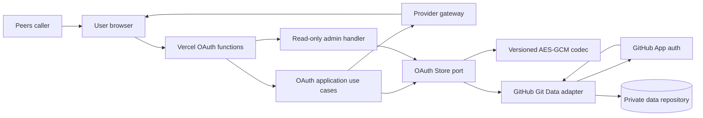

# OAuth Login Broker - Architecture Design

> **Status**: active
> **Version**: v1.0
> **Created**: 2026-09-30 | **Updated**: 2026-09-30
> **Owner**: Identity and Access
> **Module**: `apps/oauth2-client/`

---

## 1. Core Principles

1. OAuth use cases depend on domain repositories and provider gateways, never
   GitHub REST payloads.
2. Serverless requests share durable state only through the configured store;
   process memory is local-development behavior.
3. Authorization codes and raw state are transient. Persisted paths use keyed
   fingerprints and persisted payloads use authenticated encryption.
4. A successful callback is one atomic domain completion, not independent
   best-effort writes.
5. Browser and administrator projections are sanitized views, not credential
   read APIs.
6. Missing persistence or cryptographic configuration fails closed on Vercel.
7. Redirect destinations are site-owned configuration, never request or
   callback authority.

## 2. Evidence Ledger

| Claim | Class | Evidence | Confidence | Missing proof |
|---|---|---|---|---|
| Vercel routes can run in independent function instances | verified_fact | Vercel Functions runtime and filesystem documentation | high | live deployment smoke |
| Durable deployments use the configured `OAuthStore`; memory is local-only | verified_fact | `internal/bootstrap/container.go`, GitHub and memory adapters | high | live deployment smoke |
| Provider adapters retain normalized access and refresh metadata | verified_fact | provider implementations and fixture tests | high | live provider consent |
| GitHub and Google exchange authorization codes with PKCE | verified_fact | provider `AuthorizeURL`, `ExchangeCode`, and fixture tests | high | live provider consent |
| GitHub private repositories support authenticated Git Data writes | verified_fact | GitHub REST Git Data documentation | high | live App installation |
| One private repository is sufficient for current single-operator volume | inference | accepted operating scope and GitHub App rate limits | medium | production traffic observation |
| A domain store can later be replaced by a database | proposal | repository ports below | high | future adapter |

## 3. System Architecture



## 4. Sources Of Truth And Ownership

| Concern | Source of truth | Mutation owner |
|---|---|---|
| Site/provider configuration | Vercel environment plus site config | deployment operator |
| Authorization transaction | OAuth Store | start/callback use cases |
| Provider identity ledger | OAuth Store | callback completion |
| Provider credential | encrypted OAuth Store record | callback/refresh use cases |
| Refresh operation ledger | encrypted OAuth Store record | refresh use case |
| Login audit | append-only OAuth Store records | OAuth use cases |
| Encryption key ring | Vercel secret environment | deployment operator |
| Git branch head | dedicated private repository branch | GitHub adapter CAS |
| Admin projection | derived at request time | no mutation |

No Station business truth is moved into this module. A later Station
integration consumes the signed redirect contract or replaces the adapter
through a separate accepted design.

## 5. Application Contracts

```go
type OAuthStore interface {
    CreateAuthorization(context.Context, AuthorizationTransaction, AuditEvent) error
    FindAuthorization(context.Context, rawState string) (*AuthorizationTransaction, error)
    CompleteAuthorization(context.Context, AuthorizationCompletion) error
    RecordAuthorizationFailure(context.Context, AuthorizationFailure) error
    LoadCredential(context.Context, identityID string) (*OAuthCredential, error)
    LoadCredentialForRefresh(context.Context, identityID, operationID string) (*OAuthCredential, bool, error)
    ReplaceCredential(context.Context, CredentialRefresh) (*OAuthCredential, error)
    AdminSnapshot(context.Context, int) (AdminSnapshot, error)
}

type OAuthMaintenanceStore interface {
    RotateEncryption(context.Context, int) (RotationResult, error)
}

type ProviderGateway interface {
    Provider() Provider
    AuthorizeURL(state, verifier string, ProviderConfig) (string, error)
    ExchangeCode(context.Context, code, verifier string, ProviderConfig) (*AuthorizationGrant, error)
    RefreshToken(context.Context, refreshToken string, ProviderConfig) (*TokenSet, error)
}
```

`AuthorizationCompletion` is the callback unit of work. The store must verify
that the transaction is still unconsumed at the commit head.

## 6. Storage Adapter Contract

The GitHub adapter owns:

- GitHub App JWT generation and installation-token caching;
- reading the configured branch head and immutable blobs;
- creating blobs, a tree, and a commit;
- non-force branch-reference compare-and-swap;
- bounded retry after a ref conflict;
- encrypted record paths and payload encoding.

Allowed data layout:

```text
oauth-data/
├── transactions/<state-fingerprint>.json
├── identities/<identity-fingerprint>.json
├── credentials/<identity-fingerprint>.json
├── refresh-operations/<identity-fingerprint>/<operation-fingerprint>.json
└── audits/YYYY/MM/<event-id>.json
```

Every file is a versioned encrypted envelope. Directory names reveal record
class and audit month only. State and provider subject values do not appear in
paths.

## 7. Atomicity And Concurrency

For each mutation:

1. Read branch head and base tree.
2. Read records against that exact commit.
3. Validate domain preconditions, including unconsumed state.
4. Encode all changed records and create blobs.
5. Create one tree and one commit with the observed head as parent.
6. Move the branch reference with `force=false`.
7. On a non-fast-forward conflict, discard the candidate and retry from step 1.

Retries are bounded. Idempotency keys are stable event IDs:

- start: transaction fingerprint plus `authorization_started`;
- callback: transaction fingerprint plus `login_succeeded`;
- refresh: HMAC fingerprint of the caller-supplied opaque operation ID, retained
  as an append-only encrypted marker.

The store treats an already committed identical event as success, remembers
completed refresh IDs across later refreshes, and rejects a different second
completion for the same authorization transaction.

Refresh replacement is optimistic: the use case supplies the credential
generation observed before calling the provider. A generation conflict discards
the stale provider response and retries from the current credential.

## 8. Cryptographic Boundary

- Algorithm: AES-256-GCM with a fresh 96-bit nonce per envelope.
- AAD: a canonical NUL-delimited tuple of domain, version, key ID, algorithm,
  update timestamp, record kind, and repository path.
- Keys: versioned environment variables selected by active key ID.
- Indexes: HMAC-SHA256 with a dedicated storage-index key.
- Code audit fingerprint: HMAC-SHA256 with a separate audit key.
- Bridge signatures remain site-specific and are not reused for storage.
- Admin password comparison uses a configured PBKDF2-SHA256 digest and
  constant-time comparison; missing credentials bypass derivation, concurrent
  derivations are bounded per instance, and HTTPS is mandatory outside local
  development.

Decryption errors are typed and never include ciphertext, nonce, key bytes, or
upstream bodies.

Key rotation is an explicit server-side maintenance operation. It scans all
five record prefixes, rewrites old-key envelopes through the same CAS adapter,
and reports only counts and opaque paths. Admin GETs never mutate repository
state.

## 9. Provider Semantics

- GitHub and Google use PKCE S256 and submit `code_verifier` at exchange.
- Weixin keeps its provider-specific code flow because it does not consume the
  same PKCE contract.
- Token sets normalize access token, refresh token, token type, scope,
  acquisition time, access expiry, and refresh expiry.
- Refresh implementations preserve the existing refresh token when omitted by
  the provider.
- Provider errors are mapped to stable codes; raw response bodies are not
  returned to callers.

## 10. Administration Boundary

`/api/admin` and `/api/admin/data`:

- authenticate before reading storage;
- are GET-only;
- return only identity, token-presence/expiry metadata, and sanitized events;
- set `Cache-Control: no-store`, strict CSP, frame denial, MIME sniffing
  protection, referrer restriction, and noindex headers;
- never embed GitHub credentials or call GitHub directly from JavaScript.

## 11. Redirect Trust Boundary

- Each site declares allowed return destinations.
- Comparison uses normalized scheme, authority, and path; caller query and
  fragment do not expand trust.
- An unapproved `return_to` falls back to the configured success URL.
- Callback error routing resolves the site from the stored transaction and
  never trusts callback `site_id`.
- Vercel startup requires a bridge signing secret for every configured site.
- Raw state is not copied into success/error redirects or response bodies.

## 12. Allowed And Forbidden Dependencies

Allowed:

```text
HTTP handler -> use case -> domain port
GitHub store -> crypto codec + GitHub REST client
provider adapter -> provider HTTP API
admin handler -> sanitized store projection
```

Forbidden:

```text
use case -> GitHub REST types
browser -> GitHub repository or OAuth token
admin handler -> credential plaintext fields
provider adapter -> repository implementation
memory store -> Vercel production fallback
```

## 13. Quality Gates

- Cross-container authorization test with one shared durable fake repository.
- GitHub Git Data contract test including installation token and one CAS retry.
- AES-GCM round trip, nonce uniqueness, wrong-path, wrong-key, and every
  envelope-field tamper test.
- Provider exchange/refresh fixture tests with PKCE assertions.
- HTTP tests for redirect exfiltration, unsigned production config, replay,
  persistence failure, admin auth, headers, and redaction.
- Lost-response idempotency tests for callback and refresh, plus full-prefix key
  rotation and second-run no-op proof.
- `go test -race ./...`, module governance, Plan validation, and registered
  OAuth Acceptance Gate.

Current status: implemented and verified in deterministic local runtime cells.
Live provider consent, GitHub App installation, and Vercel deployment remain
unproven.
