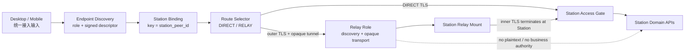

# Station 统一接入生命周期 - 架构设计

> **Status**: active
> **Version**: v2.0
> **Created**: 2026-09-26 | **Updated**: 2026-10-06
> **Owner**: Identity and Access
> **Module**: `apps/desktop/`, `apps/mobile/`, `apps/station/frame/touch/`

---

## 1. 核心原则

1. **Station identity 与 route 分离**：`station_peer_id` 是身份，URL 与 Relay
   route 只描述如何到达它。
2. **Station 始终裁决**：Access Gate、Session、业务授权和数据真源不进入 Relay。
3. **Relay 按不可信网络设计**：Relay 可观察连接元数据，但不能解密客户端的
   Station Session credential 或业务 payload。
4. **一个客户端 binding**：Desktop/Mobile 扩展现有 Station binding，不增加
   Relay registry、Relay session 或 Relay 业务 runtime。
5. **安全先于可达**：身份、证书、attestation、epoch 或 capability 不匹配时
   fail closed，不降级到明文或旧 forward。
6. **一个代码库、显式角色**：复用 Station binary 与 frame primitives，通过
   role allowlist 组合 Relay；不复制业务 handler 或创建烟囱服务。
7. **统一 capability**：相同能力在双端共享协议、状态、错误和作用域。
8. **单一 Session 类别槽**：Session 并发槽由 canonical client class 决定，
   不由安装实例或运行时标签决定。

## 2. 系统架构



两条 route 在 Station 入口前汇合。Relay 不实现 Access Gate，不复制 Station API，
也不把 Relay token 交给普通客户端。

| Concern | 真源 | 客户端投影 |
|---|---|---|
| Station identity | 签名 `StationIdentityStatement` | 以 `station_peer_id` 固定的 registry |
| Access decision | Station Access Gate | 当前 attempt/gate/decision |
| Actor identity | Station Actor + `ActorRef` | 当前 session/account |
| Device identity | canonical device registration | 当前 runtime device scope |
| Federation topology | Station Federation + Ledger | 无 |
| Federation context | Station 可用 context | 当前选择、名称、状态 |
| Relay token/mount/routing | Station/Relay operator plane | 仅诊断摘要 |

## 3. 统一 Endpoint Discovery

Station 与 Relay 均实现一个 registry-declared、未登录可调用的 protobuf
discovery capability：

```text
POST /.well-known/peers-touch/access
Content-Type: application/x-protobuf

AccessEndpointRequest
  challenge
  optional connection_grant

AccessEndpointResponse
  endpoint_role: DIRECT_STATION | RELAY
  endpoint_identity
  station_routes[]
  issued_at
  expires_at
```

- `DIRECT_STATION` 返回 challenge-bound `StationIdentityResponse` 与 direct route。
- `RELAY` 返回 Relay identity，以及公开或 grant-scoped 的
  `StationRouteAttestation`。
- endpoint role 必须签名且短期有效；HTTP 状态、HTML、redirect 或猜测 route
  不能决定 role。
- Relay 一个候选可自动选择，多个候选由用户选择，零候选为 typed failure。

## 4. Station Route Attestation

每个 Relay route 由目标 Station host key 签名：

```text
StationRouteAttestation
  station_peer_id
  relay_peer_id
  route_id
  route_generation
  inner_tls_spki_sha256
  capabilities_digest
  visibility: PUBLIC | GRANT_ONLY
  issued_at
  expires_at
  host_public_key
  signature
```

客户端必须：

1. 从 `host_public_key` 推导 `station_peer_id`；
2. 验证 domain-separated signature 和时间窗；
3. 验证 attestation 的 `relay_peer_id` 等于当前 Relay；
4. 建立 tunnel 后验证 Station inner TLS certificate SPKI；
5. 再调用 Station identity endpoint，并要求得到相同 `station_peer_id`。

Relay 不能自行声明某个 Station，也不能把 Station A 的 attestation 用于 Station B。

## 5. Route-aware Station Binding

客户端持久化对象以 `station_peer_id` 为主键：

```text
StationBinding
  station_peer_id
  display_name
  pinned_host_public_key
  routes[]
  active_route_id
  route_revision
  lifecycle_generation
```

每个 route 记录类型、endpoint、attestation 摘要、有效期、健康状态和最近成功时间。

- route 变化且 Station identity 相同：增加 `route_revision`，只重建 transport。
- Station identity 变化：要求显式确认，停止 runtime、清 projection，再增加
  `lifecycle_generation`。
- Session、Actor、Device、Federation 与业务缓存不以 route URL 为 identity key。
- route failure 可自动重试当前 route；DIRECT 与 RELAY 之间的切换会改变网络隐私
  属性，默认必须由用户显式确认，即使两者属于同一 `station_peer_id`。

## 6. Relay Tunnel

Relay 数据面采用两层安全：

1. Client 通过 `wss://<relay>/.well-known/peers-touch/tunnel` 建立 outer TLS
   WebSocket；Station mount 使用 TLS stream，二者都验证 Relay endpoint。
2. Client 到 Station 的 inner TLS 1.3，证书 SPKI 由
   `StationRouteAttestation` 固定。

Relay 只转发有界 opaque frames：

```text
TunnelOpen(route_id, route_generation, nonce, optional grant proof)
TunnelOpened(tunnel_id, limits, relay_nonce)
TunnelData(tunnel_id, sequence, ciphertext)
TunnelCancel(tunnel_id, reason)
TunnelClose(tunnel_id, result)
```

WebSocket 只承载 binary frame；text frame、per-message compression、redirect 和
协议降级均拒绝。Relay 将 binary payload 原样复用现有有界 stream multiplexer 发往
Station，Station 将其接入进程内 TLS ingress。

inner TLS 在 Station 进程内终止，再进入现有 canonical router、Access Gate 和
auth middleware。Relay 不读取 HTTP method/path/header/body。Station 对未登录 tunnel
只允许 discovery、identity 与 Access Gate capability；登录后仍按现有 Station
Session 授权。

硬限制包括：

- handshake、idle 和 request deadline；
- 每 Station、每 route、每来源的并发与速率；
- 单 frame、单 request、单 response 和连接累计字节；
- backpressure、显式 cancel、graceful drain；
- bounded error body 与低基数 metrics。

超限必须返回 typed error，禁止 `LimitReader` 后继续处理截断 payload。

## 7. Station Enrollment

```text
operator creates one-time invite
  -> Station requests Relay challenge
  -> Station signs challenge + invite_id + relay_peer_id
  -> Relay derives station_peer_id from host key
  -> atomic invite consume + mount generation create
  -> short-lived mount credential
  -> TLS control stream + route attestation publish
```

安全要求：

- invite secret 只返回一次，数据库只存 hash；
- invite 必须定向 Station 或在首次 PoP 后不可变绑定；
- mount credential 使用 Relay 专用非对称 issuer，包含
  `aud/scope/jti/exp/station_peer_id/generation`；
- rotate 要求当前 generation credential 与新的 Station host-key challenge；
- revoke 原子递增 generation、关闭 active streams、拒绝 refresh/reconnect；
- 过期缓存触发 enrollment-required，而不是永久失败或伪 running。

Relay admin API 使用独立 operator audience/scope，不能接受任意 Station 用户 JWT。

私有连接材料编码为：

```text
peers-touch://connect#<base64url deterministic StationConnectionEnvelope>
ptc1:<base64url deterministic StationConnectionEnvelope>
```

fragment/code 包含 Relay origin、route attestation 与短期 connection grant。Station
通过已认证 mount 先向 Relay 登记 grant digest、route generation、expiry 和使用
次数。客户端解析后直接提交 discovery request；原文不得进入 URL query、Referer、
analytics、错误信息或日志。

## 8. Relay Runtime Role

同一 Station binary 可以装配不同角色，但路由必须按角色 allowlist：

| Role | 允许 |
|---|---|
| `station` | Station 业务 subservers；可启用 relay-client mount |
| `relay` | health、signed discovery、operator admin、mount control、opaque tunnel、metrics |

`relay` role 禁止加载 Actor、OAuth、Chat、Social、Agent、OSS 或 Federation
governance handler。生产模式缺少 TLS、Relay signing key、operator policy 或配额时
启动失败。开发模式的明文例外必须显式、仅 loopback 且不能生成生产证据。

## 9. Station-to-Station Transport

现有 `/relay/forward/{peer}/{path}` 的 ANY + header passthrough 不是目标协议。
cutover 后：

- Federation transport 只调用正向 registry 中的 typed peer capability；
- Station credential 位于 inner TLS 内，Relay 不见
  `Authorization` 或 `X-Peers-Target-Authorization`；
- broadcast topic 保持 deny-by-default，并增加 publisher scope、速率与 payload
  上限；
- 无 consumer 的 `relay-client-token` 和透明 HTTP forward 同 closure 删除。

客户端 registry 不复制 method/path。Gate 验证 Station capability 存在、required
consumer 完整、platform-only 例外有理由、无消费者 wrapper 为零。

## 9.1 Federation 与 Relay 边界

普通客户端保留：

- list/select Federation context；
- scoped search/resolve；
- 当前 Station/Federation 名称与连接状态。

普通客户端删除：

- Federation create/join/leave/delete/member-station；
- Relay invite/token/mount/seed/forward endpoint；
- 登录页中的 Relay 拓扑说明。

Actor discoverability 收敛到 Actor Profile canonical visibility。
`/actor/federation/health` 仅供运维诊断。本设计接受后 supersede Federation D-05
中“所有用户在 Settings 执行 Join/Leave”的条款。

## 9.2 Scope Fence

所有接入结果携带或解析到：

```text
station_peer_id + actor_ptid + device_id + lifecycle_generation
```

账号或 Station 切换时，前一 runtime 先 quiesce，前一 projection 再清除。异步结果返回
前重新比较 lifecycle generation；不匹配则丢弃。

## 9.3 Client-Class Session Slot

Station 把 Access Attempt `platform` 映射为唯一 `ClientClass`：

```text
desktop -> desktop
mobile  -> mobile
web     -> web
```

`desktop-native`、窗口 label、设备型号、OS 名称和构建 target 都不是合法类别。
Desktop 的 Tauri runtime 必须提交 `desktop`，Mobile 必须提交 `mobile`。

Session 激活事务必须：

1. 验证 `ClientClass` 为 canonical enum；
2. 在撤销或激活前锁定 actor 持久化行，串行化同一 actor 的 class-slot 变更；
3. 将同一 actor、同一 class、不同 Session 的全部未撤销记录标记为
   `revoked_reason=kicked`；
4. 激活或创建新 Session；
5. 保留同一 actor 的其他 class Session；
6. 在提交后只向被替换类别投影 typed revocation。

`actor_sessions` 同时以 partial unique index 强制
`(user_id, device_type) WHERE revoked = false`。Migration 必须先归一
`desktop-native -> desktop`，再按最新 Session 保留一个 winner 并将同类旧行
标记为 `kicked`，最后创建 unique index。应用锁负责确定 winner 和 typed
撤销语义，数据库约束负责在遗漏锁或并发回归时 fail closed。

密码 Access Gate finalizer、OAuth credential acknowledgement 和
`/actor/session/takeover` 共用这一 authority。`device_id` 继续绑定具体安装、
Actor Device、Messaging、OAuth attempt 和 lifecycle generation，但不参与并发
槽选择。现存非 canonical 类别数据在 schema migration 中一次性归一后删除运行时
兼容解释；新写入必须 fail closed。

## 9.4 当前接口约束

- Desktop 与 Mobile 只调用 capability registry 登记的四个 Access Gate 接口。
- 请求与响应只使用 generated protobuf 类型。
- 本地账号、Session、runtime 和 projection 均使用完整 scope tuple。
- 普通客户端只消费 Federation context，不包含 topology mutation。
- Relay 信息只以 Station 提供的诊断摘要出现。
- Actor profile 与 visibility 由一个 profile owner 提供。

任何未登记 route、command、DTO、parser、storage key 或 client wrapper 都是
contract violation。回滚只通过 Git/deployment 回退整组 closure。

## 9. Failure Semantics

| Failure | 必须行为 |
|---|---|
| endpoint role/identity 无法验证 | 登录前 fail closed |
| route attestation 过期、篡改或 Relay 不匹配 | 删除候选或要求刷新 |
| inner TLS SPKI 不匹配 | 关闭 tunnel，绝不发送凭据 |
| route 中断 | 当前 route bounded retry；展示同 Station 其他候选供显式切换 |
| 所有 route 不可用 | 保留 Station binding，显示离线 |
| mount revoked | 立即关闭 generation，拒绝旧 credential |
| invite 重放 | 原子冲突，仅一个成功 |
| overload/oversize | typed 429/413，完整拒绝，不截断 |
| Station identity 变化 | 显式替换并完整 scope teardown |
| Access Gate 未知类型 | typed unsupported，不调用其他接入接口 |
| Attempt 过期 | 重新开始 canonical attempt |
| Federation context 缺失 | 阻止 scoped action，不猜默认 ID |
| Scope 切换 | 丢弃前一 scope 的异步结果 |
| 非 canonical client class | 凭据激活前 fail closed |
| 同类别新 Session | 原子撤销旧同类 Session；异类 Session 保持有效 |

## 11. 证据要求

完成证据必须同时包含：

- source inventory 与 API/architecture governance；
- Relay role route 枚举和无未声明出站；
- Station enrollment 并发、rotation、revocation、recovery；
- opaque tunnel 抓包/日志断言和攻击用例；
- Desktop/Mobile 原生 direct、relay、route switch、restart；
- 两 Station 跨 Relay 的 Chat/Social 代表性业务；
- 安装态 Desktop 与 iOS Simulator，而非仅 web mock。
