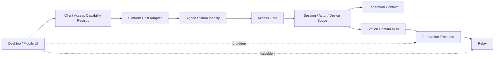

# Station 接入生命周期 - 架构设计

> **Status**: active
> **Version**: v1.2
> **Created**: 2026-09-26 | **Updated**: 2026-10-06
> **Owner**: Identity and Access
> **Module**: `apps/desktop/`, `apps/mobile/`, `apps/station/frame/touch/`

---

## 1. 核心原则

1. URL 只定位连接，签名 `station_peer_id` 才代表 Station identity。
2. Access Gate 是普通客户端唯一准入 owner。
3. 相同 capability 在双端共享协议、状态、错误和作用域。
4. Federation governance 与普通客户端 context consumption 分离。
5. Relay 只存在于 Station/运维基础设施。
6. 无历史用户，所有替换均为单次硬切。
7. Session 并发槽由 canonical client class 决定，不由安装实例或运行时标签决定。

## 2. 系统架构



## 3. Ownership

| Concern | 真源 | 客户端投影 |
|---|---|---|
| Station identity | 签名 `StationIdentityStatement` | 以 `station_peer_id` 固定的 registry |
| Access decision | Station Access Gate | 当前 attempt/gate/decision |
| Actor identity | Station Actor + `ActorRef` | 当前 session/account |
| Device identity | canonical device registration | 当前 runtime device scope |
| Session class slot | Station Actor Session | `desktop`、`mobile` 或 `web` 的当前 Session |
| Federation topology | Station Federation + Ledger | 无 |
| Federation context | Station 可用 context | 当前选择、名称、状态 |
| Relay token/mount/routing | Station/Relay operator plane | 仅诊断摘要 |

## 4. Canonical 接入序列

```text
reachability probe
  -> signed station identity verification
  -> explicit pin or replace
  -> access_start
  -> access_submit / access_cancel / access_decision
  -> granted session
  -> runtime bootstrap
```

客户端固定使用：

| Endpoint | Request / Response |
|---|---|
| `POST /actor/access/start` | `StartAccessAttemptRequest/Response` |
| `POST /actor/access/submit` | `SubmitAccessGateRequest/Response` |
| `POST /actor/access/decision` | `GetAccessDecisionRequest/Response` |
| `POST /actor/access/cancel` | `CancelAccessAttemptRequest/Response` |

请求与响应均为 `application/protobuf`，只使用 generated decoder。Dashboard 若需要
JSON，使用独立 admin adapter，不改变客户端 wire。

## 5. Capability Applicability

`station-api-capabilities.yaml` 继续作为 Station route/owner 唯一真源。客户端
registry 只记录：

```yaml
capability_id: client.access.submit
product_ids: [SAL-C02]
station_capability_id: access.gate.submit
contract: peers_touch.model.access_gate.v1.SubmitAccessGateRequest
platforms: { desktop: required, mobile: required }
surface: access-gate
```

客户端 registry 不复制 method/path。Gate 验证 Station capability 存在、required
consumer 完整、platform-only 例外有理由、无消费者 wrapper 为零。

## 6. Federation 与 Relay 边界

普通客户端保留：

- list/select Federation context；
- scoped search/resolve；
- 当前 Station/Federation 名称与连接状态。

普通客户端删除：

- Federation create/join/leave/delete/member-station；
- Relay invite/token/mount/seed/forward endpoint；
- 登录页中的 Relay 拓扑说明。

Actor discoverability 收敛到 Actor Profile canonical visibility。
`/actor/federation/health` 仅供运维诊断。本设计接受后 supersede Federation D-05
中“所有用户在 Settings 执行 Join/Leave”的条款。

## 7. Scope Fence

所有接入结果携带或解析到：

```text
station_peer_id + actor_ptid + device_id + lifecycle_generation
```

账号或 Station 切换时，前一 runtime 先 quiesce，前一 projection 再清除。异步结果返回
前重新比较 lifecycle generation；不匹配则丢弃。

## 8. Client-Class Session Slot

Station 把 Access Attempt `platform` 映射为唯一 `ClientClass`：

```text
desktop -> desktop
mobile  -> mobile
web     -> web
```

`desktop-native`、窗口 label、设备型号、OS 名称和构建 target 都不是合法类别。
Desktop 的 Tauri runtime 必须提交 `desktop`，Mobile 必须提交 `mobile`。

Session 激活事务必须：

1. 验证 `ClientClass` 为 canonical enum；
2. 在撤销或激活前锁定 actor 持久化行，串行化同一 actor 的 class-slot 变更；
3. 将同一 actor、同一 class、不同 Session 的全部未撤销记录标记为
   `revoked_reason=kicked`；
4. 激活或创建新 Session；
5. 保留同一 actor 的其他 class Session；
6. 在提交后只向被替换类别投影 typed revocation。

`actor_sessions` 同时以 partial unique index 强制
`(user_id, device_type) WHERE revoked = false`。Migration 必须先归一
`desktop-native -> desktop`，再按最新 Session 保留一个 winner 并将同类旧行
标记为 `kicked`，最后创建 unique index。应用锁负责确定 winner 和 typed
撤销语义，数据库约束负责在遗漏锁或并发回归时 fail closed。

密码 Access Gate finalizer、OAuth credential acknowledgement 和
`/actor/session/takeover` 共用这一 authority。`device_id` 继续绑定具体安装、
Actor Device、Messaging、OAuth attempt 和 lifecycle generation，但不参与并发
槽选择。现存非 canonical 类别数据在 schema migration 中一次性归一后删除运行时
兼容解释；新写入必须 fail closed。

## 9. 当前接口约束

- Desktop 与 Mobile 只调用 capability registry 登记的四个 Access Gate 接口。
- 请求与响应只使用 generated protobuf 类型。
- 本地账号、Session、runtime 和 projection 均使用完整 scope tuple。
- Session `device_type` 只持久化 canonical client class。
- 普通客户端只消费 Federation context，不包含 topology mutation。
- Relay 信息只以 Station 提供的诊断摘要出现。
- Actor profile 与 visibility 由一个 profile owner 提供。

任何未登记 route、command、DTO、parser、storage key 或 client wrapper 都是
contract violation。回滚只通过 Git/deployment 回退整组 closure。

## 10. Failure Semantics

| Failure | 必须行为 |
|---|---|
| Station identity 无法验证 | 凭据提交前 fail closed |
| URL 对应 identity 变化 | 要求显式替换 |
| Access Gate 未知类型 | typed unsupported，不调用其他接入接口 |
| Attempt 过期 | 重新开始 canonical attempt |
| Federation context 缺失 | 阻止 scoped action，不猜默认 ID |
| Scope 切换 | 丢弃前一 scope 的异步结果 |
| 非 canonical client class | 凭据激活前 fail closed |
| 同类别新 Session | 原子撤销旧同类 Session；异类 Session 保持有效 |
| Relay 不可用 | 显示诊断状态，不暴露管理能力 |

## 11. 目标布局

```text
model/domain/
├── access_gate/
└── peer/station_identity.proto

apps/desktop/
├── src/kernel/identity*
├── src/runtimes/
└── src-tauri/src/application/{auth,federation}/

apps/mobile/
├── src/runtimes/
├── src/features/auth/
└── src-tauri/src/runtime/

apps/station/
├── frame/touch/accessgate/
├── frame/touch/actor*
└── app/subserver/federation/
```

当前状态：`accepted`。
