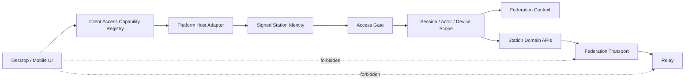

# Station 接入生命周期 - 架构设计

> **Status**: accepted
> **Version**: v1.0
> **Created**: 2026-09-26 | **Updated**: 2026-09-26
> **Owner**: Identity and Access
> **Module**: `apps/desktop/`, `apps/mobile/`, `apps/station/frame/touch/`

---

## 1. 核心原则

1. URL 只定位连接，签名 `station_peer_id` 才代表 Station identity。
2. Access Gate 是普通客户端唯一准入 owner。
3. 相同 capability 在双端共享协议、状态、错误和作用域。
4. Federation governance 与普通客户端 context consumption 分离。
5. Relay 只存在于 Station/运维基础设施。
6. 无历史用户，所有替换均为单次硬切。

## 2. 系统架构



## 3. Ownership

| Concern | 真源 | 客户端投影 |
|---|---|---|
| Station identity | 签名 `StationIdentityStatement` | 以 `station_peer_id` 固定的 registry |
| Access decision | Station Access Gate | 当前 attempt/gate/decision |
| Actor identity | Station Actor + `ActorRef` | 当前 session/account |
| Device identity | canonical device registration | 当前 runtime device scope |
| Federation topology | Station Federation + Ledger | 无 |
| Federation context | Station 可用 context | 当前选择、名称、状态 |
| Relay token/mount/routing | Station/Relay operator plane | 仅诊断摘要 |

## 4. Canonical 接入序列

```text
reachability probe
  -> signed station identity verification
  -> explicit pin or replace
  -> access_start
  -> access_submit / access_cancel / access_decision
  -> granted session
  -> runtime bootstrap
```

客户端固定使用：

| Endpoint | Request / Response |
|---|---|
| `POST /actor/access/start` | `StartAccessAttemptRequest/Response` |
| `POST /actor/access/submit` | `SubmitAccessGateRequest/Response` |
| `POST /actor/access/decision` | `GetAccessDecisionRequest/Response` |
| `POST /actor/access/cancel` | `CancelAccessAttemptRequest/Response` |

请求与响应均为 `application/protobuf`，只使用 generated decoder。Dashboard 若需要
JSON，使用独立 admin adapter，不改变客户端 wire。

## 5. Capability Applicability

`station-api-capabilities.yaml` 继续作为 Station route/owner 唯一真源。客户端
registry 只记录：

```yaml
capability_id: client.access.submit
product_ids: [SAL-C02]
station_capability_id: access.gate.submit
contract: peers_touch.model.access_gate.v1.SubmitAccessGateRequest
platforms: { desktop: required, mobile: required }
surface: access-gate
```

客户端 registry 不复制 method/path。Gate 验证 Station capability 存在、required
consumer 完整、platform-only 例外有理由、无消费者 wrapper 为零。

## 6. Federation 与 Relay 边界

普通客户端保留：

- list/select Federation context；
- scoped search/resolve；
- 当前 Station/Federation 名称与连接状态。

普通客户端删除：

- Federation create/join/leave/delete/member-station；
- Relay invite/token/mount/seed/forward endpoint；
- 登录页中的 Relay 拓扑说明。

Actor discoverability 收敛到 Actor Profile canonical visibility。
`/actor/federation/health` 仅供运维诊断。本设计接受后 supersede Federation D-05
中“所有用户在 Settings 执行 Join/Leave”的条款。

## 7. Scope Fence

所有接入结果携带或解析到：

```text
station_peer_id + actor_ptid + device_id + scope_revision
```

账号或 Station 切换时，旧 runtime 先 quiesce，旧 projection 再清除。异步结果返回
前重新比较 scope revision；不匹配则丢弃。

## 8. 硬切

- 删除 Desktop `auth_login`、`direct_login_fallback` 和 `/actor/login`。
- 删除 Station `ValidateLegacySubmission`、legacy login/invite handlers。
- 删除 JSON key/enum 双形态 normalizer。
- 删除未限定 Station scope 的账号 key 与运行时兼容清理。
- 删除普通客户端 Federation governance command/UI chain。
- 删除普通客户端 Relay topology surface。
- 删除重复 Actor federation profile/visibility surface。

新代码与旧代码不并行存在；回滚只通过 Git/deployment 回退整组 closure。

## 9. Failure Semantics

| Failure | 必须行为 |
|---|---|
| Station identity 无法验证 | 凭据提交前 fail closed |
| URL 对应 identity 变化 | 要求显式替换 |
| Access Gate 未知类型 | typed unsupported，不调用旧登录 |
| Attempt 过期 | 重新开始 canonical attempt |
| Federation context 缺失 | 阻止 scoped action，不猜默认 ID |
| Scope 切换 | 丢弃旧 scope 的异步结果 |
| Relay 不可用 | 显示诊断状态，不暴露管理能力 |

## 10. 目标布局

```text
model/domain/
├── access_gate/
└── peer/station_identity.proto

apps/desktop/
├── src/kernel/identity*
├── src/runtimes/
└── src-tauri/src/application/{auth,federation}/

apps/mobile/
├── src/runtimes/
├── src/features/auth/
└── src-tauri/src/runtime/

apps/station/
├── frame/touch/accessgate/
├── frame/touch/actor*
└── app/subserver/federation/
```

当前状态：`accepted`。
