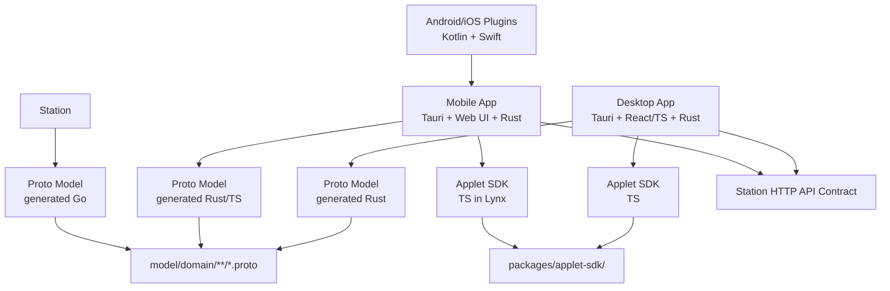

# Client: Cross-Platform Shared Strategy

> **Rules for Cross-Platform Sharing (Proto + API Contract + Applet SDK)**

---

## 🎯 Overview

The cross-platform sharing strategy has evolved from the legacy Flutter shared library model (`peers_touch_base` / `peers_touch_ui`) to a **Proto + API Contract + Applet SDK** model.

**Background:**
- **Mobile** has migrated from Flutter/native dual-platform UI to **Tauri v2 Mobile + shared Web UI + Rust + native plugins**.
- **Desktop** is built with **Tauri + React/TS + Rust**.
- The legacy Flutter shared libraries (`peers_touch_base` / `peers_touch_ui`) are no longer applicable and have been **archived as historical reference only**.
- Android Kotlin and iOS Swift remain valid for native plugins, not as the primary UI mainline.

**Current Sharing Strategy:**
1. **Proto Model Layer**: `model/domain/**/*.proto` → each platform generates its own typed contracts.
2. **Applet SDK**: `packages/applet-sdk/` → shared TS SDK reused directly within Lynx containers across platforms.
3. **API Contract**: Station HTTP API paths and parameter structures → each platform independently implements its own HTTP Client.

---

## 📜 General Principles

### 1. Platform Agnostic
- Proto definitions MUST remain language-neutral and platform-neutral.
- Applet SDK MUST only depend on Lynx container APIs; no platform-specific native bridges.
- API contracts define the **shape** (paths, params, response structures); each platform owns its HTTP client implementation.
- If platform-specific logic is needed, define **interfaces at the Proto / API contract level** and implement them independently per platform.

### 2. Contract-Driven Separation
- **Proto Model Layer** defines data structures and domain models only — no transport or UI concerns.
- **Applet SDK** encapsulates applet lifecycle and communication — no business logic beyond applet orchestration.
- **API Contract** specifies request/response schemas — no client implementation details leak into contract definitions.

### 3. Stability First
- Changes to Proto definitions affect **ALL** platforms (Desktop, Android, iOS, Station).
- **Breaking Changes**: Must be coordinated across all platform teams; use Proto field deprecation and reserved fields.
- **Deprecation**: Mark deprecated Proto fields with `[deprecated = true]` and document migration paths before removal.
- Applet SDK changes affect all platforms running Lynx containers — version and test accordingly.

---

## 📦 Dependency Graph

---

## 🔗 Cross-Platform Shared Layers

### Proto Model Layer
- **Source**: `model/domain/**/*.proto`
- **Generation targets**:
  - Desktop (Rust): via `protoc` + Rust plugin
  - Android (Kotlin): via `protoc` + Kotlin/Java plugin
  - iOS (Swift): via `protoc` + Swift plugin
  - Station (Go): via `protoc` + Go plugin
- **Rule**: All domain models, enums, and message types are defined here as the single source of truth.

### Applet SDK
- **Source**: `packages/applet-sdk/`
- **Runtime**: Runs inside Lynx containers on Desktop, Android, and iOS.
- **Rule**: Provides a unified TS API for applet lifecycle, communication, and data access. Each platform hosts the Lynx container natively and bridges into the SDK.

### API Contract
- **Definition**: Station HTTP API — paths, HTTP methods, request/response parameter structures.
- **Rule**: Each platform independently implements its own HTTP client (Rust `reqwest` for Desktop, `OkHttp`/`Ktor` for Android, `URLSession` for iOS) but all conform to the same API contract.

---

## 🛠️ Development Workflow

1. **Modify Proto Definitions**:
   - Edit `.proto` files in `model/domain/`.
   - Run code generation for all target platforms to produce updated typed contracts.
   - Verify generated code compiles on each platform.

2. **Modify Applet SDK**:
   - Edit files in `packages/applet-sdk/`.
   - Run TS type checks and tests within the package.
   - Test in Lynx container environments on at least one platform.

3. **Modify API Contract**:
   - Update Station API endpoints and document the contract changes.
   - Update each platform's HTTP client implementation to conform to the new contract.
   - Run integration tests across platforms.

4. **Cross-Platform Verification**:
   - Proto changes → regenerate and build on all platforms.
   - Applet SDK changes → test on Desktop + at least one Mobile platform Lynx container.
   - API contract changes → verify all platform HTTP clients against the updated Station.

---

## 📁 Archived Packages

The following legacy Flutter shared libraries have been **archived** and are retained for historical reference only:
- `peers_touch_base` — former shared core logic, data models, networking, and utilities.
- `peers_touch_ui` — former shared UI components, theme tokens, and design system.

These packages are **NOT** used in the current architecture. Do not add new code to them.

---

## 📚 Related Documents

- **Common UX Methodology**: [ux-design-methodology.md](./ux-design-methodology.md)
- **Form Control UX Contract**: [form-control-ux-contract.md](./form-control-ux-contract.md)
- **Package Details**: [packages.md](./packages.md)
- **Desktop Usage**: [../desktop/base.md](../desktop/base.md)
- **Mobile Usage**: [../mobile/base.md](../mobile/base.md)
