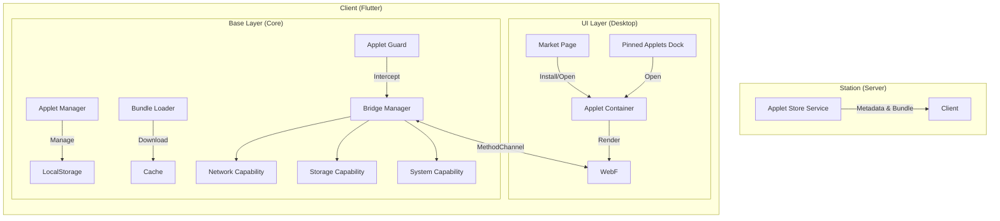

# Applet 扩展能力建设文档

## 1. 概述 (Overview)

为了增强 Peers Touch 的生态扩展能力，我们引入了类似“小程序”的动态化方案——**Applet**。
Applet 允许开发者使用 Web 技术栈（HTML/CSS/JS，推荐 Vue/React）开发业务模块，并在 Peers Touch 客户端中以接近原生的体验运行。

核心技术选型：**WebF (原 Kraken)**
*   渲染层：直接对接 Flutter Rendering Pipeline（无 WebView 性能瓶颈）。
*   逻辑层：QuickJS 引擎执行 JS Bundle。
*   通信层：通过 Bridge 与 Flutter 宿主双向通信。

---

## 2. 架构设计 (Architecture)

### 2.1 整体分层



### 2.2 目录结构规范

*   **Proto 定义**: `model/domain/applet/applet.proto` (生成 Go/Dart 代码)
*   **客户端核心 (Base)**: `client/common/peers_touch_base/lib/applet/`
    *   `bridge/`: 通信协议与 Guard 切面。
    *   `capabilities/`: 具体的原生能力实现（网络、存储等）。
    *   `manager/`: 应用生命周期管理。
*   **客户端 UI (Desktop)**: `client/desktop/lib/`
    *   `modules/applet_launcher/`: WebF 容器与 Controller。
    *   `modules/applet_market/`: 市场页面。
    *   `features/shell/view/widgets/applet_dock.dart`: 侧边栏停靠区。
*   **服务端 (Station)**: `station/app/subserver/applet_store/`

---

## 3. 核心机制实现细节

### 3.1 通信桥接 (The Bridge)

我们定义了一套统一的 JSON 通信协议，不依赖具体的 WebF API 版本。

*   **JS 端调用**:
    ```javascript
    // 假设注入了全局对象 PeersBridge
    window.PeersBridge.invoke({
        module: 'network',
        action: 'request',
        params: { url: '/api/v1/user' },
        callbackId: 'cb_123'
    });
    ```
*   **Dart 端处理 (`BridgeManager`)**:
    1.  `AppletController` 接收消息。
    2.  `BridgeManager.handleInvoke` 进行分发。
    3.  `AppletGuard` 进行权限检查（目前默认放行）。
    4.  `Capability` 执行具体逻辑（如调用 Dio）。
    5.  结果通过 `evaluateJavascript` 回传给 JS。

### 3.2 容器实现 (`AppletContainer`)

*   **位置**: `client/desktop/lib/modules/applet_launcher/view/applet_container.dart`
*   **状态管理**: 使用 `GetX` (`AppletController`) 管理 Loading、Error 和 WebF Controller。
*   **多实例**: 使用 `appId` 作为 GetX Tag，支持同时打开多个不同 Applet。
*   **依赖**: `webf: ^0.16.0` (注意：需配合 `intl: ^0.20.2` 的 override 使用)。

### 3.3 侧边栏停靠区 (`PinnedAppletsDock`)

*   **位置**: `client/desktop/lib/features/shell/view/widgets/applet_dock.dart`
*   **特性**:
    *   **呼吸边框**: 使用 `AnimationController` 实现 Hover 时的视觉反馈。
    *   **隐形滚动**: 隐藏 Scrollbar，保留 `BouncingScrollPhysics`。
    *   **拖拽排序**: 基于 `ReorderableListView`。
*   **集成**: 嵌入在 `ShellPage` 的左侧导航栏底部。

---

## 4. 工程化与构建 (Engineering)

### 4.1 依赖冲突解决
我们在 `client/desktop/pubspec.yaml` 中使用了 `dependency_overrides` 来解决 `flutter_localizations` (intl 0.20) 与 `webf` (intl 0.19) 的版本冲突。

```yaml
dependency_overrides:
  intl: ^0.20.2
```

### 4.2 Proto 生成
*   **插件版本**: 锁定了 `protoc_plugin: ^24.0.0` 以兼容新版 protobuf。
*   **构建脚本**: `model/build.sh` 已更新，强制使用本地依赖的 protoc 插件，避免环境差异。

---

## 5. 遗留工作与后续计划 (TODO)

1.  **恢复 Bridge 回调**:
    *   目前 `AppletController` 中的 JS 回调代码被注释掉了（因为 `evaluateJavascript` API 变动）。
    *   **Next Step**: 查阅 WebF 0.16 文档，确认正确的 JS 执行方法（可能是 `view.evaluateJavascript` 或 `registerPlugin`），并恢复代码。
2.  **对接真实 Station**:
    *   目前的 `MarketController` 使用的是 Mock 数据。
    *   **Next Step**: 调用 `station/app/subserver/applet_store` 的 API 获取真实列表。
3.  **完善 Guard**:
    *   目前的 `DefaultAppletGuard` 是透传的。
    *   **Next Step**: 实现域名白名单和权限弹窗。
4.  **JS SDK**:
    *   需要封装一个 `peers-js-sdk` npm 包，供扩展开发者使用，屏蔽底层的 `invoke` 细节。

---

**文档维护人**: Trae AI
**最后更新**: 2025-12-25
